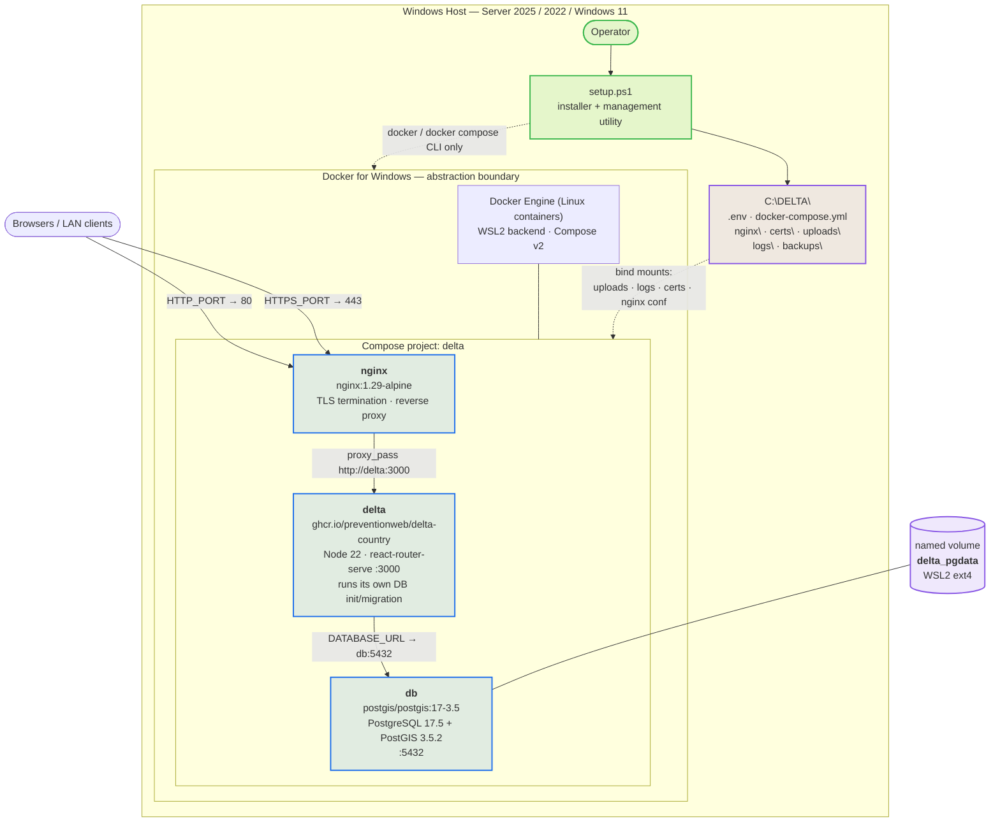
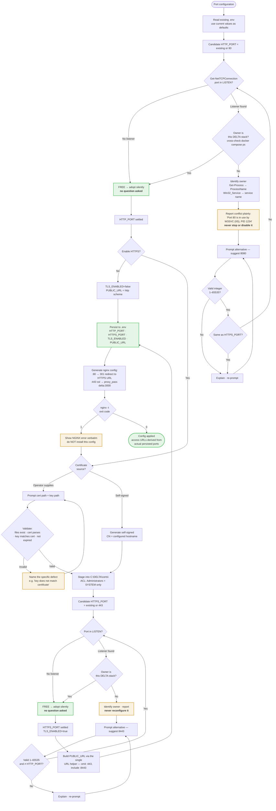

# DELTA Windows Docker Installer — Technical Assessment

**Status:** Assessment, written before any code existed. **Left as written**, as the record of what was measured and decided in advance — its verified facts and design decisions are still the source of truth, and are cited throughout the phasing document as *A§n*.
**Date:** 2026-08-19 · implementation followed in `DELTA-WINDOWS-DOCKER-INSTALLER-PHASES.md` and completed 2026-08-21.
**Purpose:** Single technical source of truth for the subsequent implementation-phasing task.

> **Where implementation superseded this document, the phasing document wins.** The differences are recorded there rather than edited into the text below, so that the original reasoning stays legible. The material ones: A§18.2 offers `docker manifest inspect` as a fallback for remote digest detection — measurement showed it returns a *different* digest and it is deliberately not used (Phase 9); A§19.1's sketch pipes `pg_dump` through PowerShell, which corrupts a custom-format archive and was replaced with a byte-exact transport (Phase 8); A§16.3 sketched a SYSTEM scheduled task, which measurement showed would provision a second, empty engine, so the task runs as the installing user under S4U (Phase 6).
>
> **A§9.3's conditional sentence about uninstall is now a description of something that exists, and the implementation exceeds it.** It reads *"Uninstall — if implemented at all — must require explicit typed confirmation and must offer a final backup first"*, and it was written when nothing of the kind was planned. Phase 12's `uninstall.ps1` requires the word `DELETE` typed in full, and does not merely *offer* a final backup: it takes a verified database dump and a verified archive of the entire installation root, outside that root, and the deletion code is unreachable until both have succeeded — enforced by a mandatory typed parameter, not by a flag a caller could ignore. There is no switch that skips it. The text below is left as written — it is the record of what was assessed before any code existed — and the phasing document carries the implementation.

**Evidence legend**

| Tag | Meaning |
|---|---|
| `[VERIFIED]` | Measured or executed on this host during this assessment. Reproducible. |
| `[IMG]` | Extracted from the DELTA production image itself. |
| `[INST]` | Read from the existing native installer source at `C:\Workspace\DELTA-windows-installer`. |
| `[DOC]` | Vendor documentation. |
| `[ASSUME]` | Not verified here. Flagged for validation during implementation. |

**Host used for verification:** Windows Server 2025 Standard, build 26100 (`ProductType=3`), Docker Desktop 4.85.0, Docker Engine 29.6.2, Docker Compose v5.3.1, WSL 2.7.11, `desktop-linux` context. `[VERIFIED]`

---

## 1. Executive Summary

**Recommendation: proceed.** The architecture proposed in the brief is sound and was validated end-to-end on this host. A three-service Compose stack (NGINX → DELTA → PostgreSQL 17 + PostGIS) was built, started, initialised its schema, served HTTP 200 through the reverse proxy on both HTTP and HTTPS, survived full container recreation with data intact, and produced a restorable database dump. `[VERIFIED]`

The Docker approach is markedly **simpler** than the native installer, not merely different. An entire class of native-installer work disappears rather than being ported: Node.js bootstrapping, the EDB PostgreSQL installer, the PostGIS bundle installer, WinSW service definitions, and Windows NGINX installation are all replaced by three image references. The existing installer is ~1.1 MB of PowerShell across `setup.ps1`, `setup-iis.ps1`, `setup-nginx.ps1` and `lib\`; the Docker equivalent should be a small fraction of that.

### The five findings that shape the design

1. **DELTA initialises and migrates its own database on every container start.** `[IMG][VERIFIED]` The installer must never run migrations, and must never place schema SQL in `docker-entrypoint-initdb.d`. But it also means **every recreation of the DELTA container is a potential schema migration**, which makes "back up before update" a hard requirement rather than good manners.

2. **Unattended startup after a Windows reboot does not work out of the box, and this is the single critical risk.** `[VERIFIED]` On this Server 2025 host there is **no `com.docker.service` Windows service at all** — Docker Desktop is installed per-user and started solely by an `HKCU\...\Run` entry. Docker therefore starts at *interactive sign-in*, not at boot. Compose restart policies are worth nothing until the engine runs. §16 gives the recommended fix.

3. **Named volume beats bind mount for PostgreSQL data, on measured evidence.** `[VERIFIED]` Both work — a Windows NTFS bind mount initialised a PG 17.5 cluster cleanly with no permission errors, contrary to expectation. But the named volume measured **975 tps / 4.10 ms** against the bind mount's **686 tps / 5.83 ms** (~42% more throughput), and it sits on native ext4 inside WSL2 where fsync semantics are not translated and antivirus cannot reach it. §9 recommends the named volume for the database *only*, with everything else on bind mounts. This is the assessment's most significant deviation from the proposed layout.

4. **`postgis/postgis:17-3.5` solves the PostGIS-superuser problem for free.** `[VERIFIED]` The image's own init script creates `postgis` and `fuzzystrmatch` in `POSTGRES_DB` at first initialisation, as superuser, before DELTA ever connects. DELTA's `CREATE EXTENSION IF NOT EXISTS postgis` then becomes a no-op. No `initdb.d` scripting is required from the installer.

5. **Two security defects must be closed by this installer.** `[IMG][INST]` The schema seeds `admin@admin.com` with a **fixed bcrypt hash published in a public image**, and the native installer ships the static `SESSION_SECRET` from `.env.example` unchanged. The Docker installer must reset the administrator before the stack is externally reachable, and must generate a per-installation CSPRNG session secret.

### Deviations from the brief, and why

| # | Proposed | Recommended | Reason |
|---|---|---|---|
| D1 | `data\postgres\` bind mount | Docker **named volume** for PGDATA only | 42% measured throughput gain; untranslated fsync; immune to AV/indexing. Recoverability is preserved by `pg_dump` backups to `C:\DELTA\backups\`, which are more useful than raw PGDATA anyway (§9.3). |
| D2 | `docker pull` to detect updates | Compare **remote digest to local `RepoDigests`** before pulling | `docker buildx imagetools inspect` returns the remote digest anonymously without downloading 214 MB. Exact change detection, no release-management system. `[VERIFIED]` (§18) |
| D3 | NGINX logs to bind-mounted files | **Both**, deliberately split | Bind-mounting `/var/log/nginx` replaces the image's stdout symlinks, so `docker compose logs nginx` goes silent. Confirmed on this host. Keep `error_log` on stdout, send `access_log` to the file. (§21) |
| D4 | (unstated) | Add `depends_on: service_healthy` **and** an explicit healthcheck for DELTA | Without it the DELTA container crash-loops against an absent database and Docker's exponential backoff delayed recovery past 200 s in testing; with it, cold start to HTTP 200 was **13 s**. `[VERIFIED]` (§16) |
| D5 | Backup via `pg_dump` | `pg_dump` must run **in the `db` container** | The DELTA image ships `pg_dump` **15.19**, which refuses a 17.5 server outright. `[VERIFIED]` (§19) |
| D6 | (unstated) | Pin `DELTA_IMAGE` to a **digest** in `.env` after each successful update | `prod-latest` moves. A restart or repair must not silently migrate the schema. (§18) |

---

## 2. Verified Facts and Assumptions

### 2.1 DELTA container image `[IMG][VERIFIED]`

Pulled anonymously — **no `docker login`, no GHCR credentials required**.

| Property | Value |
|---|---|
| Reference | `ghcr.io/preventionweb/delta-country:prod-latest` |
| Digest at assessment | `sha256:aa180b0d7948e09f301fac2148f6f9134507387e017a5475a61eb32f771692f5` |
| Created | 2026-08-14 |
| Size / platform | 214 MB, `linux/amd64` **only** |
| Base | `node:22-bookworm`, Node **22.23.2**, Yarn 1.22.22 |
| Application version | `undrr-delta` **0.2.3** (`package.json`) |
| `WORKDIR` | `/delta` |
| `USER` | *empty* → runs as **root** |
| `EXPOSE` | `3000/tcp` — **confirmed**, and `ENV PORT=3000` |
| `ENV` baked | `NODE_ENV=production`, `PORT=3000` |
| `HEALTHCHECK` | **none declared** — the Compose file must supply one |
| `VOLUME` | **none declared** — nothing persists implicitly |
| Extra tooling | `postgresql-client` **15.19**; **no `curl`, no `wget`** |
| `ENTRYPOINT` | `docker-entrypoint.sh` (inherited from the Node base image) |
| `CMD` | `sh -c 'psql "$DATABASE_URL" -f ./dts_database/database_init_docker_prod.sql && yarn start'` |

**The startup command is the most consequential fact in this assessment.** Verbatim, `database_init_docker_prod.sql` is:

```sql
SELECT (COUNT(*) <= 1) AS is_new_database FROM pg_tables WHERE schemaname = 'public' \gset
\if :is_new_database
    \ir ./dts_db_schema.sql        -- full schema + seed data
\else
    \ir ./upgrade_database.sql     -- forward-only migration chain
\endif
```

Observed behaviour, both branches: `[VERIFIED]`
- First start against an empty database → *"Initializing new database with full schema..."* → 39 tables in `public`, `dts_system_info.version_no = 0.2.3`.
- Second start after `docker compose down` + `up` → *"Applying upgrade migrations to existing database..."* → a no-op at 0.2.3, data intact. **The start path is idempotent at the current version.**

Consequences the installer must respect:

- **Never** run migrations from PowerShell. **Never** put DELTA schema SQL into `docker-entrypoint-initdb.d`.
- **Never** create objects in the `public` schema before first start. Any stray table flips `is_new_database` to false and sends a virgin database down the upgrade path, where `\gset` against a non-existent `dts_system_info` fails.
- `upgrade_database.sql` is **forward-only** (0.1.1 → 0.1.3 → 0.2.0 → 0.2.1 → 0.2.2 → 0.2.3). There are no down-migrations. **Rolling back an image after a migration does not roll back the schema** — recovery requires a database restore.
- The `psql` call carries **no `ON_ERROR_STOP=on`**. A migration can fail partway, `psql` still exits 0, `yarn start` still runs, and the app comes up looking healthy on a half-migrated schema. Migration success must be verified *actively* (log scan + `dts_system_info.version_no`), never inferred from container health.

**Database requirements** `[IMG][VERIFIED]` — the schema's opening statements are `CREATE EXTENSION IF NOT EXISTS pgcrypto` and `CREATE EXTENSION IF NOT EXISTS postgis`. PostGIS use is modest: `geometry(Geometry,4326)` on two columns and `st_isvalid`. No raster, no topology. The schema file is a `pg_dump` from **PostgreSQL 16.6** — it restores cleanly onto 17.5. `[VERIFIED]`

**Environment variables actually read by the built server** `[IMG]` — extracted from `/delta/build/server/index.js`:

`APP_VERSION` · `AUTHENTICATION_SUPPORTED` · `DATABASE_URL` · `DEPLOYMENT_REGION` · `EMAIL_FROM` · `EMAIL_TRANSPORT` · `ENABLE_LOG_METRICS` · `ENABLE_REMOTE_LOGGING` · `HOSTNAME` · `HTTP_PROXY` · `INSTANCE_ID` · `LOG_DIR` · `LOG_LEVEL` · `LOG_RETENTION_DAYS` · `NODE_ENV` · `PUBLIC_URL` · `REACT_APP_CSS_NONCE` · `REMOTE_LOG_API_KEY` · `REMOTE_LOG_ENDPOINT` · `SESSION_SECRET` · `SMTP_HOST` · `SMTP_PASS` · `SMTP_PORT` · `SMTP_SECURE` · `SMTP_USER` · `SSO_AZURE_B2C_*` · `SUPPORT_EMAIL` · `SUPPORT_URL` · `VITE_SERVER_PORT`

**The image ships a leftover `/delta/.env`** containing `NODE_ENV="development"` and `SESSION_SECRET="not-random-dev-secret"`. It is **inert**: the server bundle contains **zero references to `dotenv`** `[VERIFIED]`, so nothing loads it. It must be left alone — never mount over `/delta`, never `docker cp` a real `.env` in, and never let anyone "fix" configuration by editing it.

**Paths inside the container** `[IMG][VERIFIED]`

| Path | Purpose | Configurable? |
|---|---|---|
| `/delta/uploads` | All user uploads. `BASE_UPLOAD_PATH = "uploads"`, resolved relative to CWD `/delta`. Tenant-scoped: `uploads/tenant-<id>/…`. | **No.** Hard-coded. Must be bind-mounted at exactly this path. |
| `/delta/logs` | Winston daily-rotate files: `access-%DATE%.log`, `error-%DATE%.log`, `dts-%DATE%.log`, plus `.*-audit.json`. | **Yes** — `LOG_DIR`, default `logs`. Set it explicitly to `/delta/logs`. |
| `/delta/build/server/index.js` | The application. | — |

Confirmed writing through a Windows bind mount: after one run, `logs/` contained `access-2026-08-19.log`, `dts-2026-08-19.log`, `error-2026-08-19.log` and their audit files, all readable from Windows. `[VERIFIED]`

**Upload size limits** `[IMG]` — the standard validator is `10 * 1024 * 1024` (10 MB); one path allows `50 * 1024 * 1024`. NGINX's default `client_max_body_size` is **1 MB**, and the native installer's templates do not raise it `[INST]`. **Set `client_max_body_size 64m`** — otherwise uploads between 1 MB and 50 MB fail with HTTP 413.

**Application routes** `[VERIFIED]` against the running stack:

| Path | Result |
|---|---|
| `/` | 200 |
| `/admin/login` | 200 |
| `/en/admin/login` | 200 — the form the native installer's access guide advertises `[INST]` |
| `/en/user/login` | 200 |
| `/en` | 302 → `/en/hazardous-event` |
| `/health`, `/healthz`, `/status`, `/ping` | **do not exist** — `/health` 302s into the catch-all route |

**There is no health endpoint.** The healthcheck must be a plain `GET /` expecting 200. Since the image has neither `curl` nor `wget`, use Node 22's global `fetch` — verified working inside the running container, exit 0, status 200: `[VERIFIED]`

```yaml
healthcheck:
  test: ["CMD", "node", "-e", "fetch('http://127.0.0.1:3000/').then(r=>process.exit(r.ok?0:1)).catch(()=>process.exit(1))"]
```

### 2.2 Database image `postgis/postgis:17-3.5` `[VERIFIED]`

| Property | Observed |
|---|---|
| PostgreSQL | **17.5** (Debian 17.5-1.pgdg110+1) |
| PostGIS | **3.5.2** |
| Extensions auto-created in `POSTGRES_DB` | `postgis`, `fuzzystrmatch`, `postgis_topology`, `postgis_tiger_geocoder`, `plpgsql` |
| GEOS / PROJ | 3.9.0 / 7.2.1 |
| `pg_isready` | present at `/usr/bin/pg_isready` |
| `pg_dump` | 17.x — matches the server |
| First-init on Windows bind mount | **clean**, no permission errors, `PG_VERSION` = `17` readable from Windows |

The image's `/docker-entrypoint-initdb.d/10_postgis.sh` runs at first initialisation and loads PostGIS into both `template_postgis` and `POSTGRES_DB` **as the superuser**, before the application ever connects. This is why the superuser/extension problem does not arise in practice.

**`pgcrypto` is *not* pre-created**, but it is a **trusted** extension in PostgreSQL 13+, so DELTA's own `CREATE EXTENSION IF NOT EXISTS pgcrypto` succeeds as the database owner. Verified: the full schema load completed with no extension errors. `[VERIFIED]`

### 2.3 Docker / Windows host `[VERIFIED]`

| Item | Observed |
|---|---|
| OS | Windows Server 2025 Standard, build 26100, `ProductType=3` (server SKU) |
| Docker Desktop | 4.85.0, installed **per-user** at `%LOCALAPPDATA%\Programs\DockerDesktop` |
| Engine / Compose | 29.6.2 (`linux`/`overlayfs`) / Compose **v5.3.1** |
| WSL | 2.7.11.0, kernel 6.18.33.2; distros: `docker-desktop` (Docker's own) and a pre-existing `Ubuntu-24.04` (the operator's, unrelated to DELTA) |
| `com.docker.service` | **absent** — `sc query` returns no Docker service whatsoever |
| Autostart mechanism | `HKCU\SOFTWARE\Microsoft\Windows\CurrentVersion\Run` → `Docker Desktop.exe` |
| `settings-store.json` | `AutoStart = False` |
| `docker desktop status` | returns structured output (`Status: running`, `SessionID`) — parseable |
| GHCR anonymous pull | works; `docker manifest inspect` and `docker buildx imagetools inspect` also work unauthenticated |

### 2.4 Assumptions still carrying risk `[ASSUME]`

- Behaviour on **Windows Server 2022** and **Windows 11** is assumed equivalent at the Docker interface but has not been exercised here.
- **Crash durability** of the named volume under abrupt host power loss was not tested — only clean restart cycles.
- The **upgrade migration path** was exercised only as a no-op (0.2.3 → 0.2.3). A genuine version-to-version migration has not been run.

---

## 3. Recommended Architecture

Unchanged from the brief in structure. One Compose project, three services, one private network, one host-published service.

**Service summary**

| Service | Image | Published | Persistence | Restart |
|---|---|---|---|---|
| `nginx` | `nginx:1.29-alpine` (pin + record digest) | `${HTTP_PORT}:80`, `${HTTPS_PORT}:443` | `./nginx/conf.d` (ro), `./certs` (ro), `./logs/nginx` | `unless-stopped` |
| `delta` | `${DELTA_IMAGE}` (digest-pinned) | **none** | `./uploads` → `/delta/uploads`, `./logs/delta` → `/delta/logs` | `unless-stopped` |
| `db` | `postgis/postgis:17-3.5` (pin + record digest) | **none** | **named volume** `delta_pgdata` → `/var/lib/postgresql/data` | `unless-stopped` |

Port 3000 and port 5432 are **never** published to the Windows host. There is no operational requirement for either: NGINX reaches DELTA over the Compose network, the installer reaches PostgreSQL through `docker compose exec`, and both are strictly better than a host port.

**Rejected as unnecessary:** a fourth "migration" or "init" service (DELTA does its own), a Windows service wrapper for the stack (§16 handles reboot differently), and a separate least-privileged database role for V1 (§7.4).

---

## 4. Architecture Diagram



**The boundary rule.** `setup.ps1` talks to Docker only through `docker`, `docker compose` and `docker desktop`. It never enters a Linux distribution, never installs or supervises `dockerd`, never edits `wsl.conf`, never manages WSL IP addresses or `netsh portproxy`, and never treats Docker's `docker-desktop` WSL distro as a DELTA artefact. Everything inside the Compose project is DELTA's; everything below the engine is Docker's.

---

## 5. Windows / Docker Runtime Assessment

### 5.1 Runtime choice

**Recommendation: Docker Desktop for Windows with the WSL2 backend.** It is the only Windows runtime that provides all three of the things the design needs — a `docker` CLI, a Linux-capable engine, and the Compose v2 plugin — through one vendor-documented silent installer.

The alternatives were considered and rejected for V1:
- **Docker CE + Hyper-V Linux VM the installer provisions.** This puts DELTA back in the business of owning an operating system, which the brief explicitly forbids.
- **Windows containers.** The DELTA image is `linux/amd64` only. Not applicable.
- **Rancher Desktop / Podman Desktop.** Viable engines, but they shift the support story and offer no advantage here.

### 5.2 The Ubuntu question, answered

**The operator never installs or manages an Ubuntu distribution.** Docker Desktop's WSL2 backend runs its own private `docker-desktop` distribution, created and maintained entirely by Docker. On this host, `wsl --list --verbose` shows `docker-desktop` alongside a pre-existing `Ubuntu-24.04` that belongs to the operator and has nothing to do with DELTA. `[VERIFIED]` The DELTA containers run on Docker's internal Linux kernel; that is an implementation detail of the engine, not an OS the operator maintains. This requirement is satisfied by construction.

### 5.3 WSL2 vs Hyper-V

**Recommend WSL2.** It is Docker's default, is installable on Server 2022 and 2025 with the Microsoft-supported `wsl.exe --install` `[DOC]`, and is what was validated here. Hyper-V backend remains selectable via `--backend=hyper-v` if a site cannot use WSL, but it should be a fallback the installer offers on failure, not a choice it puts in front of the operator unprompted.

**Detection trap, from the reference project `[INST]`:** `Get-WindowsOptionalFeature -FeatureName Microsoft-Windows-Subsystem-Linux` reports **Disabled** on hosts where WSL is installed and healthy, because modern WSL ships as a store/MSIX package. **Never use optional-feature state as the WSL test.** Use `wsl.exe --status` / `wsl.exe --version` and interpret exit codes. Also set `$env:WSL_UTF8 = 1` before calling `wsl.exe` — it otherwise emits UTF-16LE that PowerShell 5.1 mangles into unparseable output. Both traps were re-confirmed here.

### 5.4 Prerequisites the installer checks

| Check | Mechanism | Failure behaviour |
|---|---|---|
| 64-bit Windows, supported build | `Get-CimInstance Win32_OperatingSystem` → `Caption`, `BuildNumber`, `ProductType` | Explain, stop |
| Elevation | `WindowsPrincipal.IsInRole(Administrator)` | Explain, stop |
| Hardware virtualization enabled | `Get-CimInstance Win32_ComputerSystem` → `HypervisorPresent`, plus `systeminfo` firmware line | Explain how to enable in firmware, stop |
| WSL present and v2 | `wsl.exe --version` with `WSL_UTF8=1` | Offer `wsl --install`, then require reboot |
| Docker CLI present | `docker version` | Branch to install |
| Engine reachable | `docker info` exit code | Branch to start |
| Linux container mode | `docker info --format '{{.OSType}}'` = `linux` | `docker desktop engine use linux` |
| Compose v2 | `docker compose version` | Explain, stop |
| Disk space on install volume | `Get-PSDrive` | Warn below threshold, stop below hard floor |

### 5.5 Docker installation

Vendor-documented silent install `[DOC]`:

```powershell
& "Docker Desktop Installer.exe" install --quiet --accept-license --backend=wsl-2 --always-run-service
```

`--accept-license` may only be passed **after** the operator has explicitly confirmed. See the licensing caveat below.

### 5.6 The three deployment caveats

**C1 — Vendor support.** Docker documents that Docker Desktop is not supported on server versions of Windows `[DOC]`. It nonetheless installs and runs correctly on Server 2025 `[VERIFIED]`. This is a disclosure obligation, not a blocker. *Installer behaviour:* on a server SKU, print an explicit notice before installing Docker, record the acknowledgement, and continue. Never refuse on this basis — that is the operator's call.

**C2 — Licensing.** Docker Desktop requires a paid subscription for organisations at or above 250 employees or $10M annual revenue `[DOC]`. *Installer behaviour:* when Docker is **absent** and about to be installed, show the terms summary and require explicit confirmation before passing `--accept-license`. When Docker is **already present**, the obligation already exists and belongs to the operator — log it, do not prompt.

**C3 — Unattended startup after reboot.** This is the critical one and is treated fully in §16.

---

## 6. DELTA Container Assessment

All facts in §2.1. Design decisions that follow:

| Aspect | Decision |
|---|---|
| Image reference | `${DELTA_IMAGE}` in `.env`, **pinned to a digest** after each successful install/update: `ghcr.io/preventionweb/delta-country@sha256:…`. A human-readable `DELTA_IMAGE_TAG=prod-latest` is recorded alongside for display. |
| Startup command | **Never overridden.** The image's `CMD` is the migration mechanism. |
| Node.js on Windows | **Not installed.** Node 22.23.2 is inside the image. The native installer's 32 MB `node-v24.18.0-x64.msi` becomes dead weight. |
| Environment | Compose `env_file: .env` plus explicit `environment:` for derived values. Required: `DATABASE_URL`, `PUBLIC_URL`, `SESSION_SECRET`, `NODE_ENV=production`, `LOG_DIR=/delta/logs`. |
| Ports | **None published.** NGINX reaches `delta:3000` over the Compose network. |
| Volumes | `./uploads:/delta/uploads` and `./logs/delta:/delta/logs`. **Never bind-mount `/delta` itself** — it would hide the application baked into the image. |
| Healthcheck | Node `fetch` probe on `http://127.0.0.1:3000/` (§2.1). `start_period: 180s` — cold first-init took ~90 s including full schema load and translation import; warm start reached HTTP 200 in **13 s**. `[VERIFIED]` |
| Restart | `unless-stopped` |
| `depends_on` | `db: { condition: service_healthy }` — **mandatory**, see §16.2 |
| Filesystem permissions | Container runs as **root**, so bind-mounted `uploads/` and `logs/` need no Windows-side ownership work. Confirmed writing correctly. `[VERIFIED]` |
| Migrations | Owned by the container. The installer **verifies**, never performs. |

**The `Secure`-cookie consequence.** `NODE_ENV=production` is baked into the image, which marks session cookies `Secure`. Browsers treat `http://localhost` as a secure context, so a local smoke test over plain HTTP appears to work — while the *same* deployment reached over plain HTTP at a real hostname silently fails to keep users signed in. The installer must state plainly that **plain HTTP is suitable for localhost testing only**, and that any real hostname deployment needs TLS.

---

## 7. PostgreSQL 17 + PostGIS Assessment

### 7.1 Image recommendation

**`postgis/postgis:17-3.5`** — pin this tag and record the resolved digest in installer state.

Reasoning:

- It is the **official PostGIS project image**, maintained in lockstep with PostGIS releases, and is the well-trodden path for exactly this need.
- Plain `postgres:17` is **not sufficient** — the DELTA schema's first statements include `CREATE EXTENSION IF NOT EXISTS postgis`, which fails outright without the PostGIS binaries. The brief is right to warn against it.
- It delivers **PostgreSQL 17.5 + PostGIS 3.5.2**, verified together on this host with DELTA's real schema.
- Its `initdb.d` script **pre-creates PostGIS as superuser** at first initialisation, which removes the entire "who is allowed to `CREATE EXTENSION postgis`" problem (§7.4).

**Tag strategy.** At assessment time `postgis/postgis:17-3.6` does **not** exist for Debian (only `17-3.6-alpine`), so `17-3.5` is the current correct Debian choice. `[VERIFIED]` Prefer the Debian variant over Alpine: it matches the locale and collation behaviour of the PostgreSQL 16.6 dump the schema came from, and Alpine's musl `libc` has a history of collation differences that are painful to discover late. Avoid `17-master` (a moving development tag).

**Do not float the PostgreSQL major version.** The major version is chosen once, recorded in installer state, and changed only through an explicit dump/restore. PostgreSQL will not start against a data directory from a different major, and there is no in-place upgrade path in this design.

### 7.2 Extensions

| Extension | How it is created | Notes |
|---|---|---|
| `postgis` 3.5.2 | Automatically by the image's `10_postgis.sh` at first init, as superuser | DELTA's `CREATE EXTENSION IF NOT EXISTS postgis` then no-ops |
| `pgcrypto` | By DELTA's own schema load | **Trusted** extension in PG 13+; succeeds as database owner. Also used by the administrator-reset flow (§20.2) |
| `fuzzystrmatch`, `postgis_topology`, `postgis_tiger_geocoder` | Automatically by the image | Not used by DELTA; harmless |

### 7.3 Service configuration

```yaml
db:
  image: postgis/postgis:17-3.5
  restart: unless-stopped
  environment:
    POSTGRES_USER: ${POSTGRES_USER}
    POSTGRES_PASSWORD: ${POSTGRES_PASSWORD}
    POSTGRES_DB: ${POSTGRES_DB}
  volumes:
    - delta_pgdata:/var/lib/postgresql/data
  healthcheck:
    test: ["CMD-SHELL", "pg_isready -U ${POSTGRES_USER} -d ${POSTGRES_DB}"]
    interval: 10s
    timeout: 5s
    retries: 12
    start_period: 60s
  # no ports published
```

**Mount path rule.** For PostgreSQL 17 and below the data directory must be mounted at **`/var/lib/postgresql/data`**, not at `/var/lib/postgresql` — the latter does not persist across container recreation `[DOC]`. `PGDATA` becomes version-specific in PostgreSQL 18+, so the chosen major and its mount path must be recorded together.

### 7.4 The database-role decision

**Recommendation for V1: a single role — the image's `POSTGRES_USER` superuser — used directly in `DATABASE_URL`.**

Rationale: the application container runs the schema load itself, so the installer cannot interpose a privileged step without duplicating the migration chain, which §2.1 forbids. Because `postgis/postgis` already creates PostGIS as superuser at init, DELTA's own `CREATE EXTENSION IF NOT EXISTS` calls are satisfied without elevation in practice — but the schema also creates tables, types, indexes and constraints, and needs ownership of them.

The tradeoff is honest: privilege separation is weaker than ideal. It is acceptable here because **the database publishes no host port**, so anything that can reach `db:5432` is already inside the Compose network.

Design so that hardening later is additive: define `POSTGRES_PASSWORD` and `DELTA_DB_PASSWORD` as **distinct keys in `.env` from day one**, initially set to the same generated value. A future least-privileged application role then becomes a configuration change rather than a schema migration.

### 7.5 Credentials

Generated with a CSPRNG at first install, or operator-supplied. Stored **only** in `.env`, ACL-hardened. Never passed on a command line — set `PGPASSWORD` in the process environment or use `docker compose exec -e`.

**Structural warning to encode in the installer.** The PostgreSQL image applies `POSTGRES_PASSWORD` **only at first initialisation**, when the data directory is empty. Editing it in `.env` afterwards changes what `delta` presents but not what the cluster expects, producing `password authentication failed`. The correct fix is `ALTER ROLE` *plus* the `.env` update as one operation — **never** deleting the data volume to "resync", which destroys the database.

---

## 8. NGINX Assessment

### 8.1 Configuration

| Aspect | Decision |
|---|---|
| Image | `nginx:1.29-alpine`, pinned, digest recorded |
| Ports | `${HTTP_PORT}:80` and, when TLS is enabled, `${HTTPS_PORT}:443` |
| Config | Generated by the installer into `C:\DELTA\nginx\conf.d\`, bind-mounted **read-only** |
| Certificates | `C:\DELTA\certs\` bind-mounted **read-only** at `/etc/nginx/certs` |
| Upstream | `proxy_pass http://delta:3000` — Compose DNS, **never** `localhost` |
| `depends_on` | `delta` |
| Restart | `unless-stopped` |
| Healthcheck | `wget -qO- http://127.0.0.1/ ` — BusyBox `wget` **is** present in `nginx:alpine` `[VERIFIED]` |

### 8.2 Three corrections to the native templates

The native NGINX templates at `templates\nginx\` must **not** be inherited verbatim `[INST]`:

1. `proxy_pass http://localhost:__PORT__` → **`proxy_pass http://delta:3000`**.
2. **`client_max_body_size` must be set to `64m`.** The native templates do not set it; NGINX defaults to 1 MB while DELTA accepts uploads up to 10 MB (50 MB on one path). Without this, uploads above 1 MB fail with 413. This is a latent defect in the native templates too, but fixing it there is out of scope.
3. TLS material comes from the `/etc/nginx/certs` mount, not a hard-coded Windows path.

**Retain the native templates' proxy headers verbatim** — `Host`, `X-Real-IP`, `X-Forwarded-For`, `X-Forwarded-Proto`, `X-Forwarded-Host`, `X-Forwarded-Port`, and `proxy_http_version 1.1` — the application reads them `[INST]`. Add `proxy_read_timeout 300s` for long uploads and report generation.

### 8.3 Validation and reload

Both mechanisms verified on this host: `[VERIFIED]`

| Command | Behaviour |
|---|---|
| `docker compose exec -T nginx nginx -t` | exit **0** on good config, exit **1** on bad config |
| `docker compose exec -T nginx nginx -s reload` | reloads workers; containers keep running, no downtime |

**Capture the exit code directly** — do not pipe `nginx -t` through anything before checking `$LASTEXITCODE`, or you will read the pipeline's status instead of NGINX's. This was observed during assessment.

**Rule for the certificate flow: always `nginx -t` before `nginx -s reload`, and never write a configuration that fails validation into the live path.** Generate to a temporary file, mount-test, then move into place.

### 8.4 Logging — deliberate split

Bind-mounting `/var/log/nginx` replaces the image's `access.log → /dev/stdout` and `error.log → /dev/stderr` symlinks with real files. Confirmed consequence: **`docker compose logs nginx` then shows only startup lines, no request logging.** `[VERIFIED]`

**Recommendation (D3):** keep `error_log` on **stderr** so failures surface in `docker compose logs`, and direct `access_log` to a **bind-mounted file** at `C:\DELTA\logs\nginx\access.log` so the operator has a durable Windows-side request log. This gives each stream the one destination that suits it and avoids the duplication the brief warns against.

Scope discipline: the installer generates one server block per protocol from a template it owns. It is not a general-purpose NGINX management system, and it does not offer arbitrary config editing.

---

## 9. Persistence and Directory Layout

### 9.1 Recommended layout

```text
C:\DELTA\
├── docker-compose.yml          generated
├── .env                        generated, ACL-hardened, secrets
├── .delta-install.json         installer state (see §17.2)
├── nginx\
│   └── conf.d\delta.conf       generated, mounted read-only
├── certs\                      cert + key, mounted read-only, ACL-hardened
├── uploads\                    → /delta/uploads          BIND
├── logs\
│   ├── delta\                  → /delta/logs             BIND
│   ├── nginx\                  → /var/log/nginx          BIND
│   └── installer\              setup.ps1's own transcripts
└── backups\                    pg_dump output + config snapshots

Docker-managed volume (not under C:\DELTA):
  delta_pgdata                  → /var/lib/postgresql/data   NAMED VOLUME
```

The only change from the brief is `data\postgres\`, which becomes the named volume `delta_pgdata`.

### 9.2 The PostgreSQL storage decision (deviation D1) — ✅ **APPROVED 2026-08-19**

> **Decision of record.** The recommendation below is **approved and final**: PostgreSQL raw `PGDATA` uses the Docker-managed named volume **`delta_pgdata`**. Windows bind mounts remain the approach for operator-managed persistent files. Database portability and recovery use `pg_dump` logical backups under `C:\DELTA\backups\` — raw `PGDATA` is never the portable backup artefact. See §26 U2.

The brief asked this to be assessed specifically, so here is the measured answer rather than an opinion.

**Bind mount works.** A PostgreSQL 17.5 cluster initialised into `…\data\postgres` on Windows NTFS through Docker Desktop's WSL2 backend with **no permission errors** — no `initdb: could not change permissions`, no `data directory has invalid permissions`. It started clean, loaded DELTA's full 39-table schema, served the application, and survived `docker compose down` followed by `up` with data intact. `PG_VERSION` was readable from the Windows side. The commonly-feared failure did not occur. `[VERIFIED]`

**But the named volume is measurably better.** Identical `pgbench` runs (scale 5, 4 clients, 2 threads, 20 s) on the same host:

| Storage | TPS | Mean latency |
|---|---|---|
| Windows NTFS bind mount | 686 | 5.83 ms |
| Docker named volume (WSL2 ext4) | **976** | **4.10 ms** |

That is ~42% more throughput and ~30% lower latency, on PostgreSQL's characteristic many-small-synchronous-writes profile. Beyond the numbers, the named volume gets three properties the bind mount cannot:

- **Untranslated `fsync`.** The volume is native ext4 inside the WSL2 VM. Durability guarantees are PostgreSQL's own, not a filesystem-translation layer's approximation of them. Throughput can be measured in twenty seconds; a durability defect surfaces once, during a power cut, as a corrupt cluster.
- **Out of reach of Windows-side interference.** Antivirus, search indexing, backup agents and file-sync clients cannot scan or lock files inside the VHDX. A live PostgreSQL cluster under `C:\DELTA\data\` is exactly the kind of directory an AV real-time scanner or a OneDrive-redirected folder will corrupt or stall.
- **No path-length or case-sensitivity exposure.**

**The cost, stated honestly:** the operator can no longer see the database files in Explorer, and cannot copy them out by dragging a folder.

**Why that cost is acceptable — and is arguably a benefit.** Raw `PGDATA` is a poor recovery artefact regardless of where it lives: it is not portable across PostgreSQL major versions, it is worthless without a byte-compatible server, and copying it while the cluster is running produces a corrupt snapshot. The recovery artefact operators actually need is the **`pg_dump` file in `C:\DELTA\backups\`** (§19) — Windows-visible, portable, restorable, and safe to take while the stack is running. The design already produces it. Substituting a genuine backup for the illusion of recoverability is a net gain.

**Recommendation: named volume for PostgreSQL data only. Bind mounts for everything else** — uploads, logs, certificates, configuration and backups all stay directly visible and editable under `C:\DELTA\`, which is where operator intuition is correct and useful.

This satisfies the brief's own tiebreaker: *"Operational simplicity is important, but database integrity is more important."*

### 9.3 Survival matrix

| Event | uploads | delta logs | nginx logs | **database** | certs | `.env` | backups |
|---|---|---|---|---|---|---|---|
| `docker compose restart` | ✓ | ✓ | ✓ | ✓ | ✓ | ✓ | ✓ |
| Container recreation (`up --force-recreate`) | ✓ | ✓ | ✓ | ✓ | ✓ | ✓ | ✓ |
| `docker compose down` + `up` | ✓ | ✓ | ✓ | ✓ `[VERIFIED]` | ✓ | ✓ | ✓ |
| Image update (§18) | ✓ | ✓ | ✓ | ✓ | ✓ | ✓ | ✓ |
| Docker Desktop restart | ✓ | ✓ | ✓ | ✓ | ✓ | ✓ | ✓ |
| Windows reboot | ✓ | ✓ | ✓ | ✓ | ✓ | ✓ | ✓ |
| Rerunning `setup.ps1` | ✓ | ✓ | ✓ | ✓ | ✓ | ✓ | ✓ |
| `docker compose down **-v**` | ✓ | ✓ | ✓ | **DESTROYED** | ✓ | ✓ | ✓ |

**The `-v` row is the one dangerous command in the whole design.** `setup.ps1` must never issue `docker compose down -v`, and no menu path may reach it. Uninstall — if implemented at all — must require explicit typed confirmation and must offer a final backup first.

### 9.4 The empty-data trap

If the database volume is missing or empty on a *registered* installation, `docker compose up` will happily let PostgreSQL initialise a **brand-new empty cluster**. DELTA then sees an empty database, takes the `is_new_database` branch, and creates a fresh schema **with seed data and the default administrator**. The result presents as *"DELTA works, but all the data is gone."*

**Precheck required before every `up` on a registered installation:** confirm the volume exists and contains a `PG_VERSION` whose major matches the configured `db` image. If it does not, **stop and explain** — do not start the stack. Missing *containers* are disposable and may be recreated automatically; missing *data* is a stop condition.

### 9.5 Install-root constraints

Because uploads, logs, certificates and backups live here: local fixed volume only (**no UNC path, no mapped drive, no removable volume**), not inside a redirected or cloud-synced folder, short path (`C:\DELTA`), and sufficient free space validated against expected data growth rather than installation size.

---

## 10. Networking and Intelligent Port Handling

### 10.1 Topology

```text
Windows Host
   ├── HTTP_PORT  → nginx:80
   └── HTTPS_PORT → nginx:443
                      │  (compose network "delta", bridge)
                      ├──→ delta:3000     — not published
                      └──→ db:5432        — not published, reached only by delta
```

One private bridge network. NGINX is the only service with published ports. No additional exposure is required: the installer reaches the database via `docker compose exec` and the application via NGINX.

### 10.2 Port detection mechanism

**`Get-NetTCPConnection` is the correct primary mechanism**, and the reference installer already uses exactly this `[INST]` — reuse it.

```powershell
$conn = Get-NetTCPConnection -LocalPort $Port -State Listen -ErrorAction SilentlyContinue | Select-Object -First 1
if ($conn) {
    $proc = Get-Process -Id $conn.OwningProcess -ErrorAction SilentlyContinue
    $svc  = Get-CimInstance Win32_Service -Filter "ProcessId=$($conn.OwningProcess)" -ErrorAction SilentlyContinue
    # report $proc.ProcessName and $svc.Name / $svc.DisplayName
}
```

Verified on this host: ports 80 and 443 free; ports 8099 and 8443 correctly reported occupied with `pid=6620 proc=wslrelay` while the test stack was published. `[VERIFIED]`

**Do not use a `TcpListener` bind probe as the primary test.** Attempting to bind `TcpListener(IPAddress.Any, 8099)` **succeeded** while Docker was actively publishing 8099, because Docker's relay had bound only `::1`. A bind probe would have reported a genuinely occupied port as free. `[VERIFIED]` `Get-NetTCPConnection` got it right in the same test.

**Two refinements the reference installer does not need but this one does:**

1. **Recognise DELTA's own ports.** On rerun, `HTTP_PORT` will be held by `wslrelay` / `com.docker.backend` on behalf of *this* stack. That is not a conflict. Cross-check the port against the current Compose project (`docker compose ps --format json`) before reporting a conflict, otherwise every rerun falsely reports one.
2. **Check all addresses, not just the first.** `Select-Object -First 1` is fine for identifying an owner but a port may be bound on several addresses; enumerate before concluding it is free.

### 10.3 Intelligent HTTP port behaviour

Preferred `HTTP_PORT=80`, applied silently when free. **No question is asked when port 80 is available** — this is the "intelligent default, minimal prompts" requirement, and it is the common case. When occupied: identify the owner, report it plainly, suggest `8080`, validate the operator's choice against the same detector, and loop until a free valid port is entered.

**Never stop, disable, uninstall or reconfigure IIS, `http.sys`, or any other service because it owns port 80.** Report the owner and move DELTA. The reference installer's IIS handover logic is explicitly *not* carried over (§23).

Validation on an operator-entered port: integer, 1–65535, not already chosen for the other DELTA endpoint, and free by the detector above. Ports below 1024 are permitted (the installer is elevated) but warned about.

---

## 11. HTTPS / Certificate Handling

### 11.1 TLS modes

| Mode | Behaviour | Honest label |
|---|---|---|
| **None** | HTTP only. `PUBLIC_URL` is `http://…` | *"Suitable for localhost testing only. Sessions will not persist for users reaching this server by hostname."* (§6, `Secure` cookies) |
| **Operator-supplied certificate** | Operator provides cert + key paths; installer validates and copies into `C:\DELTA\certs\` | Recommended for production |
| **Self-signed** | Installer generates a self-signed cert | *"Browsers will show a warning. Suitable for internal testing."* |

### 11.2 Certificate validation before use

Before writing anything into the live configuration:

1. Both files exist and are readable.
2. The certificate parses (`X509Certificate2`) — the reference installer already ships this logic and the BouncyCastle dependency `[INST]`.
3. The **private key matches the certificate**. This is the check that actually prevents a broken reload.
4. Not expired; warn if expiring within 30 days.
5. Copy into `C:\DELTA\certs\`, ACL-hardened (§24).
6. Generate config → `nginx -t` → **only on exit 0** → `nginx -s reload`.

Verified working end-to-end with a self-signed certificate: HTTPS on a non-standard port returned **200** for `/` and `/en/admin/login`, and HTTP correctly issued a **301** to the HTTPS URL including the non-standard port. `[VERIFIED]`

### 11.3 URL construction

`PUBLIC_URL` and the access guide must both omit standard ports and include non-standard ones:

| Scheme | Port | URL |
|---|---|---|
| https | 443 | `https://delta.example.org` |
| https | 8443 | `https://delta.example.org:8443` |
| http | 80 | `http://delta.example.org` |
| http | 8080 | `http://delta.example.org:8080` |

This single rule must live in **one** helper function used by `PUBLIC_URL` generation, the access guide, the completion summary, and the HTTP→HTTPS redirect. The reference installer's `Get-DeltaPublicUrl` / `Sync-DeltaPublicUrlEnvironment` pair solves the same problem and its logic is worth adapting `[INST]`.

---

## 12. Installation Flowchart

```mermaid
flowchart TD
    START(["setup.ps1"]) --> ELEV{"Elevated?"}
    ELEV -->|No| FAIL_ELEV["Explain: run as Administrator"]:::fail
    ELEV -->|Yes| DETECT["Detect installation state<br/>read C:\DELTA\.delta-install.json"]

    DETECT --> STATE{"Installation<br/>state?"}
    STATE -->|Valid existing| MENU(["MANAGEMENT MENU — §17"]):::done
    STATE -->|Partial / inconsistent| RESUME["Report what exists<br/>offer Resume or Repair"]
    RESUME --> PRE
    STATE -->|None| PRE["Check Windows prerequisites<br/>edition · build · virtualization · disk"]

    PRE --> PREOK{"Prerequisites<br/>met?"}
    PREOK -->|No| FAIL_PRE["Explain exactly what is missing<br/>and how to fix it"]:::fail
    PREOK -->|Yes| SKU{"Server SKU?"}
    SKU -->|Yes| CAVEAT["Disclose C1 vendor-support caveat<br/>record acknowledgement"]
    SKU -->|No| DOCK
    CAVEAT --> DOCK{"Docker CLI<br/>present?"}

    DOCK -->|No| LIC["Disclose C2 licensing terms<br/>require explicit confirmation"]
    LIC --> WSL{"WSL2 ready?"}
    WSL -->|No| WSLINST["wsl --install"] --> REBOOT_R(["Reboot required<br/>rerun setup.ps1 after restart"]):::warn
    WSL -->|Yes| DINST["Install Docker Desktop silently<br/>--quiet --accept-license --backend=wsl-2"]
    DINST --> DINSTOK{"Install<br/>succeeded?"}
    DINSTOK -->|No| FAIL_DI["Report installer exit code + log path"]:::fail
    DINSTOK -->|Yes| REBOOT_R

    DOCK -->|Yes| VALID["Validate Docker<br/>engine reachable · OSType=linux · compose v2"]
    VALID --> VOK{"Docker<br/>healthy?"}
    VOK -->|Engine down| DSTART["docker desktop start --timeout 300"] --> VALID
    VOK -->|Wrong engine| DENG["docker desktop engine use linux"] --> VALID
    VOK -->|Unrecoverable| FAIL_DOCK["Report docker info output"]:::fail
    VOK -->|Yes| ROOT["Create / validate C:\DELTA\<br/>and subdirectories"]

    ROOT --> HTTP["Check HTTP_PORT (default 80)"]
    HTTP --> HTTPOK{"Free?"}
    HTTPOK -->|No| HTTPALT["Identify owner · report · prompt<br/>alternative (suggest 8080) · validate"]
    HTTPALT --> HTTPOK
    HTTPOK -->|Yes| TLS{"Enable<br/>HTTPS?"}

    TLS -->|No| CFG
    TLS -->|Yes| CERT["Certificate: supplied or self-signed<br/>validate cert · key · pair match · expiry"]
    CERT --> CERTOK{"Valid?"}
    CERTOK -->|No| CERTRETRY["Explain defect · re-prompt"] --> CERT
    CERTOK -->|Yes| HTTPS["Check HTTPS_PORT (default 443)"]
    HTTPS --> HTTPSOK{"Free?"}
    HTTPSOK -->|No| HTTPSALT["Identify owner · report · prompt<br/>alternative (suggest 8443) · validate"]
    HTTPSALT --> HTTPSOK
    HTTPSOK -->|Yes| CFG["Collect configuration<br/>hostname · SMTP · admin password<br/>generate POSTGRES_PASSWORD + SESSION_SECRET"]

    CFG --> GEN["Generate .env · docker-compose.yml<br/>nginx\conf.d\delta.conf<br/>ACL-harden .env and certs\"]
    GEN --> PULL["docker compose pull"]
    PULL --> PULLOK{"Pull<br/>succeeded?"}
    PULLOK -->|No| FAIL_PULL["Classify: DNS · proxy · TLS · 401/403 · disk<br/>offer retry"]:::fail
    PULLOK -->|Yes| PIN["Resolve digests · pin DELTA_IMAGE<br/>record in .delta-install.json"]

    PIN --> UPDB["docker compose up -d db"]
    UPDB --> DBH{"db healthy?<br/>pg_isready, ≤120s"}
    DBH -->|No| FAIL_DB["docker compose logs db<br/>classify init vs auth vs storage"]:::fail
    DBH -->|Yes| UPAPP["docker compose up -d delta"]

    UPAPP --> MIG{"Migration<br/>succeeded?<br/>scan logs + read dts_system_info"}
    MIG -->|No| FAIL_MIG["Report psql errors<br/>STOP — do not proceed"]:::fail
    MIG -->|Yes| APPH{"delta healthy?<br/>GET / = 200, ≤300s"}
    APPH -->|No| FAIL_APP["docker compose logs delta"]:::fail
    APPH -->|Yes| ADMIN["Reset default administrator<br/>BEFORE publishing ports"]:::sec

    ADMIN --> UPNGX["docker compose up -d nginx"]
    UPNGX --> VERIFY["End-to-end verification<br/>GET http(s)://localhost:PORT/ = 200"]
    VERIFY --> VOK2{"Reachable?"}
    VOK2 -->|No| FAIL_NGX["nginx -t · logs · port binding<br/>offer retry"]:::fail
    VOK2 -->|Yes| FW["Windows Firewall rules<br/>for published ports"]
    FW --> STATE_W["Write .delta-install.json<br/>state = installed"]
    STATE_W --> SUMMARY(["Installation complete<br/>access URLs · admin password<br/>reboot behaviour · AV guidance"]):::done

    classDef fail fill:#f8514922,stroke:#f85149,stroke-width:2px
    classDef done fill:#3fb95022,stroke:#3fb950,stroke-width:2px
    classDef warn fill:#d2992222,stroke:#d29922,stroke-width:2px
    classDef sec  fill:#8957e522,stroke:#8957e5,stroke-width:2px
```



---

## 13. Installation Flow Explanation

Ordering note: this flow differs from the brief's conceptual sequence in one deliberate way — **the stack is brought up service-by-service (`db` → `delta` → `nginx`) rather than all at once**, and **the administrator reset happens before NGINX publishes host ports**. Both changes exist to close the window in which a public port serves an application with a publicly-known default password.

| Stage | Purpose | Entry condition | Success | Failure | Persisted state | Safe to rerun? | Depends on |
|---|---|---|---|---|---|---|---|
| **Detect state** | Decide installer vs management mode | Always | Branches correctly | — | reads `.delta-install.json` | Yes — read-only | — |
| **Prerequisites** | Confirm the host can run Docker at all | Fresh/partial install | Proceed | Explain precisely what is missing; stop. Never auto-remediate firmware or edition | none | Yes — read-only | — |
| **Caveat disclosure** | C1/C2 obligations (§5.6) | Server SKU / Docker absent | Acknowledgement recorded | Operator declines → stop cleanly | `.delta-install.json` | Yes — re-prompts | Prerequisites |
| **Docker install** | Provide the runtime | Docker CLI absent | Docker installed | Report installer exit code and log path; do not retry blindly | `.delta-install.json` | Yes — detects existing install first | Prerequisites, WSL2 |
| **Docker validate** | Engine reachable, Linux mode, Compose v2 | Docker present | Proceed | Try `docker desktop start`, then `engine use linux`; if still failing, report `docker info` verbatim | none | Yes | Docker present |
| **Create root** | Own the install directory | Docker valid | Directories exist | Path invalid/unwritable/UNC → explain, re-prompt | directory tree | **Yes — never deletes existing content** | Docker valid |
| **HTTP port** | Pick a publishable port without asking unnecessary questions | Root exists | `HTTP_PORT` chosen | Loop until valid and free | `.env` | Yes — recognises DELTA's own port as not-a-conflict | — |
| **TLS + certificate** | Decide and validate TLS material | After HTTP port | Cert+key staged in `certs\` | Re-prompt on any validation defect; never stage an invalid pair | `certs\`, `.env` | Yes — replaces cleanly | — |
| **HTTPS port** | Same intelligent behaviour as HTTP | TLS enabled | `HTTPS_PORT` chosen | Loop until valid and free | `.env` | Yes | TLS enabled |
| **Configuration** | Collect hostname, SMTP, admin password; generate secrets | Ports settled | Values collected | Re-prompt | in-memory → `.env` | Yes — **must reuse existing `.env` values as defaults, never regenerate secrets on rerun** | — |
| **Generate artefacts** | Write `.env`, `docker-compose.yml`, NGINX config | Config complete | Files written, ACLs applied | Report path and error | `C:\DELTA\` | **Yes — but back up existing `.env` first** | Configuration |
| **Pull images** | Fetch all three images | Artefacts exist | Images local | Classify DNS / proxy / TLS / 401-403 / disk-full and offer retry. GHCR is anonymous, so 401 means a proxy is intercepting | none | Yes — idempotent | Docker valid |
| **Pin digests** | Freeze exactly what will run | Pull succeeded | `DELTA_IMAGE` pinned by digest | — | `.env`, `.delta-install.json` | Yes | Pull |
| **Start `db`** | Initialise/attach the cluster | Images pinned | `pg_isready` healthy ≤120 s | Read `docker compose logs db`; distinguish first-init failure, auth failure and storage failure | named volume | **Yes — but run the §9.4 precheck first** | Pull |
| **Start `delta`** | Trigger the container's own schema init/migration | `db` healthy | Container running | Show `psql` output verbatim | database schema | Yes — upgrade branch is a no-op at current version `[VERIFIED]` | `db` healthy |
| **Verify migration** | Catch the silent-failure case | `delta` started | Log shows the expected branch **and** `dts_system_info.version_no` reads correctly | **STOP.** Do not continue to a reachable stack on a half-migrated schema | none | Yes — read-only | `delta` started |
| **Wait for health** | Confirm the app actually serves | Migration verified | `GET /` = 200 within 300 s | `docker compose logs delta` | none | Yes | Migration verified |
| **Reset administrator** | Close the published-default-password hole | App healthy, **ports not yet published** | Password set | Stop; do not publish ports with the default credential live | database row | Yes — always offered from the menu too | App healthy |
| **Start `nginx`** | Publish the service | Admin reset done | Containers running | `nginx -t`, logs, port-binding errors | none | Yes | Admin reset |
| **Verify end-to-end** | The operator's actual success criterion | NGINX running | `GET http(s)://localhost:PORT/` = 200 | Distinguish NGINX-not-listening from upstream-unreachable | none | Yes | NGINX running |
| **Firewall** | Reachability from other machines | Verified locally | Rules created | Warn, do not fail the install | Windows Firewall | Yes — idempotent by rule name | Verification |
| **Write state** | Mark the install complete | All above | `state = installed` | — | `.delta-install.json` | Yes | All |
| **Summary** | Tell the operator what they need to know | Complete | Access URLs, generated admin password shown **once**, §16 reboot behaviour, §9.5 AV guidance | — | none | Yes | — |

**The two stages that must never be automated away:** *Verify migration* (because the image's `psql` has no `ON_ERROR_STOP`, container health lies) and *Reset administrator* (because the default credential is published in a public image).

---

## 14. Port / HTTPS Flowchart



---

## 15. Port / HTTPS Flow Explanation

**The silent-adoption branches (`E` and `W`) are the point of this flow.** When port 80 is free, DELTA takes it without asking; when HTTPS is enabled and 443 is free, DELTA takes it without asking. A question is a cost, and these two are the overwhelmingly common cases. The operator is only interrupted when there is a real conflict that only they can resolve.

**Branch `F` / `X` — "is the owner us?"** This branch does not exist in the reference installer and must exist here. On any rerun, `HTTP_PORT` is held by `wslrelay` or `com.docker.backend` on behalf of DELTA's own NGINX container `[VERIFIED]`. Without this check, every rerun falsely reports a conflict and pushes the operator toward changing a port that is working fine. Resolve by cross-checking the port against the current Compose project before declaring a conflict.

**Branch `G`/`H` and `Y` — identify, report, never remediate.** The owning process is identified via `Get-Process -Id $conn.OwningProcess` and, when it is a service, `Win32_Service` by `ProcessId`. The message names the process *and* the service so the operator can act. The installer **never** stops, disables, uninstalls or reconfigures IIS, `http.sys`, or anything else holding the port. This is a firm rule: DELTA moves, the incumbent stays.

**Branch `D`/`V` — detection mechanism.** `Get-NetTCPConnection -LocalPort N -State Listen`. A `TcpListener` bind probe must **not** be used as the primary test — during assessment it reported an actively-published Docker port as bindable because Docker had bound only `::1` `[VERIFIED]`. Enumerate all matching listeners rather than only the first, since a port may be bound on several addresses.

**Validation loops `J`/`L` and `AB`.** Three conditions, all required: parses as an integer, falls in 1–65535, and does not collide with the other DELTA endpoint. Then the flow re-enters the *same* occupancy check at `D`/`V` — the operator's alternative is validated by exactly the mechanism that rejected the first choice, so there is one detector and one behaviour. Sub-1024 ports are allowed but warned about.

**Certificate validation `R` — the pair-match check is the one that matters.** Existence and parseability catch typos; *"the private key does not match the certificate"* is the failure that would otherwise sail through configuration generation and only surface as a cryptic NGINX startup error. Each defect is named specifically. Nothing enters `C:\DELTA\certs\` until every check passes.

**Persistence `Z`.** `HTTP_PORT`, `HTTPS_PORT`, `TLS_ENABLED` and `PUBLIC_URL` are written to `.env` and become the defaults on the next run — which is what makes the whole flow idempotent. A rerun with no conflicts asks nothing and changes nothing.

**URL construction `AE`.** Exactly one helper builds URLs, applying the standard-vs-non-standard port rule from §11.3, and it is used by `PUBLIC_URL`, the HTTP→HTTPS redirect, the access guide and the completion summary. Duplicating this logic is how the three end up disagreeing.

**Validation gate `AG`.** `nginx -t` runs against the generated configuration **before** it becomes live, and its exit code is read directly rather than through a pipeline. Exit 1 shows the error verbatim and returns to certificate selection; only exit 0 proceeds. Verified: exit 0 on good config, exit 1 on bad. `[VERIFIED]`

---

## 16. Reboot / Automatic Startup

**This is the highest-risk item in the assessment, and the evidence is worse than the brief assumes.**

### 16.1 What was actually found

On this Windows Server 2025 host: `[VERIFIED]`

- `sc query type=service state=all` returns **no Docker service at all**. `com.docker.service` does not exist.
- Docker Desktop is installed **per-user** at `%LOCALAPPDATA%\Programs\DockerDesktop`, not under `Program Files`.
- The only autostart mechanism is `HKCU\SOFTWARE\Microsoft\Windows\CurrentVersion\Run` → `Docker Desktop.exe`, which fires at **interactive user sign-in**, not at boot.
- `settings-store.json` has `AutoStart = False`.

**Consequence: after an unattended Windows reboot on this host, Docker does not start, and therefore DELTA does not come back.** Compose restart policies are irrelevant until the engine is running. A server that reboots overnight for patching stays down until someone signs in.

This is caveat C3 from §5.6, and it is confirmed rather than theoretical.

### 16.2 What Compose does handle correctly

Once the engine is running, Compose recovery works well, and the measurements are worth recording:

- `restart: unless-stopped` on all three services brings the stack back automatically. Verified: the `delta` container crash-looped and self-recovered once the database became healthy. `[VERIFIED]`
- **`depends_on: db { condition: service_healthy }` is not optional.** Without it, `delta` starts before the database, its `psql` init fails (`could not translate host name "db"`), the container exits, and Docker's **exponential restart backoff** takes over. In testing, a stack recovering this way was still returning 502 after **200 seconds**. With `depends_on: service_healthy`, a clean `down`/`up` reached HTTP 200 in **13 seconds**. `[VERIFIED]` This one line is the difference between a fast, predictable recovery and an unbounded one.
- Every service therefore needs a real healthcheck: `pg_isready` for `db`, the Node `fetch` probe for `delta` (§2.1), BusyBox `wget` for `nginx`.

### 16.3 Recommendation

**Layer 1 — configure every vendor-supported mechanism.** Install with `--always-run-service` so `com.docker.service` exists and is set to Automatic where the installer supports it; set Docker Desktop's `AutoStart` to true; apply `restart: unless-stopped` to all three services. On many hosts — particularly Windows 11 with a signed-in user — this is sufficient.

**Layer 2 — measure, do not assume.** The installer must **determine at install time** whether the engine actually returns unattended, and record the mechanism it configured in `.delta-install.json`. It must not print a reassuring claim it has not tested.

**Layer 3 — a scheduled task, only if Layer 1 proves insufficient.** Where the engine does not return at boot, register a Windows Scheduled Task running as `SYSTEM` with trigger *At startup*:

```text
Trigger:  At system startup (delay 60s)
User:     SYSTEM,  Run whether user is logged on or not
Action:   powershell.exe -NoProfile -ExecutionPolicy Bypass -File C:\DELTA\start-delta.ps1
```

where `start-delta.ps1` starts Docker if needed (`docker desktop start --timeout 300`), waits for `docker info` to succeed, runs the §9.4 persistent-data precheck, then `docker compose --project-directory C:\DELTA up -d`, and logs to `C:\DELTA\logs\installer\startup.log`.

This is a deliberate, narrowly-scoped exception to "prefer Docker's own mechanisms". It is **not** a revival of the WinSW architecture: it supervises nothing, holds no service lifecycle, and its entire job is to run one Compose command once at boot. If Docker's own service proves sufficient on the target hosts, this layer should be dropped.

**Never** configure autologon and **never** try to run Docker Desktop's interactive components as SYSTEM.

**Layer 4 — tell the truth in the summary.** The completion screen states, in plain words, the mechanism that was actually configured: *"After a Windows restart, DELTA becomes available once Docker is running. On this machine that happens via <mechanism>, typically within N minutes."* The management menu also offers **Start DELTA**, which starts Docker first and then the stack, so manual recovery is one menu item rather than a diagnosis exercise.

**This must be validated on each target Windows version before release.** `[ASSUME]` It is the single item most likely to differ between Windows 11, Server 2022 and Server 2025.

---

## 17. setup.ps1 Management Model

### 17.1 Dual purpose

One entry point, mode selected automatically from detected state (§28). No `-Install` / `-Manage` switch — the installer works out which it is.

### 17.2 Installation state

A single JSON file, `C:\DELTA\.delta-install.json`, holding **non-secret** facts only:

```jsonc
{
  "schemaVersion": 1,
  "state": "installed",              // none | partial | installed
  "installedAt": "2026-08-19T12:00:00Z",
  "installRoot": "C:\\DELTA",
  "deltaImage": "ghcr.io/preventionweb/delta-country@sha256:aa180b…",
  "deltaImageTag": "prod-latest",
  "dbImage": "postgis/postgis:17-3.5",
  "dbImageDigest": "sha256:…",
  "nginxImage": "nginx:1.29-alpine",
  "postgresMajor": 17,
  "pgDataVolume": "delta_pgdata",
  "composeProject": "delta",
  "httpPort": 80, "httpsPort": 443, "tlsEnabled": true,
  "startupMechanism": "scheduled-task",
  "caveatsAcknowledged": { "serverSku": true, "licensing": true },
  "lastUpdate": { "at": "…", "fromDigest": "sha256:…", "toDigest": "sha256:…", "backup": "…" }
}
```

Secrets live **only** in `.env`. State is derived from evidence where possible and this file is a cache, not the sole authority — a missing state file with a populated `C:\DELTA\` is a *partial* installation, not an absent one.

### 17.3 Menu

```text
========================================
 DELTA Docker Management                C:\DELTA
========================================

Status
  Docker         Running  (engine 29.6.2, linux)
  PostgreSQL     Running  (healthy)
  DELTA          Running  (healthy)   image prod-latest @aa180b0
  NGINX          Running  (healthy)
  Access         https://delta.example.org

  1. Update DELTA
  2. Backup Database
  3. Stop DELTA
  4. Restart DELTA
  5. Configure SMTP
  6. Reset Administrator Password
  7. Certificate Management
  8. DELTA Access Guide
  9. View Logs
  0. Exit
```

The status block is built from `docker compose ps --format json` in **one** call — service state and health in a single query, no per-service polling. When Docker itself is not running, the menu says so and offers **Start DELTA** in place of the runtime actions rather than showing four "Unknown" rows.

---

## 18. Update Strategy

### 18.1 The `prod-latest` problem

`prod-latest` is a moving tag. Three consequences:

1. **A restart is not neutral.** If Compose holds the tag rather than a digest, any `docker compose up` after an upstream push silently pulls a new image — and because the container migrates its own schema on start, that is a **silent, unbackedup schema migration**.
2. **"What is running?" has no answer from the tag.** Only the digest identifies the image.
3. **Migrations are forward-only.** Reverting the image does *not* revert the schema.

**Recommendation (D6): pin `DELTA_IMAGE` to a digest in `.env`.** The tag is retained separately for display and for update checks. This makes restart, repair and reboot deterministic, and confines schema change to the one operation that intends it.

### 18.2 Change detection (D2)

Verified anonymously on this host, without downloading the 214 MB image: `[VERIFIED]`

```powershell
# remote digest for the moving tag
docker buildx imagetools inspect ghcr.io/preventionweb/delta-country:prod-latest --format '{{.Manifest.Digest}}'
# local pinned digest
docker image inspect $env:DELTA_IMAGE --format '{{index .RepoDigests 0}}'
```

Comparing the two answers "is there an update?" exactly, in one cheap call. `docker manifest inspect` also works as a fallback. No release-management system, no version file, no changelog parsing.

### 18.3 Update flow

1. Read `DELTA_IMAGE` (pinned digest) and `DELTA_IMAGE_TAG` from `.env`.
2. Resolve the remote digest for the tag. **If unchanged → report "already current" and stop.** No pull, no restart, no risk.
3. Show the operator both digests and require confirmation.
4. **Mandatory database backup (§19) — no opt-out.** Because starting the new container *is* the migration, and migrations are forward-only, this backup is the **only** rollback path. If the backup fails, **abort the update.**
5. `docker compose pull delta`.
6. Write the new digest into `.env`; snapshot the previous `.env` into `backups\`.
7. `docker compose up -d delta` — recreates **only** the application container. The database and NGINX are untouched; uploads, logs, certificates and configuration are on mounts and are unaffected.
8. **Verify the migration actively** — scan the container log for the branch message and `psql` errors, then read `dts_system_info.version_no`. Do not trust container health (§2.1).
9. Wait for the healthcheck, then verify `GET /` through NGINX.
10. On success: record `lastUpdate` in state and report old → new digest and schema version.
11. On failure: report the diagnostics, state plainly that **image rollback alone is not sufficient if the schema migrated**, and offer restore-from-backup as the recovery path.

Step 4 and step 11's honesty are the two things that make this safe. Everything else is mechanical.

---

## 19. Database Backup Strategy

### 19.1 Mechanism

**`pg_dump` executed inside the `db` container, streamed to a Windows file.** `[VERIFIED]` — produced a 332 KB custom-format dump of the live DELTA database.

```powershell
$stamp = Get-Date -Format 'yyyyMMdd-HHmmss'
$out   = "C:\DELTA\backups\delta-$stamp.dump"
docker compose exec -T db pg_dump -U $POSTGRES_USER -d $POSTGRES_DB -Fc | Set-Content -LiteralPath $out -Encoding Byte
```

**It must run in the `db` container, not the `delta` container (D5).** The DELTA image ships `pg_dump` **15.19**, which refuses a 17.5 server outright: `aborting because of server version mismatch`. `[VERIFIED]` The `db` container's `pg_dump` matches its server by construction.

`-T` is required (no TTY, or the stream is corrupted). Streaming to stdout avoids writing inside the container and then copying out.

### 19.2 Format and naming

**Custom format (`-Fc`)** — compressed, and restorable selectively with `pg_restore`. Filename `delta-YYYYMMDD-HHmmss.dump`, sortable and unambiguous.

**PostGIS implication.** A `pg_dump` of a PostGIS-enabled database dumps `CREATE EXTENSION postgis`, not the extension's internals. Restore therefore requires a target with PostGIS **available** — which `postgis/postgis:17-3.5` guarantees. This is why the database image choice and the backup strategy are one decision, not two. `spatial_ref_sys` is extension-owned and handled by the extension; DELTA's own `geometry(Geometry,4326)` columns dump and restore as ordinary data.

### 19.3 Verification, retention, failure

- **Verify every backup**: non-zero size, and `pg_restore --list` parses it. An unverified backup is not a backup — and update (§18) depends on it.
- **Retention**: keep the last **10** dumps plus anything from the last 30 days; report reclaimed space. Minimal retention is justified because §18 creates a dump on every update, so the directory would otherwise grow without bound. Nothing more elaborate is warranted.
- **Failure**: report `pg_dump` stderr verbatim, delete the partial file, and — when invoked from the update flow — **abort the update**.

### 19.4 Restore

Restore is destructive and out of scope for the V1 menu, but the backups must be restorable and the procedure must be documented:

```powershell
docker compose stop delta                     # stop the app; leave db running
Get-Content backup.dump -Encoding Byte | docker compose exec -T db pg_restore -U $u -d $d --clean --if-exists
docker compose start delta
```

Stopping `delta` first is essential — otherwise its restart policy may bring it back mid-restore and run a migration against a half-restored schema.

---

## 20. SMTP / Administrator Reset / Access Guide

### 20.1 SMTP — adapt

The existing `Invoke-DeltaEmailConfiguration`, `Read-DeltaEmailTransportChoice`, `Read-DeltaEmailSettingValue` and `Read-DeltaSmtpPassword` `[INST]` are directly applicable: the prompts, validation and `SecureString` handling are unchanged, and the variables are the same ones the containerised app reads `[IMG]`.

| Aspect | Decision |
|---|---|
| Variables | `EMAIL_TRANSPORT` (`smtp`/`file`), `EMAIL_FROM`, `SMTP_HOST`, `SMTP_PORT`, `SMTP_USER`, `SMTP_PASS`, `SMTP_SECURE` — all confirmed in the server bundle `[IMG]` |
| Persistence | `C:\DELTA\.env`, consumed via Compose `env_file` |
| Delivery to container | Environment variables. **Never** `docker cp` a file into `/delta` |
| Apply | `docker compose up -d delta` — environment changes require **recreation**, not `restart`. `docker compose restart` will *not* pick up new values; this is the mistake to avoid |
| Validation | Host resolves; TCP connect to `SMTP_HOST:SMTP_PORT` succeeds. A real send test needs a recipient and belongs in the app, not the installer |

### 20.2 Administrator password reset — reuse the SQL, replace the transport

The existing implementation is well-built and its core transfers **unchanged** `[INST]`:

```sql
\getenv password DELTA_ADMIN_NEW_PASSWORD
UPDATE public.super_admin_users
   SET password = crypt(:'password', gen_salt('bf', 10))
 WHERE email = '<email>' RETURNING email;
```

This is the same `pgcrypto` bcrypt call the schema itself seeds accounts with, so it changes only the stored hash, never how the application verifies it. The `\getenv` indirection keeps the password off the command line and out of the process list — keep it exactly as it is.

**The only change is transport.** Instead of locating `psql.exe` on Windows and connecting over TCP, run it in the database container:

```powershell
docker compose exec -T -e DELTA_ADMIN_NEW_PASSWORD=$plain db `
    psql -U $u -d $d --set ON_ERROR_STOP=on --tuples-only --no-align -f -
```

Everything the native version needed for connectivity — `Get-PostgresBinDirectory`, `ConvertFrom-DatabaseUrl`, `Test-PostgresCredentials`, `Get-PostgresConnectionFailureReason`, `PGPASSWORD` save/restore — **disappears**. This is a good illustration of how much the Docker model removes.

Keep: the read-only account lookup before any change, the confirmation screen, generate-or-type choice, `New-DeltaRandomPassword` (CSPRNG, 15 bytes → 20 Base64 chars), and displaying a generated password exactly once.

**Additionally, this must run automatically during first install** (§13), before NGINX publishes host ports, because the schema seeds `admin@admin.com` with a bcrypt hash that is public in the image.

### 20.3 Access guide — adapt

The native `Show-DeltaAccessGuide` `[INST]` has the right shape and the right paths, but was written for a localhost-only deployment and says *"public access requires a configured reverse proxy"*. Under Docker, NGINX **is** that reverse proxy, so the guide can and must show the real external URLs.

Paths verified against the running application `[VERIFIED]`:

| Purpose | Path |
|---|---|
| Application | `/` |
| Administrator login | `/en/admin/login` (`/admin/login` also serves) |
| User login | `/en/user/login` |

URLs are built from `PUBLIC_URL` plus the persisted `HTTP_PORT`/`HTTPS_PORT`/`TLS_ENABLED`, through the single URL helper of §11.3 — so `https://delta.example.org` when 443, `https://delta.example.org:8443` when not. Retain the native guide's discipline of never claiming reachability it has not tested; if it wants to assert the site is up, it should probe.

---

## 21. Logging and Diagnostics

### 21.1 Where each stream lives

| Stream | Destination | Rationale |
|---|---|---|
| DELTA application | `/delta/logs` → `C:\DELTA\logs\delta\` **and** container stdout | Winston writes rotating files (`dts-`, `access-`, `error-`, plus `.*-audit.json`); the console stream also reaches `docker compose logs`. Both verified. `[VERIFIED]` |
| NGINX **access** | bind-mounted file → `C:\DELTA\logs\nginx\access.log` | Durable, Windows-visible request log |
| NGINX **error** | **stdout/stderr** | Failures must appear in `docker compose logs nginx` |
| PostgreSQL | container stdout only | `docker compose logs db`. No bind mount — it would add nothing and risks interfering with the data path |
| Installer | `C:\DELTA\logs\installer\` | PowerShell transcripts, secrets redacted |

The deliberate split for NGINX is deviation D3, explained in §8.4.

### 21.2 Logs submenu

```text
1. DELTA Application Logs      docker compose logs -f --tail 200 delta
2. NGINX Access Log            Get-Content -Wait -Tail 200 C:\DELTA\logs\nginx\access.log
3. NGINX Error Log             docker compose logs -f --tail 200 nginx
4. PostgreSQL Logs             docker compose logs -f --tail 200 db
5. All Container Logs          docker compose logs -f --tail 100
0. Back
```

Use Docker's own mechanisms — the installer must not build a log aggregator.

**Ctrl+C behaviour.** `docker compose logs -f` is a client-side stream; interrupting it terminates the `docker` CLI process and **does not affect the containers**. In PowerShell, run the tail inside `try { … } finally { … }` so the menu is redrawn after the interrupt, and confirm the containers are still running on return. Option 2 uses `Get-Content -Wait`, which is interrupted the same way. This must be covered by an acceptance test (§27) because it is easy to get wrong and alarming when it is.

### 21.3 Log rotation

`LOG_RETENTION_DAYS` is read by the application `[IMG]` and governs Winston's own rotation. Set it explicitly (default 30) rather than leaving it unset. Docker's json-file driver should be capped in Compose so container logs cannot fill the disk:

```yaml
logging:
  driver: json-file
  options: { max-size: "20m", max-file: "5" }
```

NGINX's bind-mounted `access.log` has **no rotation** — NGINX rotates only on `USR1`. Either cap it with a simple scheduled trim or accept unbounded growth and document it. This is a real gap worth closing cheaply.

---

## 22. Failure and Recovery Behaviour

Governing principle throughout: **Detect → Explain → Offer a safe corrective action → Allow retry.** Never attempt a destructive automatic fix.

| Scenario | Detection | Response | Auto-fix? |
|---|---|---|---|
| Unsupported Windows | `Win32_OperatingSystem` | Name the requirement not met; stop | No |
| Virtualization unavailable | `HypervisorPresent`, firmware check | Explain how to enable in firmware; stop | No |
| WSL2 missing | `wsl --version` (with `WSL_UTF8=1`) | Offer `wsl --install`; require reboot | Yes, with consent |
| Docker install failed | Installer exit code | Report code and Docker's log path; do not retry blindly | No |
| Docker daemon down | `docker info` exit ≠ 0 | `docker desktop start --timeout 300`, re-check | Yes |
| Wrong container mode | `docker info` `OSType` ≠ `linux` | `docker desktop engine use linux` | Yes, with consent |
| Image pull failure | `docker compose pull` exit | Classify: DNS, proxy, TLS interception, 401/403, disk full. **GHCR is anonymous**, so 401 almost always means a proxy is intercepting — say so | Retry only |
| GHCR unreachable | `docker manifest inspect` fails | Test DNS and HTTPS to `ghcr.io`; report proxy settings | Retry only |
| Port conflict | §10.2 | Identify owner, prompt alternative. **Never** stop the incumbent | No |
| Invalid certificate | §11.2 | Name the specific defect; re-prompt | No |
| **Persistent data missing** | §9.4 precheck | **STOP.** Never start a stack that would initialise an empty cluster over a registered installation | **Never** |
| PostgreSQL won't start | Healthcheck timeout | `docker compose logs db`; distinguish first-init failure / auth failure / storage failure. On auth failure, explain the `POSTGRES_PASSWORD`-only-at-init rule (§7.5) and **never** suggest deleting the volume | No |
| **Migration failure** | Log scan + `dts_system_info` | **STOP.** Highest-consequence failure. Report `psql` errors verbatim; recovery is restore-from-backup. Container health must never be accepted as evidence here | **Never** |
| DELTA won't start | Healthcheck timeout | `docker compose logs delta`; check `DATABASE_URL`, db health, missing required env | No |
| NGINX failure | Container exits / `nginx -t` | Show `nginx -t` output; check cert paths and port binding | No |
| Health-check timeout | Bounded wait | Report elapsed time and last log lines; offer extended wait or abort. Cold first-init legitimately takes ~90 s `[VERIFIED]` | Retry |
| Backup failure | `pg_dump` exit ≠ 0 | Report stderr; delete the partial file; **abort any update that depended on it** | No |
| Update failure | Any step in §18 | Report the failing step; state plainly whether the schema migrated; offer restore | No |
| Disk exhaustion | Pre-flight free space | Report required vs available before starting | No |

---

## 23. Existing Installer Reuse Matrix

Scope: functionality relevant to the Docker installer only.

### Reuse largely as-is

| Area | Location | Why |
|---|---|---|
| Port detection & owner identification | `Get-NetTCPConnection` + `Get-Process` + `Win32_Service` pattern | Proven, correct, and re-verified here. Needs only the "is the owner us?" refinement (§10.2) |
| Admin password reset **SQL** | `Invoke-DeltaAdminPasswordReset` core | `crypt(:'password', gen_salt('bf',10))` with `\getenv` is exactly right; only the transport changes |
| `New-DeltaRandomPassword` | `lib\DeltaInstaller.Common.ps1` | CSPRNG password generation, fit for purpose |
| `.env` read/write helpers | `Get-EnvFileValue` and friends | Same file format, same problem |
| SMTP prompt/validation flow | `Invoke-DeltaEmailConfiguration` et al. | Same variables, same UX |
| Console presentation | `Show-Section`, `Write-Step`, `Write-Detail` | Consistent operator experience across both installers |
| Certificate parse/validate | `X509Certificate2` logic, BouncyCastle | Same validation problem |
| Existing-install detection philosophy | Evidence-based, not mere directory existence | The right principle; new evidence signatures |
| Elevation & prerequisite checks | Standard patterns | Unchanged requirement |

### Adapt

| Area | Change |
|---|---|
| NGINX templates (`templates\nginx\`) | Keep proxy headers verbatim; change `proxy_pass` to `delta:3000`, **add `client_max_body_size 64m`**, move certs to the mount path (§8.2) |
| Access guide | Keep structure and paths; derive real external URLs from `PUBLIC_URL`/ports instead of localhost-only (§20.3) |
| Public URL construction | `Get-DeltaPublicUrl` / `Sync-DeltaPublicUrlEnvironment` — same problem, now with configurable NGINX ports |
| Diagnostics (`doctor.ps1`) | Keep the diagnose-don't-mutate philosophy; replace every check with a Docker equivalent |
| Backup | `pg_dump` knowledge transfers; execution moves into the `db` container (§19) |
| Installation state | Evidence-based detection retained; new signatures (§28) |

### Replace

| Area | Replaced by |
|---|---|
| PostgreSQL + PostGIS installers (`postgresql-17.6-1-windows-x64.exe`, `postgis-bundle-pg17x64-setup`, 470 MB) | `postgis/postgis:17-3.5` |
| Node.js installer (`node-v24.18.0-x64.msi`, 32 MB) | Node 22.23.2 inside the DELTA image |
| Windows NGINX installation/management | `nginx:1.29-alpine` container |
| WinSW service architecture (`WinSW-2.12.0-NET461.exe`, `templates\service\`, `lib\DeltaInstaller.Service.ps1`, 91 KB) | Compose `restart: unless-stopped` + the §16 startup mechanism |
| `init_db.ps1`, `upgrade_database.ps1` | The container's own `CMD` (§2.1) — **must not** be reimplemented |
| Application file deployment / `dts_shared_binary` | The image |
| Windows `psql.exe` discovery | `docker compose exec db psql` |

### Remove

| Area | Why |
|---|---|
| **All IIS support** (`setup-iis.ps1` 150 KB, `lib\DeltaDoctor.IIS.ps1` 123 KB, `templates\iis\web.config`) | NGINX replaces IIS. This is the single largest deletion |
| IIS/NGINX reverse-proxy handover & multi-provider arbitration (`lib\DeltaDoctor.ReverseProxy.ps1`) | Exactly one provider now, owned by the installer |
| Certificate **trust-store** manipulation | The container terminates TLS from mounted files; no Windows cert store involvement |
| Node/PostgreSQL/PostGIS version pinning in `.env.installer` | Replaced by image tags and digests |
| Windows service account permission grants (`Grant-DeltaServiceAccountAccess`) | No Windows service runs DELTA |

**Estimated reduction: on the order of 400 KB of PowerShell removed outright**, before counting the simplification in what remains. The reuse that matters is concentrated in a small number of genuinely good functions — port detection, the admin-reset SQL, `.env` handling, and the console presentation layer.

---

## 24. Security Considerations

| Item | Decision |
|---|---|
| **Default administrator** | The schema seeds `admin@admin.com` with a **fixed bcrypt hash published in a public image** `[IMG][VERIFIED]`. **Must** be reset during first install, before NGINX publishes host ports (§13). This is the single most important security action the installer takes |
| **`SESSION_SECRET`** | The native installer ships the static value from `.env.example` unchanged `[INST]`, so every native deployment shares one publicly-known session-signing key. The Docker installer **must** generate a per-installation CSPRNG value and **must never** inherit the example. Generated once at first install; never regenerated on rerun (it would invalidate every live session) |
| **Database credentials** | CSPRNG-generated or operator-supplied; stored **only** in `.env`; never on a command line. `POSTGRES_PASSWORD` and `DELTA_DB_PASSWORD` defined as separate keys from day one (§7.4) |
| **`.env` permissions** | ACL restricted to `Administrators` + `SYSTEM`, inheritance disabled. It holds every secret in the system |
| **Certificate private keys** | Same ACL as `.env`; mounted **read-only** into NGINX |
| **Host port exposure** | **Only** NGINX's HTTP/HTTPS ports. Port 3000 and port 5432 are never published — there is no operational need |
| **Internal networking** | One private bridge network; the database is reachable only from within it |
| **`exposeDockerAPIOnTCP2375`** | **Never** enable. It is unauthenticated root-equivalent access to the engine |
| **Secrets in logs** | Redact `POSTGRES_PASSWORD`, `SESSION_SECRET`, `SMTP_PASS`, `DATABASE_URL` and admin passwords from installer transcripts and any diagnostic output. `DATABASE_URL` is the easy one to forget — it embeds the password |
| **Generated password display** | Shown exactly once, in the completion summary, never written to a log |
| **Container runs as root** | The DELTA image declares no `USER` `[IMG]`. Accepted for V1 (it is what makes bind-mounted uploads work without ownership fights) and recorded as a hardening item requiring an upstream image change |
| **Windows Firewall** | Rules created only for the ports actually published |

---

## 25. Dependencies for Future Phase Planning

Not phases — the ordering constraints the phases must respect.

```text
Windows prerequisites  (edition · virtualization · WSL2)
        ↓
Docker runtime         (install · validate · Linux mode · Compose v2)
        ↓
Install root + configuration model   (C:\DELTA · .env · state file)
        ↓
        ├──→ Port & TLS resolution  (HTTP_PORT · HTTPS_PORT · certs)
        │            ↓
        ├──→ Persistence model      (named volume + bind mounts)
        │            ↓
        └──→ Compose stack generation & startup   (db → delta → nginx)
                     ↓
             Application health & migration verification
                     ↓
        ┌────────────┼─────────────────────────────┐
        ↓            ↓                             ↓
  Backup ────→  Update                    Management operations
 (MUST precede update)                (SMTP · admin reset · certs ·
                                        access guide · logs · stop/restart)
                     ↓
             Reboot / unattended startup   (validate on each target OS)
                     ↓
             Failure handling & idempotency (cross-cutting)
```

**Hard ordering constraints:**

1. **Backup must be implemented and verified before Update.** Update's only rollback path is a restore, because migrations are forward-only.
2. **Persistence decisions must be settled before the Compose file is generated.** Changing PGDATA's location afterwards means a dump/restore.
3. **Migration verification must exist before Update ships.** Without it, a failed migration presents as a successful update.
4. **Port/TLS resolution must precede configuration generation** — `PUBLIC_URL` and the NGINX config both derive from it.
5. **Reboot behaviour must be validated on every target Windows version**, and it cannot be validated until the stack starts (§16).

---

## 26. Unresolved Decisions

Only genuinely open items are listed. Where evidence settled a question, §1's deviation table records the answer instead.

**U2 was resolved on 2026-08-19** and is retained below, marked resolved, as the decision of record. The remaining four items are open.

### U1 — Does Docker start unattended after reboot on each target OS?

1. **Question.** With `--always-run-service` and `AutoStart` configured, does the engine return after an unattended reboot on Windows Server 2022, Server 2025 and Windows 11 — with no interactive sign-in?
2. **Why it matters.** It determines whether §16's Layer 3 scheduled task ships or is dropped. DELTA's core promise is surviving a reboot.
3. **Evidence found.** On this Server 2025 host, **no `com.docker.service` exists at all**; Docker Desktop is per-user with an `HKCU\…\Run` entry and `AutoStart=False`. `[VERIFIED]` This host, as configured, would **not** recover. Whether `--always-run-service` at install time changes that was not tested — the existing installation predates this assessment.
4. **Recommended default.** Configure all vendor mechanisms, **measure** the actual result at install time, and ship the scheduled task as a fallback where measurement shows it is needed. Never print a recovery claim that has not been tested.
5. **Blocks phasing?** **No.** The work is scoped either way; only the fallback's necessity is open.
6. **Resolvable during implementation?** **Yes — and it must be**, with a real reboot test on each target OS.

### U2 — Named volume vs bind mount for PostgreSQL — ✅ **RESOLVED 2026-08-19**

**Decision: APPROVED — PostgreSQL raw `PGDATA` uses the Docker-managed named volume `delta_pgdata`.** This confirms the recommendation in §9.2 (deviation D1). The question below is retained for the record; it is no longer open.

1. **Question.** The named volume is recommended (D1). Is the loss of Windows-side visibility acceptable to the operators who will run this?
2. **Why it matters.** It is the one place where the recommendation contradicts the brief's proposed layout, and reversing it later requires a dump/restore.
3. **Evidence found.** Both work. Bind mount initialised cleanly with no permission errors — the feared failure did not occur. Named volume measured 976 vs 686 tps and 4.10 vs 5.83 ms latency, on native ext4 with untranslated `fsync` and out of reach of antivirus. `[VERIFIED]` Crash durability under power loss was not tested for either. `[ASSUME]`
4. **Resolution.** **Named volume `delta_pgdata` for PostgreSQL raw `PGDATA` only.** Windows bind mounts remain the approach for operator-managed persistent files — DELTA uploads, database backups, certificates and configuration. Database portability and recovery use **`pg_dump` logical backups stored under `C:\DELTA\backups\`**; raw `PGDATA` is **not** the portable backup or recovery artefact (§9.2, §19).
5. **Blocks phasing?** **No — and no longer a decision gate.** The design is settled; implementation follows §9.1 and §7.3 directly.
6. **Rationale of record.** A Windows NTFS bind mount for `PGDATA` was verified to work technically, but the named volume showed better measured database performance and avoids unnecessary Windows/Linux filesystem translation for PostgreSQL's internals. The named volume is therefore the approved production design.

### U3 — Should Update be blocked when no verified backup exists?

1. **Question.** If `pg_dump` fails during the mandatory pre-update backup, does the update abort unconditionally, or may an informed operator override?
2. **Why it matters.** Migrations are forward-only; without a backup there is no recovery path from a failed migration.
3. **Evidence found.** `upgrade_database.sql` contains no down-migrations `[IMG]`. `pg_dump` from the `db` container works reliably `[VERIFIED]`. So a backup failure signals a real problem, not a routine hiccup.
4. **Recommended default.** **Abort unconditionally.** No override. The failure that an override protects against — "I need to update and backup is broken" — is precisely the situation where an update is most dangerous.
5. **Blocks phasing?** **No.**
6. **Resolvable during implementation?** **Yes.**

### U4 — NGINX access-log rotation

1. **Question.** The bind-mounted `access.log` has no rotation; NGINX rotates only on `USR1`. Cap it, or accept unbounded growth?
2. **Why it matters.** A busy instance can fill the system volume, which takes the database down with it.
3. **Evidence found.** Confirmed that bind-mounting `/var/log/nginx` replaces the stdout symlinks with real files `[VERIFIED]`. Docker's json-file driver caps container logs but not this file.
4. **Recommended default.** Ship a small scheduled trim (rename + `nginx -s reopen`, keep 7 files), or send access logs to stdout only and drop the file. Prefer the trim — the durable Windows-side request log is worth keeping.
5. **Blocks phasing?** **No.**
6. **Resolvable during implementation?** **Yes.**

### U5 — Windows Server 2022 and Windows 11 behaviour

1. **Question.** Does everything verified here on Server 2025 hold on Server 2022 and Windows 11?
2. **Why it matters.** These are stated target platforms; the Docker interface should be identical, but the §16 caveats bite differently per SKU.
3. **Evidence found.** All verification in this assessment was on Server 2025 build 26100. `[VERIFIED]` Nothing observed is version-specific in principle. `[ASSUME]`
4. **Recommended default.** Treat Server 2025 as the reference platform; exercise Server 2022 and Windows 11 continuously from the first stack-startup milestone, not only at release.
5. **Blocks phasing?** **No.**
6. **Resolvable during implementation?** **Yes.**

---

## 27. Acceptance Criteria

### Docker / Windows

- [ ] Installer correctly identifies edition, build and `ProductType`; refuses unsupported configurations with a specific reason.
- [ ] Detects an existing Docker installation without reinstalling it.
- [ ] Installs Docker Desktop silently when absent, after explicit licensing confirmation.
- [ ] WSL2 detected via `wsl --version` (**not** optional-feature state); `WSL_UTF8=1` set before every `wsl.exe` call.
- [ ] Hyper-V backend selectable as a documented fallback.
- [ ] Server-SKU support caveat disclosed and acknowledgement recorded.
- [ ] **The operator is never asked to install or manage an Ubuntu distribution**; `wsl --list` shows no DELTA-created distro.
- [ ] Validates `docker info` `OSType=linux` and `docker compose version` before proceeding.
- [ ] **After a Windows reboot with no interactive sign-in, DELTA is reachable on its configured port**, by whichever §16 mechanism the installer configured — and the completion summary states which one.

### Networking

- [ ] Port 80 free → adopted silently, **no prompt shown**.
- [ ] Port 80 occupied → owning process **and** service named; alternative prompted; incumbent untouched.
- [ ] Alternative HTTP port validated for range, collision and occupancy; invalid input re-prompts without exiting.
- [ ] Port 443 free with HTTPS enabled → adopted silently, **no prompt shown**.
- [ ] Port 443 occupied → same identify/report/prompt behaviour.
- [ ] Alternative HTTPS port validated identically.
- [ ] `docker compose ps` shows published ports **only** on `nginx`; 3000 and 5432 unpublished.
- [ ] Rerunning setup does **not** report DELTA's own published ports as a conflict.

### DELTA

- [ ] `ghcr.io/preventionweb/delta-country:prod-latest` pulls anonymously with no `docker login`.
- [ ] Container starts and reaches healthy state; `GET /` returns 200 through NGINX.
- [ ] Healthcheck uses the Node `fetch` probe (image has no `curl`/`wget`) with `start_period` ≥ 180 s.
- [ ] A file uploaded through the UI appears under `C:\DELTA\uploads\` and survives container recreation.
- [ ] `.env` changes survive container recreation and reboot.
- [ ] Update completes, application returns healthy, and uploads plus database are intact.
- [ ] Change detection reports "already current" **without pulling** when the remote digest matches the pinned digest.
- [ ] `DELTA_IMAGE` is digest-pinned after install and after every update.
- [ ] Migration verification detects an injected `psql` failure that leaves the container "healthy".

### PostgreSQL / PostGIS

- [ ] `postgis/postgis:17-3.5` starts and reports PostgreSQL 17.x.
- [ ] `SELECT postgis_full_version()` succeeds; PostGIS 3.5.x present.
- [ ] `postgis` and `pgcrypto` both present in `pg_extension` after first DELTA start.
- [ ] DELTA connects and creates 39 tables; `dts_system_info.version_no` reads `0.2.3`.
- [ ] Database survives `docker compose down` followed by `up` with data intact.
- [ ] Database survives a Windows reboot with data intact.
- [ ] `pg_dump` produces a file that `pg_restore --list` parses, run **from the `db` container**.
- [ ] A restored backup yields a working PostGIS-enabled database with DELTA's spatial columns queryable.
- [ ] The §9.4 precheck **stops** the installer when the data volume is missing on a registered installation.

### NGINX / HTTPS

- [ ] HTTP reverse proxy returns 200 for `/` and `/en/admin/login`.
- [ ] HTTPS reverse proxy returns 200 for the same paths.
- [ ] `client_max_body_size` ≥ 64m; a 10 MB upload succeeds (no 413).
- [ ] Certificate replacement takes effect after reload without restarting the stack.
- [ ] `nginx -t` runs **before** any reload, its exit code is read directly, and a failing config is never installed.
- [ ] Access URLs omit `:443`/`:80` and include non-standard ports.
- [ ] HTTP→HTTPS redirect carries the correct non-standard port.

### Management

- [ ] Rerunning `setup.ps1` on a complete installation opens the management menu, not the installer.
- [ ] Status block reflects real container state and health in a single `docker compose ps` call.
- [ ] Update, Backup, Stop, Restart, SMTP, Admin reset, Certificate management all work as specified.
- [ ] SMTP changes are applied by **recreation** (`up -d`), not `restart`, and take effect.
- [ ] Admin reset succeeds and the new password authenticates at `/en/admin/login`.
- [ ] Access guide URLs match the actual configuration in all four scheme/port combinations.
- [ ] Log tailing works for all five submenu options.
- [ ] **`Ctrl+C` while tailing returns to the menu with all containers still running** — verified by `docker compose ps` immediately after.

### Failure / Recovery

- [ ] Image-pull failure is classified (DNS / proxy / TLS / 401-403 / disk) rather than reported as a raw exit code.
- [ ] Database startup failure surfaces `docker compose logs db` and distinguishes init from auth from storage failure.
- [ ] DELTA startup failure surfaces `docker compose logs delta` and checks `DATABASE_URL` and database health.
- [ ] NGINX failure surfaces `nginx -t` output and checks certificate paths and port binding.
- [ ] **Rerunning setup on an existing installation destroys no data** — uploads, database, certificates and `.env` all intact afterwards.
- [ ] No code path in the installer can execute `docker compose down -v`.
- [ ] A failed pre-update backup **aborts the update**.
- [ ] Secrets are absent from installer transcripts, including inside `DATABASE_URL`.

---

## 28. Idempotency and Rerun Behaviour

State detection is **evidence-based**, following the reference installer's principle `[INST]` — the state file is a cache, never the sole authority.

| State | Evidence signature | Behaviour |
|---|---|---|
| **None** | No `C:\DELTA\`, or empty | Full installation flow |
| **Partial** | Directory and/or `.env` exist, but no state file or `state ≠ installed`, or images not pulled, or stack never started | Report exactly what exists; offer Resume (continue from the first incomplete stage) or Repair. **Never** delete existing data to "start clean" |
| **Installed, stopped** | State file `installed`, data volume present with matching `PG_VERSION`, containers absent or exited | Management menu; offer **Start DELTA** |
| **Installed, running** | Above, plus containers up | Management menu with live status |
| **Installed, unhealthy** | Containers up but healthchecks failing | Management menu with the failing service flagged, plus diagnostics |
| **Docker unavailable** | `docker info` fails | Menu in degraded mode: **Start Docker**, diagnostics, exit. Do not show runtime actions that cannot work |
| **Data missing** | State says installed, but the data volume is absent or `PG_VERSION` mismatches | **STOP** (§9.4). Never `up` |

**Stage repeatability**

| Stage | Repeatable? | Note |
|---|---|---|
| Prerequisite checks | Yes | Read-only |
| Docker install | Yes | Detects existing installation first |
| Create directories | Yes | Never removes existing content |
| Port resolution | Yes | Existing `.env` values are the defaults; DELTA's own ports are not conflicts |
| Certificate staging | Yes | Replaces cleanly after validation |
| `.env` generation | Yes — **with care** | **Must preserve existing secrets.** Regenerating `SESSION_SECRET` invalidates every session; regenerating `POSTGRES_PASSWORD` breaks authentication against an already-initialised cluster (§7.5). Back up the previous `.env` before writing |
| Compose/NGINX generation | Yes | Regenerate from template + `.env`; `nginx -t` before applying |
| Image pull | Yes | Idempotent |
| `up -d` | Yes — **after the §9.4 precheck** | Compose converges to the desired state |
| Admin reset | Yes | Always available from the menu |
| Firewall rules | Yes | Idempotent by rule name |

**The invariant:** rerunning `setup.ps1` must never destroy uploads, the database, certificates, or existing `.env` secrets. Every generated artefact is reproducible from `.env` plus templates; nothing persistent is ever regenerated.

---

## 29. Recommended Next Step

Proceed to the implementation-phasing task using this document as the technical baseline. No further investigation of the image, the database, the reverse proxy, the port mechanics, or the persistence model should be required — those are settled and recorded above with reproducible evidence.

The phasing task should respect the §25 dependency ordering, and in particular the two hard constraints: **backup ships before update**, and **migration verification ships before update**.

**U2 (PGDATA storage) is resolved** — the named volume `delta_pgdata` is approved, so Phase 3 carries no storage decision gate. Two items still need real-hardware validation during implementation rather than more analysis: **U1** (unattended reboot on each target OS — now the only item that could still change the architecture) and **U5** (Server 2022 and Windows 11 parity).

---

### Appendix — Verification commands used

Reproducible on any host with Docker and Linux containers:

```powershell
# Image facts
docker pull ghcr.io/preventionweb/delta-country:prod-latest
docker image inspect ghcr.io/preventionweb/delta-country:prod-latest
docker history --no-trunc ghcr.io/preventionweb/delta-country:prod-latest
docker run --rm --entrypoint sh <image> -c "cat /delta/dts_database/database_init_docker_prod.sql"
docker run --rm --entrypoint sh <image> -c "grep -oE 'process\.env\.[A-Z0-9_]+' /delta/build/server/index.js | sort -u"

# Database facts
docker compose exec -T db psql -U delta -d delta -c "select version(); select postgis_full_version();"
docker compose exec -T db pgbench -i -s 5 -U delta delta; docker compose exec -T db pgbench -U delta -c 4 -j 2 -T 20 delta

# Runtime facts
Get-NetTCPConnection -LocalPort 80 -State Listen
sc.exe query type= service state= all | Select-String docker
docker buildx imagetools inspect <image> --format '{{.Manifest.Digest}}'
docker compose exec -T nginx nginx -t
```
