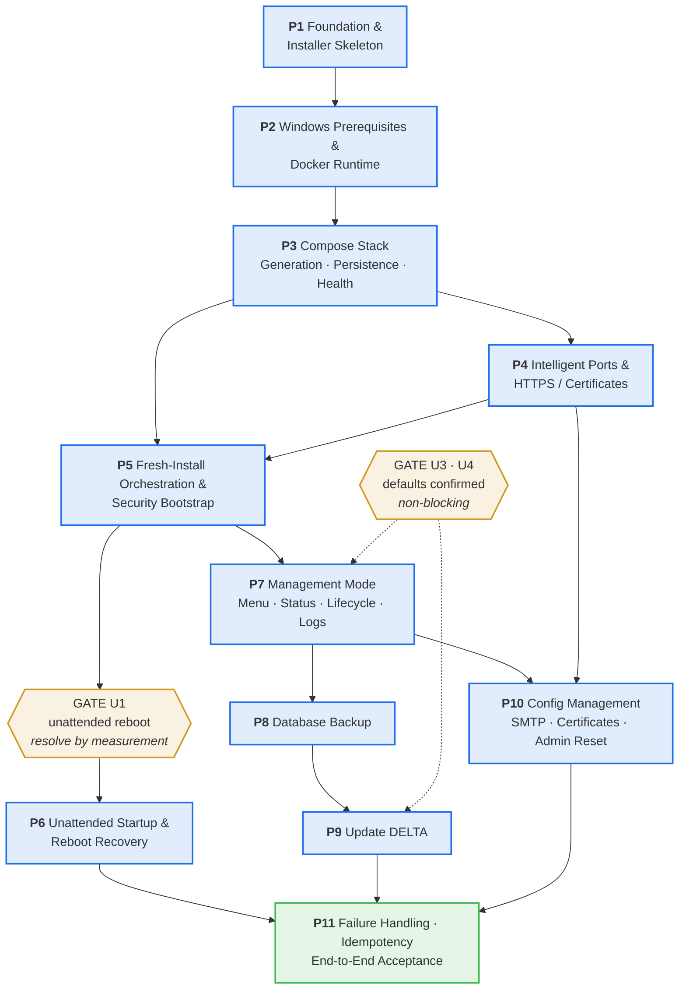

# DELTA Windows Docker Installer — Development Phasing Plan

**Status:** Implemented. Phases 1–12 are built; each phase's *Implementation status* section below records what was demonstrated, when, and by which commit. Two phases remain **PARTIAL** by design — Phase 2 (the Docker-absent install path was never executed against a real installer) and Phase 6 (no real unattended reboot has been performed). Nothing else is outstanding.
**Planning date:** 2026-08-19 · **Implementation completed:** 2026-08-21
**Companion document:** `doc\DELTA-WINDOWS-DOCKER-INSTALLER-ASSESSMENT.md` — the technical source of truth.

> **Uninstall exists as of Phase 12, and it cannot delete anything it has not first archived.** `uninstall.ps1` takes a fresh verified database dump, quiesces the stack, archives the entire installation root to `C:\DELTA-backups\DELTA-<timestamp>.zip`, verifies that archive by opening it and reading the dump back out of it — and only then removes the containers, the network, the database volume, the two scheduled tasks, the firewall rules and the installation directory. If the backup or its verification fails the run stops with the installation untouched. There is no switch that skips it. It never removes Docker Desktop, WSL, or any other shared prerequisite.
>
> This supersedes the "no uninstall workflow" statement that stood here through Phase 11, which was accurate for Phase 11: the capability was deliberately out of scope then and was added under its own contract afterwards. The assessment's one conditional mention (A§9.3, *"Uninstall — if implemented at all — must require explicit typed confirmation and must offer a final backup first"*) is a **constraint the implementation exceeds** — the confirmation is a typed `DELETE`, and the backup is mandatory rather than offered.

---

## 1. Purpose

This document turns the completed technical assessment into **eleven dependency-ordered implementation phases**. It is an execution roadmap, not a second research report.

It does not restate the architecture, re-derive verified facts, or redraw the assessment's flowcharts. Where a phase needs a technical decision, it **cites the assessment section** that already settled it. A future implementation session reads the assessment for *what and why*, and this document for *when and in what order*.

**Nothing here reopens a settled decision.** No deviation from the assessment was necessary to produce this plan — see §12.

---

## 2. Source of Truth and Inputs

| Input | Role |
|---|---|
| `doc\DELTA-WINDOWS-DOCKER-INSTALLER-ASSESSMENT.md` | **Authoritative.** Architecture, verified facts, flows, acceptance criteria. Cited throughout as *A§n*. |
| `C:\Workspace\DELTA-windows-installer` | Reference implementation. Consult for the functions named in each phase's *Existing Code to Reuse*. Never modified. |
| `C:\Workspace\DELTA-windows-installer-docker` | Target project. *(As written in 2026-08-19 this held only `doc\` and `docs\archived\`, with no code and no git repository. It is now the implemented installer — see the layout below.)* |
| ~~`docs\archived\*`~~ | Superseded prior planning. **No longer present in the repository**; the directory was not carried forward. The design lesson drawn from it survives as principle 7 in §3. |

### Verified baseline the phases must preserve

Carried forward from the assessment without change:

- `ghcr.io/preventionweb/delta-country:prod-latest` — anonymous pull, port 3000, Node 22 baked in, **runs its own DB init/migration on every container start** (A§2.1). The installer never implements migrations.
- `postgis/postgis:17-3.5` — PostgreSQL 17.5 + PostGIS 3.5.2, extensions pre-created at init (A§7).
- `nginx:1.29-alpine` — the only host-facing service. Ports 3000 and 5432 are never published (A§3, A§10).
- PGDATA on a **Docker named volume**; uploads, logs, certs, config and backups on **Windows bind mounts** under `C:\DELTA` (A§9).
- `depends_on: service_healthy` + explicit healthchecks are **mandatory**, not cosmetic (A§16.2).
- Compose restart policies alone **do not** deliver Windows reboot recovery (A§16.1).

---

## 3. Development Principles

1. **Vertical slices.** Every phase ends with behaviour that can be run, observed, or measured — not disconnected scaffolding.
2. **Evidence-based completion.** A phase is done when its acceptance gate is demonstrated, not when code exists.
3. **Reuse proven logic.** Where A§23 says *Reuse* or *Adapt*, port the named function rather than rewriting it.
4. **Carry no legacy weight.** Where A§23 says *Replace* or *Remove*, do not transplant IIS, WinSW, or native-runtime architecture.
5. **Security ships with the feature that creates the risk.** No separate hardening phase (A§24).
6. **Prefer Docker's mechanism.** Build our own only where the assessment showed Docker's is insufficient.
7. **Small installer, not a framework.** Reject speculative abstraction. The archived blueprint's failure mode was inventing subsystems; do not repeat it.

### Project layout

This was written as an *indicative* structure to be populated by the phases. It is reproduced below as the layout that actually resulted, with the differences noted — the split of configuration management into its own file, the two standalone scripts the scheduled tasks run, and the Phase 12 uninstaller.

```text
C:\Workspace\DELTA-windows-installer-docker\
├── setup.ps1                        single operator entry point (install + management)
├── uninstall.ps1                    archive-then-remove uninstall (Phase 12)
├── start-delta.ps1                  run by the Phase 6 startup task; starts Docker, prechecks, brings the stack up
├── rotate-nginx-logs.ps1            run by the Phase 7 rotation task
├── lib\
│   ├── Delta.Common.ps1             console output · transcript logging + redaction · elevation · validation
│   ├── Delta.Config.ps1             .env read/write · install-state file · secret generation · fresh-install prompts
│   ├── Delta.Docker.ps1             Windows prerequisites · Docker detect/install/validate · engine control · unattended startup · process seams
│   ├── Delta.Stack.ps1              compose + nginx generation · digest pinning · lifecycle · health · migration verification
│   ├── Delta.Network.ps1            port detection/resolution · TLS mode · certificate validation · URL construction · firewall
│   ├── Delta.Manage.ps1             management menu · status · lifecycle · logs · backup · update · administrator reset primitive
│   ├── Delta.Configure.ps1          configuration management: SMTP · administrator reset entry · certificate replacement
│   └── Delta.Uninstall.ps1          ownership resolution · the backup safety gate · archive + verification · removal primitives
├── templates\
│   ├── docker-compose.yml.template
│   ├── env.template
│   └── nginx\delta.conf.template
└── doc\
    ├── DELTA-WINDOWS-DOCKER-INSTALLER-ASSESSMENT.md
    └── DELTA-WINDOWS-DOCKER-INSTALLER-PHASES.md
```

`uninstall.ps1` was added by Phase 12; through Phase 11 there was deliberately none. There is no `docs\` directory and no `CHANGELOG.md`; the per-phase implementation-status sections in this document are the change record.

`Delta.Manage.ps1` will grow across Phases 7–10. Split it when it does — the natural seams are backup, update, and configuration management.

---

## 4. Architecture Baseline

Unchanged from A§3 and A§4. Restated only as a phasing reference:

```text
Windows host
  └── Docker Desktop (WSL2 backend)
        └── compose project "delta"
              ├── nginx   ${HTTP_PORT}:80, ${HTTPS_PORT}:443   ← only published ports
              ├── delta   :3000  (internal)   ← migrates its own schema on start
              └── db      :5432  (internal)   ← named volume delta_pgdata
```

`C:\DELTA\` holds `.env`, `docker-compose.yml`, `.delta-install.json`, `nginx\`, `certs\`, `uploads\`, `logs\`, `backups\`.

---

## 5. Unresolved Decision Gates

The assessment left five open items (A§26). **U2 has since been resolved and is no longer a gate** — the PGDATA storage design is approved and Phase 3 may begin without a decision step. The remaining four are bound to the earliest phase each actually affects; none blocks Phase 1.

| ID | Question | Gate at | Must resolve **before** the phase? | Assessment default | Class |
|---|---|---|---|---|---|
| ~~**U2**~~ | ~~Named volume vs bind mount for PGDATA~~ | — | **✅ RESOLVED 2026-08-19 — no longer a gate** | **Approved: named volume `delta_pgdata`** for raw PGDATA; bind mounts for operator-managed files; `pg_dump` to `C:\DELTA\backups\` is the portable recovery artefact (A§9.2, A§26 U2) | Settled |
| **U1** | Does Docker start unattended after reboot on each target OS? | **Phase 6** | **No** — resolve *during* the phase by measurement | Configure all vendor mechanisms, measure, add scheduled task only if needed (A§16.3). **Measured 2026-08-19 on Server 2025: Layer 1 insufficient — no Docker service exists and every present mechanism fires at sign-in. Layer 3 configured as an S4U scheduled task running as the installing user (not SYSTEM — see Phase 6 status). Awaiting the real reboot test.** | Could alter architecture |
| **U3** | Does a failed pre-update backup abort the update? | **Phase 9** | No | **Abort unconditionally**, no override (A§26 U3) | Implementation-time |
| **U4** | NGINX access-log rotation | **Phase 7** | No | Scheduled trim: rename + `nginx -s reopen`, keep 7 (A§26 U4) | Implementation-time |
| **U5** | Server 2022 / Windows 11 parity | **Phase 11** (continuous from Phase 3) | No | Server 2025 is the reference; exercise the others continuously (A§26 U5) | Validation/parity |

**Gate rules.** **No gate now halts a phase from starting.** U2 — previously the only such gate — is resolved, so Phase 3 begins directly and implements the approved named-volume design. U1 is a gate *within* Phase 6: the phase cannot pass its acceptance without a real reboot measurement. U3, U4 and U5 are decided by implementing the recommended default and recording the outcome; they never block.

---

## 6. Phase Overview

| # | Phase | Goal | Depends on | Primary deliverable | Acceptance gate |
|---|---|---|---|---|---|
| **1** | Foundation & Installer Skeleton | `setup.ps1` runs, detects state, logs safely | — | `setup.ps1`, `Delta.Common.ps1`, `Delta.Config.ps1` | Runs elevated on a clean host, reports `state=none`, writes a redacted transcript, exits 0 |
| **2** | Windows Prerequisites & Docker Runtime | Installer can guarantee a working Linux-container engine | 1 | `Delta.Docker.ps1` | On a Docker host: all checks green. On one without: correct branch, caveats disclosed, silent install attempted |
| **3** | Compose Stack: Generation, Persistence, Health | The full stack runs from generated artefacts | 2 | `templates\*`, `Delta.Stack.ps1` | `docker compose config` validates; stack starts db→delta→nginx; `GET /` = 200; data survives `down`+`up` |
| **4** | Intelligent Ports & HTTPS / Certificates | Ports and TLS resolve per the A§14 contract | 3 | `Delta.Network.ps1`, nginx TLS template | Free 80/443 adopted **silently**; occupied ports identify owner and prompt; `nginx -t` gates every write; HTTPS 200 on a non-standard port |
| **5** | Fresh-Install Orchestration & Security Bootstrap | One command installs DELTA end to end, securely | 3, 4 | `setup.ps1` install flow, admin-reset primitive | Clean host → reachable DELTA; default admin reset **before** ports publish; per-install `SESSION_SECRET`; rerun destroys nothing |
| **6** | Unattended Startup & Reboot Recovery | DELTA returns after a Windows reboot | 5 | startup mechanism + `start-delta.ps1` | **Real reboot with no interactive sign-in → DELTA reachable**; configured mechanism recorded and reported |
| **7** | Management Mode: Menu, Status, Lifecycle, Logs | `setup.ps1` becomes the management utility | 5 | `Delta.Manage.ps1` | Rerun opens the menu; status is accurate; Stop/Restart/Start work; all five log views tail; **Ctrl+C leaves containers running** |
| **8** | Database Backup | A verified, restorable dump exists | 7 | backup operation | `pg_dump` from the **db** container produces a file `pg_restore --list` parses; restore yields a working PostGIS database |
| **9** | Update DELTA | Safe, digest-aware application updates | 8 | update operation | Unchanged digest → "already current", **no pull**; changed digest → backup, pull, recreate, migration verified, healthy |
| **10** | Configuration Management: SMTP, Certificates, Admin Reset | Remaining mutating menu operations | 7, 4, 5 | SMTP / cert / admin menu entries | SMTP applied by **recreation** and takes effect; cert replacement validated then reloaded; admin reset authenticates |
| **10.5** | Fresh Install User-Flow Audit & Convenience Adjustments | A first-time administrator can install DELTA without preparing files or knowing Docker | 10 | up-front settings prompt | Hostname asked with `localhost` default; both credentials asked securely; ports silent unless genuinely occupied; SMTP not required to install |
| **11** | Failure Handling, Idempotency & End-to-End Acceptance | The product meets A§27 in full | 6, 9, 10, 10.5 | failure taxonomy, regression pass | Every A§22 scenario produces its specified diagnostic; full A§27 checklist demonstrated on a clean host |
| **12** | DELTA Uninstall & Removal | DELTA can be removed, and the deletion path is unreachable without a verified external archive | 11 | `uninstall.ps1`, `Delta.Uninstall.ps1` | A fresh verified dump and a verified ZIP under `C:\DELTA-backups` exist before anything is removed; a failed backup leaves the installation untouched; `Test-Path <InstallRoot>` is false afterwards; no unrelated resource is touched |

> **Phase 10.5 was inserted deliberately after Phase 10 was complete and before Phase 11 began.** It is not a redefinition of Phase 11, whose scope below is unchanged. It exists because the first nine phases built the install flow from the *inside out* — each phase proving its own mechanism — and nobody had yet walked the whole thing as an administrator meeting DELTA for the first time. That audit found gaps that are invisible from the component tests (§ Phase 10.5).

---

## 7. Phase Dependency Map



**The three sequencing decisions worth calling out:**

- **Phase 3 before Phase 4.** The assessment's *runtime* dependency is ports → configuration generation (A§25). The *implementation* dependency is the reverse: the Compose template consumes `${HTTP_PORT}` from `.env`, so the stack can be built and proven with default values first, and Phase 4 then supplies the logic that populates them. This ordering also lets Phase 4 test its hardest branch — "is the port's owner our own stack?" (A§10.2) — against a genuinely running project, which is impossible before Phase 3.
- **Phase 8 before Phase 9, without exception.** Migrations are forward-only (A§2.1), so a restore is the *only* rollback path an update has. This is A§25's hard constraint 1.
- **Phase 6 branches off Phase 5, not off the management chain.** Reboot recovery needs a complete installation to test but nothing from the menu. Running it in parallel with Phase 7 is legitimate; it is drawn as a branch for that reason.

---

## 8. Detailed Phase Specifications

---

### Phase 1 — Foundation & Installer Skeleton

**Goal.** `.\setup.ps1` runs on a clean Windows host, verifies elevation, detects that no DELTA installation exists, writes a redacted transcript, and exits cleanly. The configuration and state primitives every later phase depends on exist and are tested.

**Why this phase exists here.** Every later phase reads and writes `.env` and the install-state file, and every later phase logs. Building these once, correctly — especially secret redaction — prevents each subsequent phase from inventing its own.

**Scope**
- Initialise the git repository and `.gitignore` (exclude `*.env`, `certs\`, transcripts, any local test artefacts).
- `setup.ps1` entry point: `#Requires -Version 5.1`, elevation check, top-level try/catch, defined exit codes.
- `Delta.Common.ps1` — console output helpers, transcript logging with **secret redaction**, path and numeric input validation.
- `Delta.Config.ps1` — `.env` read **and write**, `.delta-install.json` read/write, CSPRNG secret generation.
- Installation-state detection per A§28: `none` / `partial` / `installed` / `installed-stopped` / `docker-unavailable`, derived from evidence with the state file as a cache, never the sole authority.

**Explicit non-scope.** No Docker interaction. No prerequisite checks. No Compose artefacts. No menu. State detection returns the correct classification but nothing acts on it yet.

**Expected components.** `setup.ps1`, `lib\Delta.Common.ps1`, `lib\Delta.Config.ps1`, `.gitignore`.

**Existing code to reuse** (`C:\Workspace\DELTA-windows-installer`)

| Function | Location | Use |
|---|---|---|
| `Write-Step`, `Write-Detail`, `Write-Success` | `lib\DeltaInstaller.Common.ps1:107,112,117` | Console output — reuse as-is (A§23) |
| `Show-Section` | `lib\DeltaInstaller.Common.ps1:1233` | Section headers |
| `Get-EnvFileValue` | `lib\DeltaInstaller.Common.ps1:1715` | `.env` reading |
| `New-DeltaRandomPassword` | `lib\DeltaInstaller.Common.ps1:3243` | CSPRNG generation (`RNGCryptoServiceProvider`) |
| `ConvertTo-PlainText` | `lib\DeltaInstaller.Common.ps1:2124` | `SecureString` handling |
| `Get-DeltaInstallPath` | `lib\DeltaInstaller.Common.ps1:716` | Evidence-based install discovery — adapt the *principle*, replace the signatures |

Note: the reference installer has **no `Set-EnvFileValue`**. The writer is new code. It must preserve comments and key order on rewrite so an operator's hand edits survive.

**Implementation requirements**
- Redaction is a property of the logger, not of call sites. Redact `POSTGRES_PASSWORD`, `DELTA_DB_PASSWORD`, `SESSION_SECRET`, `SMTP_PASS`, admin passwords, and **`DATABASE_URL`** — which embeds the password and is the one that gets forgotten (A§24).
- `.env` writes are atomic (temp file + move) and re-apply the restrictive ACL after every write.
- The state model matches A§28's table exactly. Do not invent additional states.
- `.env` values already present are always the defaults on a rerun. **Secrets are generated once and never regenerated** (A§28).

**Failure behaviour.** Not elevated → explain and exit non-zero. Unwritable install root → name the path and the reason. Malformed `.env` or state file → report which key or field, do not silently rewrite.

**Validation**
```powershell
.\setup.ps1                       # non-elevated → clear refusal, non-zero exit
.\setup.ps1                       # elevated, clean host → "no installation detected", exit 0
# seed a fake C:\DELTA with a partial .env → reports "partial", lists what exists
Select-String -Path .\logs\installer\*.log -Pattern 'SESSION_SECRET|PASSWORD|postgresql://'   # must return nothing
```

**Acceptance gate.** Runs elevated on a clean host and reports `state=none`. Round-trips `.env` and `.delta-install.json` without data loss. **A transcript containing a deliberately seeded secret shows the redacted form.** Repository initialised with a first commit.

**Dependencies for next phase.** Later phases may assume: console helpers, a redacting logger, `.env` read/write, state read/write, and state classification all exist and are tested.

**Documentation update.** None. The assessment already covers this ground.

#### Implementation status

**Status: COMPLETE** · Completed 2026-08-19 · Commit `c075b52` · **Acceptance gate: PASS**

Delivered: `setup.ps1`, `lib\Delta.Common.ps1`, `lib\Delta.Config.ps1`, `.gitignore`.

**Implementation notes**

- **Logging is a purpose-written redacting log, not `Start-Transcript`.** A PowerShell transcript captures raw console output and cannot be redacted, which A§24 forbids. Console output is *not* redacted (Phase 5 must show a generated password exactly once); the log file always is.
- **Redaction replaces the whole match, key name included, and treats a bare key name as a match.** Two reasons: the acceptance grep forbids the key names themselves, and a `.env` line malformed enough to lose its `=` still carries a real secret on the right-hand side. Covers the keys A§24/Phase 1 name plus `PGPASSWORD`, any `postgres(ql)://` URI, and any literal registered through `Register-DeltaSecretValue` — which is how output the installer did not format itself gets covered in later phases.
- **Phase 1 writes nothing under the installation root**, including its transcript, which goes to `<script root>\logs\installer\`. `Start-DeltaLog -Directory` takes the location as a parameter, so A§21.1's `C:\DELTA\logs\installer\` becomes the default once Phase 3 owns creating the root.
- **`Get-DeltaInstallationState` performs no Docker interaction.** It classifies `none` / `partial` / `installed` from filesystem evidence and takes the two Docker-dependent classifications from an optional `-DockerStatus` (`unknown` | `unavailable` | `running` | `stopped`) supplied by the caller; `installed-stopped` and `docker-unavailable` are reachable only over an otherwise-`installed` installation. A§28's *installed-running*, *installed-unhealthy* and *data-missing* rows additionally need container-health and volume evidence and belong to Phases 3 and 7.
- **`.env` writer** (new code — the reference installer has none): existing keys updated in place with their inline comments, untouched and unparseable lines kept verbatim, new keys appended, atomic replace, UTF-8 **without** BOM, existing newline style preserved, restrictive ACL re-applied after every write. A value containing both a single and a double quote is refused rather than escaped — `.env` has no escaping convention both PowerShell and Compose's parser honour, and a silently mangled password is worse than a refusal.
- **`New-DeltaPassword` uses a `[A-Za-z0-9]` alphabet** (CSPRNG, rejection-sampled). `POSTGRES_PASSWORD` ends up inside `DATABASE_URL`, so a URL-safe alphabet removes a whole class of percent-encoding defect before Phase 3 assembles that string. `New-DeltaSecret` (base64, 48 bytes) is for `SESSION_SECRET`.
- **Every `.ps1` is stored UTF-8 *with* BOM.** Windows PowerShell 5.1 decodes a BOM-less script as the ANSI code page, which turned `§` in an operator-facing message into mojibake at run time. Operator-visible strings are plain ASCII as well. `.env` and `.delta-install.json` remain BOM-less — Compose would otherwise read the BOM as part of the first key.
- `setup.ps1` takes an `-InstallRoot` parameter (default `C:\DELTA`) so the `none` classification is exercisable on a host whose `C:\DELTA` is already occupied.

**Validation observations**

- 101 primitive assertions on Windows PowerShell 5.1 — `.env` round-trip (comments, key order, inline comments, quoting, newline style, no BOM, ACL), `.delta-install.json` round-trip (merge, invalid value refused, malformed/missing-field/future-schema all reported by field and never rewritten), secret generation, redaction including `DATABASE_URL`, all five Phase 1 states, path and port validation — **all pass**.
- `setup.ps1`: elevated + absent root → `state=none`, exit 0; seeded partial root → `state=partial` with an evidence list, exit 0; non-elevated (`runas /trustlevel:0x20000`) → refusal, exit 2; UNC root → refusal naming the constraint, exit 3.
- `Select-String -Path .\logs\installer\*.log -Pattern 'SESSION_SECRET|PASSWORD|postgresql://'` returns **nothing** across every transcript, including a run whose `.env` carried a deliberately seeded malformed `SESSION_SECRET` line — which appears in the transcript as `<redacted>`.

**For Phase 2 and later**

- The assessment host already carries an unrelated **native** DELTA installation at `C:\DELTA` (`build\`, `node_modules\`, `service\`, its own `.env`). Against the default root the classifier correctly reports `partial`. Later phases must not assume `C:\DELTA` is empty, and must not assume a populated `C:\DELTA` is theirs.

---

### Phase 2 — Windows Prerequisites & Docker Runtime

**Goal.** The installer can determine whether the host can run Linux containers, disclose the caveats it is obliged to disclose, install Docker Desktop silently when absent, and validate that the engine is reachable and in Linux mode.

**Why this phase exists here.** Everything from Phase 3 onward issues `docker` commands. This phase is the guarantee that those commands will work, and it is the last phase that can run on a host with no Docker at all.

**Scope**
- Prerequisite checks per A§5.4: edition, build, `ProductType`, elevation, `HypervisorPresent`, WSL2, disk space.
- Caveat disclosure: **C1** server-SKU support notice, **C2** licensing confirmation before `--accept-license` (A§5.6).
- Silent install: `"Docker Desktop Installer.exe" install --quiet --accept-license --backend=wsl-2 --always-run-service`.
- Reboot-required handling: detect, instruct, exit cleanly so the operator reruns after restart.
- Validation and recovery: `docker info`, `docker desktop start --timeout 300`, `docker desktop engine use linux`, `docker compose version`.

**Explicit non-scope.** No `C:\DELTA` creation. No Compose artefacts. No image pulls. **No unattended-reboot work — that is Phase 6.** No WSL distribution creation, ever (A§5.2).

**Expected components.** `lib\Delta.Docker.ps1`; `setup.ps1` gains the prerequisite/runtime stage.

**Existing code to reuse.** Elevation and prerequisite patterns from the reference installer (A§23 *Reuse*). Everything Docker-specific is new — the reference installer's Node/PostgreSQL/PostGIS/NGINX/WinSW installation logic is *Replace* or *Remove* and must not be adapted.

**Implementation requirements**
- **Detect WSL with `wsl.exe --status` / `--version`, never with `Get-WindowsOptionalFeature`** — the latter reports *Disabled* on hosts where WSL is installed and healthy (A§5.3, verified).
- **Set `$env:WSL_UTF8 = 1` before every `wsl.exe` call**, or PowerShell 5.1 mangles the UTF-16LE output into something unparseable (A§5.3, verified).
- Caveat acknowledgements are recorded in `.delta-install.json`. `--accept-license` is passed **only** after explicit operator confirmation.
- Never refuse to install on a server SKU. Disclosure is the obligation; the decision is the operator's (A§5.6 C1).
- Distinguish "Docker absent" from "Docker present, engine down" from "Docker present, wrong engine mode" — each has a different, non-destructive recovery.

**Failure behaviour.** Per A§22: virtualization unavailable → explain the firmware change, stop. WSL missing → offer `wsl --install`, require reboot. Installer non-zero exit → report the code **and Docker's own log path**, do not retry blindly. Engine unreachable after `docker desktop start` → report `docker info` verbatim.

**Validation**
```powershell
docker version; docker info --format '{{.OSType}}'   # must be "linux"
docker compose version                                # v2+
wsl.exe --version                                     # with WSL_UTF8=1
# On a VM without Docker: confirm the install branch runs and the reboot path exits cleanly
```

**Acceptance gate.** On a host with Docker: every check reports green and the phase proceeds. On a host without: the licensing prompt appears, the silent install is attempted, and a reboot requirement exits cleanly with instructions. Server-SKU caveat is displayed and its acknowledgement is persisted.

**Dependencies for next phase.** Later phases may assume a reachable Docker engine in Linux-container mode with Compose v2 available.

**Documentation update.** Record in `.delta-install.json` which backend was selected. No document changes.

#### Implementation status

**Status: PARTIAL** · 2026-08-19 · Commit `8497fa0` · **Acceptance gate: Docker-present half PASS (measured on Server 2025); Docker-absent half implemented and seam-tested but never executed against a real installer.**

Delivered: `lib\Delta.Docker.ps1`; `setup.ps1` runtime stage; `Read-DeltaYesNoConfirmation` and exit codes 4/5/6 in `lib\Delta.Common.ps1`; `installers\` ignored by git.

**Implementation notes**

- **`HypervisorPresent` is checked before the processor flags, and is conclusive.** On a host that is already virtualizing, Windows is itself a guest and `Win32_Processor` reports `VirtualizationFirmwareEnabled` and `SecondLevelAddressTranslationExtensions` as **False** — measured on this host, which runs Docker happily. Reading the processor flags first would block a working host. The firmware flags and the `systeminfo` cross-check only apply when no hypervisor is running.
- **`wsl --install` always carries `--no-distribution`.** A bare `wsl --install` also installs Ubuntu and leaves the operator owning a Linux distribution, which A§5.2 says this product never does. Asserted by a test.
- **WSL detection is version-first and localisation-safe.** `wsl --version` (with `WSL_UTF8=1`) decides ready/outdated/absent; the `Default Version` line from `--status` is parsed permissively and used only for display, because it is localised and gating on it would fail a healthy non-English host.
- **C1 is disclosed on every server-SKU run but only *prompts* when Docker is about to be installed**, mirroring A§5.6's explicit treatment of C2 ("already present → log it, do not prompt"). This keeps reruns non-interactive. C2 prompts only on the install path, and `--accept-license` is passed only when it returned yes.
- **Caveat/backend persistence is conditional, because Phase 2 must not create `C:\DELTA`.** `Save-DeltaRuntimeFacts` writes `.delta-install.json` only when the root already exists **and** is either empty or already holds a valid installer state file; a populated root that is not ours is left untouched (this host's `C:\DELTA` is an unrelated *native* DELTA install). When deferred, the facts are returned on the stage result as `PendingFacts` — **Phase 3 must persist them when it creates the root.** A§13 has the same ordering wrinkle: it discloses caveats before the "create root" stage.
- **Argument quoting quotes shell metacharacters, not just whitespace.** `.NET Framework` has no `ProcessStartInfo.ArgumentList`, so the command line is built by hand; a `docker` that is a `.cmd`/`.bat` shim is launched through `cmd.exe`, which ate the `|` in `--format '{{.OSType}}|…'` during validation. Real `docker.exe` is unaffected either way.
- **Backend is detected from `docker info`'s kernel string** (`…-microsoft-standard-WSL2` → `wsl-2`), which needs no settings file to be readable, and is recorded as `dockerBackend`.
- **Installer acquisition:** `-DockerInstallerPath`, else `installers\Docker Desktop Installer.exe` beside `setup.ps1`, else Docker's documented URL — the download only with `-AllowDockerDownload` and only after C2.
- Exit codes: `4` prerequisite/Docker unusable, `5` restart required (rerun afterwards), `6` operator declined a disclosure.

**Validation observations**

- **Physically executed on this host (Server 2025, build 26100, Docker Desktop 4.85 / engine 29.6.2 / Compose 5.3.1):** every prerequisite check green; docker CLI detected; engine reachable; `OSType = linux`; backend `wsl-2`; Compose v5.3.1 accepted; WSL reported `ready 2.7.11, default version 2`; C1 disclosed and `caveatsAcknowledged.serverSku` + `dockerBackend` persisted; stage exits 0. Container/image/network/WSL-distribution/context snapshots taken before and after are **identical** — the stage runs only read-only Docker commands on this path.
- **Exercised end to end through a stub `docker` shim on PATH** (no host change): engine-down → `docker desktop start` attempted → still down → error reported verbatim → exit **4**; and over a seeded registered installation the same run re-reports `state = docker-unavailable`, filling the A§28 seam Phase 1 built.
- **Exercised through controlled function seams** (99 assertions, all pass): unsupported/32-bit/untested Windows builds; virtualization unavailable; disk floor and warning; WSL absent / outdated / localised / missing-`--version`; `cli-absent`, `engine-down`, `wrong-mode`, timeout and unclassified engine errors; Compose v1 and missing plugin; installer exit 0 / 3010 / non-zero; the exact documented install arguments; `--accept-license` withheld without confirmation; declined C1/C2; WSL-install branch; installer-not-found branch.
- **Not executed:** a real Docker Desktop silent install, a real `wsl --install`, and the reboot-and-rerun cycle. All three need a host without Docker (or without WSL) — this development host has both and must not be destabilised. This is what keeps the phase PARTIAL.

**For Phase 3**

- The stage returns `Outcome` (`ready` | `reboot-required` | `blocked` | `declined`), the Windows facts, the engine state (including `Backend`), the Compose state, and `PendingFacts` — which Phase 3 should write into `.delta-install.json` at the moment it creates the installation root.
- This host runs **unrelated Docker workloads** (containers `deltaprobe-*`, `apc-2026`; networks `deltaprobe_default`, `proxy`; images including `ghcr.io/preventionweb/delta-country:prod-latest` and `postgis/postgis:17-3.5` already pulled). Phase 3 must scope everything to its own Compose project name and must never prune, reset, or operate on resources it did not create.

---

### Phase 3 — Compose Stack: Generation, Persistence, Health

> **U2 resolved 2026-08-19 — no decision gate remains.** PGDATA uses the Docker-managed named volume **`delta_pgdata`** (approved; A§9.2, A§26 U2). Windows bind mounts carry the operator-managed files. `pg_dump` logical backups under `C:\DELTA\backups\` are the portable recovery artefact — raw PGDATA is never treated as one. Implement this directly; do not re-evaluate it.

**Goal.** The installer generates `.env`, `docker-compose.yml` and the NGINX configuration from templates, pulls and digest-pins the images, and brings the stack up in the correct order with working health gating. DELTA answers HTTP 200 through NGINX, and the data survives a full `down`/`up`.

**Why this phase exists here.** This is the project's centre of gravity. Everything after it — install orchestration, reboot recovery, management, backup, update — operates on a running stack. It is also where the persistence model becomes concrete and therefore expensive to change.

**Scope**
- `templates\env.template`, `templates\docker-compose.yml.template`, `templates\nginx\delta.conf.template`.
- Configuration generation: CSPRNG `POSTGRES_PASSWORD` and `SESSION_SECRET`, `DATABASE_URL` assembly, `POSTGRES_USER`/`POSTGRES_DB`, `LOG_DIR=/delta/logs`, `NODE_ENV=production`.
- Persistence: named volume `delta_pgdata` → `/var/lib/postgresql/data`; bind mounts for `uploads\`, `logs\delta\`, `logs\nginx\`, `nginx\conf.d\`, `certs\`.
- Image pull and **digest pinning** of all three images into `.env` and `.delta-install.json`.
- Healthchecks: `pg_isready` (db), Node `fetch` probe (delta), BusyBox `wget` (nginx). `depends_on: db { condition: service_healthy }`.
- Ordered startup `db` → `delta` → `nginx`, each gated on health.
- **Migration verification** — log scan plus `dts_system_info.version_no` (A§2.1).
- **Persistent-data precheck** before any `up` on a registered installation (A§9.4).
- Compose `logging:` caps (`max-size: 20m`, `max-file: 5`).

**Explicit non-scope.** **No port conflict detection** — the template consumes `${HTTP_PORT}`/`${HTTPS_PORT}` and Phase 3 writes the defaults 80/443. **No TLS** — HTTP only; the HTTPS server block arrives in Phase 4. No admin reset. No firewall rules. No menu. No update or backup.

**Expected components.** `templates\` (three files), `lib\Delta.Stack.ps1`.

**Existing code to reuse.** NGINX templates at `templates\nginx\` — **retain the proxy headers verbatim** (`Host`, `X-Real-IP`, `X-Forwarded-For`, `X-Forwarded-Proto`, `X-Forwarded-Host`, `X-Forwarded-Port`, `proxy_http_version 1.1`) because the application reads them, and apply the three corrections in A§8.2. `New-DatabaseUrl` / `ConvertFrom-DatabaseUrl` (`lib\DeltaInstaller.Common.ps1:3314,3349`) for `DATABASE_URL` assembly.

**Implementation requirements**
- **Never override the DELTA container's `CMD`** — it *is* the migration mechanism (A§2.1).
- **Never** place DELTA schema SQL in `docker-entrypoint-initdb.d`, and never create objects in `public` before first start; either breaks the image's `is_new_database` heuristic (A§2.1).
- The DELTA healthcheck must use Node's global `fetch` — the image has **no `curl` and no `wget`** (A§2.1, verified). `start_period: 180s`: cold first init runs ~90 s, warm start ~13 s.
- Bind mounts are expressed **relative to the compose file** (`./uploads`, `./nginx`), never as absolute Windows paths.
- `client_max_body_size 64m` in the NGINX template — the app accepts 10 MB uploads and 50 MB on one path, against NGINX's 1 MB default (A§8.2).
- NGINX logging split: **`error_log` to stderr, `access_log` to the bind-mounted file** (A§8.4, D3). Bind-mounting `/var/log/nginx` replaces the image's stdout symlinks — verified.
- **Migration success is verified actively.** The image's `psql` has no `ON_ERROR_STOP`, so a failed migration exits 0 and the app still starts (A§2.1). Container health is not evidence.
- **No code path may ever issue `docker compose down -v`** (A§9.3). Enforce this by review; it is the one command that destroys the database.
- `.env` ACL restricted to `Administrators` + `SYSTEM`, inheritance disabled (A§24) — the risk is created here, so the mitigation ships here.

**Failure behaviour.** Pull failure → classify DNS / proxy / TLS interception / 401-403 / disk-full; GHCR is anonymous, so a 401 almost certainly means an intercepting proxy — say so (A§22). `db` unhealthy → surface `docker compose logs db`, distinguish init from auth from storage failure, and **never** suggest deleting the volume. **Migration failure → STOP**; do not proceed to a reachable stack on a half-migrated schema. Data missing on a registered install → **STOP**, never `up`.

**Validation**
```powershell
docker compose config                                   # template renders and validates
docker compose up -d db;  docker compose ps             # healthy within 120s
docker compose exec -T db psql -U delta -d delta -c "select version(); select postgis_full_version();"
docker compose exec -T db psql -U delta -d delta -c "select extname from pg_extension order by 1;"
docker compose up -d
curl.exe -s -o NUL -w "%{http_code}" http://localhost/   # 200
docker compose exec -T db psql -U delta -d delta -tAc "select version_no from dts_system_info;"   # 0.2.3
docker compose down; docker compose up -d               # data intact; log shows the upgrade branch
```

**Acceptance gate.** `docker compose config` validates. Stack starts in order with all three healthy. PostgreSQL reports 17.x, PostGIS 3.5.x, and `postgis` + `pgcrypto` are present. DELTA creates 39 tables and `dts_system_info.version_no` reads `0.2.3`. `GET /` returns 200 through NGINX. After `down` + `up`, data is intact and the log shows *"Applying upgrade migrations"*. Migration verification detects an **injected** `psql` failure that leaves the container "healthy".

**Dependencies for next phase.** Later phases may assume a running, health-gated stack; generated artefacts reproducible from `.env` + templates; digest-pinned images; and a working persistent-data precheck.

**Documentation update.** None — A§3, A§7, A§8, A§9 already specify this. Record resolved digests in `.delta-install.json`.

#### Implementation status

**Status: COMPLETE** · 2026-08-19 · Commit `db404e9` · **Acceptance gate: PASS** (every criterion demonstrated physically on Server 2025 / Docker 29.6.2 / Compose 5.3.1)

Delivered: `templates\env.template`, `templates\docker-compose.yml.template`, `templates\nginx\delta.conf.template`, `lib\Delta.Stack.ps1`; `setup.ps1` stack stage with exit codes 7/8; `Test-DeltaInstallRootOwned` in `lib\Delta.Config.ps1`.

**Implementation notes**

- **The installer refuses to adopt a directory it did not create.** `Test-DeltaInstallRootOwned` accepts only a root that is absent, empty, or already holds a valid `.delta-install.json`. Phase 2's fact writer now shares it. Verified against this host's unrelated **native** `C:\DELTA`: the run stops with exit 7 and that directory is byte-for-byte unchanged.
- **`schemaVersion` in the state file is reserved for the file format.** Phase 3 first wrote the *database* schema version into it, which made the state file unreadable and would have made the installer refuse its own root on the next run. Fixed at both ends: the fact is now `deltaSchemaVersion`, and `Write-DeltaInstallState` rejects a caller-supplied `schemaVersion`.
- **Template/artefact split.** Templates are tracked; `.env`, `docker-compose.yml` and `nginx\conf.d\delta.conf` are generated per installation and gitignored. The compose template needs no installer-side substitution — everything that varies is a `${VAR}` Compose interpolates from `.env`, which is what makes the generated file reproducible from `.env` + template.
- **`.env` generation preserves everything it does not own**: comments, ordering and hand edits survive, `__GENERATE__` placeholders are filled once, and secrets are never regenerated. The previous `.env` is backed up (ACL-hardened) before each rewrite.
- **The volume is named explicitly** (`name: ${PGDATA_VOLUME}`, default `delta_pgdata`) rather than taking Compose's project prefix, so the volume in `docker volume ls` is the one recorded in `.delta-install.json`. It also gives an isolated test installation a way to use its own volume without editing templates.
- **Every Compose call carries `--project-name`, `--project-directory`, `--file` and `--env-file`.** On a host running other Compose projects that scoping is what makes the operations safe; nothing in this phase can reach another project's resources.
- **Migration verification requires three independent things**: a branch message in the log, no `psql:`/`ERROR:`/`FATAL:` lines, and a readable `dts_system_info.version_no`. Container health is explicitly not accepted as evidence.
- **Persistent-data precheck fires on evidence, not on `state = installed`** — it triggers as soon as `.delta-install.json` records a `pgDataVolume`, which is the point from which data can go missing.
- `-HttpPort` is a plain override for standing an isolated installation up on a busy host. The template default stays 80; intelligent resolution is Phase 4's.
- NGINX: `error_log /dev/stderr` at http level plus `access_log` to the bind-mounted file; `client_max_body_size 64m`; `proxy_pass http://delta:3000`; the reference installer's proxy headers verbatim plus `X-Real-IP` and `proxy_read_timeout 300s`; `server_name _` until Phase 4 supplies a hostname.

**Validation observations** (all physical unless marked)

- Clean install on `C:\DELTA-docker-test` (port 18080): `docker compose config` validates; db healthy in **7 s**, delta in **13 s**, nginx in **7 s**; `GET /` = **200**, and `/en/admin/login`, `/en/user/login`, `/admin/login` all 200.
- **PostgreSQL 17.5, PostGIS 3.5.2**; extensions after the schema load: `fuzzystrmatch, pgcrypto, plpgsql, postgis, postgis_tiger_geocoder, postgis_topology`. **39 tables** in `public`, `dts_system_info.version_no = 0.2.3`, DELTA's own `division.geom` / `division.bbox` geometry columns present.
- Published ports on **nginx only** (`0.0.0.0:18080->80`); db and delta expose 5432/3000 internally with no host binding. Images pinned: DELTA to `@sha256:aa180b0d…`, db and nginx digests recorded in state.
- **Persistence:** a marker row in a separate schema and a file in `uploads\` both survived `docker compose down` (no `-v`) followed by a full rerun; `delta_pgdata` persisted; the rerun took the **upgrade** branch, as the gate requires.
- **Rerun idempotency:** third consecutive run on the live stack recreated nothing (all services stayed up), regenerated the artefacts, kept all four secret values byte-identical, and still returned 200.
- **Injected migration failure** (isolated project `delta-inject`, own volume, removed afterwards): two tables created in `public` before first start pushed a virgin database down the upgrade path. The container reported **healthy in 7 s** while `psql` emitted 10 error lines; verification caught it, printed the errors verbatim, **did not start NGINX**, and exited **8**.
- **Empty-data trap:** a root whose state file names a volume that does not exist stops before pulling or starting anything, exit 7, no containers created.
- **Unrelated resources unchanged:** containers `deltaprobe-*` and `apc-2026`, networks `deltaprobe_default`/`proxy`, all images, WSL distributions and the Docker context are identical to the pre-Phase-3 snapshot. Only `delta_default`, `delta_pgdata` and the three `delta-*` containers were added.
- Phase 1 (101) and Phase 2 (99) suites still pass. No secret value appears in any transcript; the fresh transcript has zero matches for `SESSION_SECRET|PASSWORD|postgresql://`.

**For Phase 4**

- A **running `delta` project is intentionally left up** on `C:\DELTA-docker-test`, publishing **18080**, with volume `delta_pgdata` — Phase 4 needs a live project to test its hardest branch, "the port's owner is our own stack".
- `HTTP_PORT` is already persisted in `.env` and `httpPort`/`tlsEnabled` in `.delta-install.json`; Phase 4 replaces the two-line `PUBLIC_URL` construction in `New-DeltaEnvironmentFile` with its single shared URL helper, and adds the HTTPS port mapping to the compose template and the TLS block to the NGINX template.
- The default administrator has **not** been reset — the stack must not be exposed beyond this machine until Phase 5 does that.

---

### Phase 4 — Intelligent Ports & HTTPS / Certificates

**Goal.** Host ports and TLS resolve exactly as the A§14 flowchart specifies: free 80 and 443 are adopted **without asking**, conflicts identify their owner and prompt, alternatives are validated in a loop, selections persist, and every generated NGINX configuration passes `nginx -t` before it goes live.

**Why this phase exists here.** It needs a real running Compose project to test its hardest branch — recognising that a "conflict" on `HTTP_PORT` is DELTA's own published port (A§10.2). That branch does not exist in the reference installer and is the one that would otherwise make every rerun report a false conflict.

**Scope**
- Port occupancy detection and owner identification (process **and** service name).
- The "owner is our own stack" cross-check against `docker compose ps`.
- HTTP and HTTPS resolution loops per A§14, including validation (integer, 1–65535, no collision with the other endpoint).
- TLS modes: none / operator-supplied certificate / self-signed (A§11.1).
- Certificate validation: existence, parse, **private-key/certificate pair match**, expiry, with 30-day warning.
- Certificate staging into `C:\DELTA\certs\` with restrictive ACLs.
- HTTPS server block in the NGINX template plus the HTTP→HTTPS redirect.
- **One** URL-construction helper implementing the standard-vs-non-standard port rule (A§11.3).
- `nginx -t` validation gate before every apply.

**Explicit non-scope.** No certificate-management *menu* — that is Phase 10; this phase delivers the primitives and the install-time path. No firewall rules (Phase 5). No ACME/Let's Encrypt, no Windows certificate store, no PKI management of any kind (A§11).

**Expected components.** `lib\Delta.Network.ps1`; `templates\nginx\delta.conf.template` gains the TLS block.

**Existing code to reuse**

| Function | Location | Use |
|---|---|---|
| `Get-ListeningTcpPortOwner` | `lib\DeltaInstaller.Common.ps1:2752` | **The key reuse** — owner identification via `Get-NetTCPConnection` + `Get-Process` + `Win32_Service` |
| `Test-DeltaTcpPortListening` | `lib\DeltaInstaller.Common.ps1:2710` | Occupancy check |
| `Test-ValidTcpPort` | `lib\DeltaInstaller.Common.ps1:2355` | Range validation |
| `Get-DeltaPublicUrl`, `Sync-DeltaPublicUrlEnvironment` | `lib\DeltaInstaller.Common.ps1:2448,2671` | Adapt for configurable NGINX ports |
| `X509Certificate2` validation + BouncyCastle | `lib\` | Certificate parsing |

**Implementation requirements**
- **`Get-NetTCPConnection` is the primary detector. Do not use a `TcpListener` bind probe** — during assessment it reported an actively published Docker port as bindable because Docker had bound only `::1` (A§10.2, verified). Enumerate all matching listeners, not just the first.
- **Never** stop, disable, uninstall or reconfigure IIS, `http.sys`, or anything else holding a port. Report the owner; DELTA moves (A§10.3).
- The silent-adoption branches are the point of the flow. **No prompt when 80 is free; no prompt when 443 is free and HTTPS is enabled** (A§15).
- The operator's alternative re-enters the *same* occupancy check — one detector, one behaviour.
- The pair-match check is the one that matters: existence and parseability catch typos, but *"the private key does not match the certificate"* is the failure that otherwise surfaces as a cryptic NGINX error (A§15).
- **Read `nginx -t`'s exit code directly** — do not pipe it through anything first, or you read the pipeline's status instead of NGINX's (A§8.3, observed during assessment).
- Exactly **one** URL helper, used by `PUBLIC_URL`, the redirect, the access guide and the completion summary. Duplicating it is how they come to disagree (A§15).
- Certificate private keys get the same ACL as `.env`, and are mounted **read-only** (A§24).

**Failure behaviour.** Invalid port → explain and re-prompt without exiting. Invalid certificate → name the **specific** defect and return to certificate selection. `nginx -t` non-zero → show NGINX's error verbatim and **do not install the configuration**.

**Validation**
```powershell
# Free-port path: with 80/443 free, confirm NO prompt appears and .env records 80/443
# Conflict path: occupy 80 with a listener, rerun, confirm owner is named and 8080 is suggested
Get-NetTCPConnection -LocalPort 80 -State Listen | Select-Object OwningProcess,LocalAddress
# Own-port path: with the stack up, rerun and confirm HTTP_PORT is NOT reported as a conflict
docker compose exec -T nginx nginx -t          # 0 on good config, 1 on bad
curl.exe -sk -o NUL -w "%{http_code}" https://localhost:8443/                  # 200
curl.exe -s  -o NUL -w "%{http_code} %{redirect_url}" http://localhost:8080/   # 301 to the :8443 URL
```

**Acceptance gate.** Free 80 and 443 adopted silently with no prompt. Occupied ports name the owning process and service, and the incumbent is untouched. Invalid input re-prompts without exiting. Certificate with a mismatched key is rejected by name. HTTPS returns 200 for `/` and `/en/admin/login` on a non-standard port, and the HTTP redirect carries that port. `nginx -t` gates every write. A rerun with the stack running reports **no** conflict on DELTA's own ports.

**Dependencies for next phase.** Later phases may assume resolved and persisted `HTTP_PORT`, `HTTPS_PORT`, `TLS_ENABLED`, `PUBLIC_URL`; validated certificates staged in `certs\`; a validated NGINX config; and a single URL helper.

**Documentation update.** None.

#### Implementation status

**Status: COMPLETE** · 2026-08-19 · Commit `14c295b` · **Acceptance gate: PASS**

Delivered: `lib\Delta.Network.ps1`; TLS regions in all three templates; `setup.ps1` gains `-HttpsPort`, `-Hostname`, `-TlsMode`, `-CertificatePath`, `-CertificateKeyPath`, `-NonInteractive`.

**Implementation notes**

- **Port ownership is tied to the container's `com.docker.compose.project.config_files` label, not to the project name.** `docker compose ps --project-name X` returns whatever carries that label regardless of which compose file was passed — measured by pointing this installer's compose file at `apc-2026` and getting that project's container back. Without the label check, any installation sharing a project name would be adopted as ours.
- **Certificate cryptography runs in the database image's OpenSSL (1.1.1w).** `nginx:1.29-alpine` and the DELTA image ship **no `openssl` binary** — measured. Using an image the installation already requires avoids both a vendored BouncyCastle DLL and any Windows certificate-store involvement, which A§23 removes from this product. `X509Certificate2` still does the Windows-side parse (subject, issuer, expiry, thumbprint); the pair match compares `openssl x509 -pubkey` with `openssl pkey -pubout`, which is algorithm-agnostic.
- **`nginx -t` must run inside the running project.** In a throwaway container it fails with *"host not found in upstream 'delta'"* because `proxy_pass` resolves the upstream at configuration-test time — measured. When NGINX is not running the result is reported as *not verified*, never as a pass; the configuration is then validated by NGINX at startup behind the health gate. On failure the previous `delta.conf` is written back byte-for-byte before the run stops.
- **The NGINX healthcheck follows the protocol the site serves.** With TLS on, port 80 answers 301 and BusyBox `wget` does not follow redirects, so an HTTP probe reports the container unhealthy while the site is fine — measured on the first TLS run. The TLS variant probes `https://127.0.0.1/`, which also proves TLS termination. `ssl_client` is present in the image.
- **Marker regions (`#__IF_TLS__` / `#__IF_NO_TLS__`) rather than parallel template files**, so the HTTP and HTTPS server blocks cannot drift apart. Beware `"$var__"` in the renderer: an underscore is a valid variable-name character, so `${var}__` is required.
- **One URL helper.** `Get-DeltaPublicUrl` builds `PUBLIC_URL`, the completion summary and the NGINX redirect target — the redirect passes `$host` as the host so it works for a hostname or a bare IP while the port rule stays in one place. Phase 3's interim construction is gone.
- Certificate private keys are staged as `certs\delta.key` with the same ACL as `.env` (Administrators + SYSTEM, inheritance off) and mounted read-only. `.delta-install.json` records only the thumbprint and expiry — never a path outside the installation, never key material.
- A supplied port makes that choice non-interactive: a foreign conflict is reported and refused rather than prompted, because choosing a different port silently is the surprise this flow exists to prevent.

**Validation observations**

- **Physical, on the live installation** (`C:\DELTA-docker-test`, project `delta`): HTTP 18080 recognised as **owned** by `delta-nginx-1` on every rerun, never as a conflict; HTTPS 18443 free then owned; `https://localhost:18443/`, `/en/admin/login`, `/en/user/login` all **200**; `http://localhost:18080/…` returns **301** to `https://localhost:18443/…` carrying the path and the non-standard port; the certificate NGINX serves matches the staged file's thumbprint exactly (`2C53781D…`, TLS 1.3); `nginx -t` exit 0; published ports on **nginx only**, db 5432 and delta 3000 still internal.
- **Foreign conflicts, physical:** the unrelated Docker project `apc-2026` on 8880 is reported **foreign** (naming `wslrelay` and `com.docker.backend` with PIDs), the incumbent keeps running and `.env` is unchanged; a non-Docker listener created for the test is likewise foreign and survives detection. Windows-service naming verified read-only against real services (`RpcEptMapper`, `TermService`).
- **Defaults:** ports 80 and 443 are free on this host and are adopted **silently** — verified by direct invocation with a `Read-Host` that shouts if called. They were deliberately not published, so the fixture keeps its isolated ports.
- **Certificates, physical:** matching pair accepted; **mismatched key rejected by name** (unit and through the full installer); missing certificate and missing key each named; unparseable file rejected; passphrase-protected key rejected with the `openssl rsa` fix; expired and not-yet-valid rejected; a certificate expiring in 20 days accepted **with** the 30-day warning. Expired/not-yet-valid fixtures were built with .NET `CertificateRequest` and split to PEM by OpenSSL, because OpenSSL 1.1.1 cannot backdate.
- **`nginx -t` rollback, physical:** an invalid directive injected into the template was rejected verbatim, the previous configuration was restored (hash-identical) and the site never stopped serving 200.
- **Rerun idempotency:** `.env`, the certificate and `delta.conf` are byte-identical afterwards, the nginx container is not recreated, `conf.d` holds exactly one file, and the site still answers 200/301.
- **Seam-tested** (scripted `Read-Host`): the prompt loop rejects non-numeric input, out-of-range input and an occupied replacement, then accepts a free port; rejects an HTTP/HTTPS duplicate; and honours cancel. 60/60 Phase 4 assertions pass, alongside Phase 1 (101) and Phase 2 (99).
- Database untouched: PostgreSQL 17.5, PostGIS 3.5.2, `pgcrypto` present, 39 tables, schema 0.2.3, `delta_pgdata` intact. Unrelated containers, images, networks, volumes, Compose projects and the native `C:\DELTA` are identical to the pre-phase snapshot. No secret value or key material in any transcript.

**For Phase 5**

- The fixture is left running with **TLS enabled**: `https://localhost:18443` (self-signed, CN=localhost), HTTP 18080 redirecting to it. Phase 5's firewall rules should open only the ports `.delta-install.json` records (`httpPort`, `httpsPort`, `tlsEnabled`).
- `Get-DeltaPublicUrl` is the only URL builder — the access guide and completion summary must use it, not format their own.
- The certificate-management primitives (`Test-DeltaCertificateMaterial`, `Install-DeltaCertificate`, `New-DeltaSelfSignedCertificate`, `Test-DeltaNginxConfiguration`, `Invoke-DeltaNginxReload`) are ready for Phase 10's menu entry; no menu was built.
- The default administrator is **still not reset** — that is Phase 5's first security action, and the stack should not be exposed beyond this machine until it is.

---

### Phase 5 — Fresh-Install Orchestration & Security Bootstrap

**Goal.** One command takes a clean Windows host to a reachable, **secure** DELTA installation, following the A§12 installation flowchart. The published default administrator credential and the static session secret — the two security defects the assessment identified — are closed here.

**Why this phase exists here.** Phases 2–4 built the stages; this phase is the orchestration that sequences them, plus the two security actions that are only possible once the stack runs but *must* happen before it is externally reachable.

**Scope**
- The full first-run flow of A§12/A§13, in that order.
- **Administrator password reset primitive** — a callable function, executed automatically during install **after DELTA is healthy and before NGINX publishes host ports** (A§13).
- Per-installation CSPRNG `SESSION_SECRET`, generated once, never regenerated on rerun.
- Windows Firewall rules for the published ports only.
- Completion summary: access URLs, generated admin password shown **exactly once**, reboot behaviour, and the antivirus-exclusion guidance from A§9.5.
- Final state write (`state = installed`).
- Rerun/idempotency behaviour per A§28 for the install path.

**Explicit non-scope.** No management menu (Phase 7). No reboot mechanism (Phase 6). No backup, update, SMTP, or certificate-management menu entries. No uninstall.

**Expected components.** `setup.ps1` install orchestration; admin-reset primitive in `lib\Delta.Manage.ps1` (created here, its menu entry added in Phase 10).

**Existing code to reuse.** `Invoke-DeltaAdminPasswordReset` (`setup.ps1:1492`) and its helpers at `:1354`, `:1410`, `:1454`. **Reuse the SQL exactly as written:**

```sql
\getenv password DELTA_ADMIN_NEW_PASSWORD
UPDATE public.super_admin_users
   SET password = crypt(:'password', gen_salt('bf', 10))
 WHERE email = '<email>' RETURNING email;
```

Only the transport changes — `docker compose exec -T -e DELTA_ADMIN_NEW_PASSWORD=… db psql …` replaces Windows `psql.exe` over TCP. Everything the native version needed for connectivity (`Get-PostgresBinDirectory`, `Test-PostgresCredentials`, `PGPASSWORD` save/restore) **disappears** (A§20.2).

**Implementation requirements**
- Follow A§12's ordering, including its two deliberate departures from the brief's conceptual flow: **service-by-service startup** (`db` → `delta` → `nginx`) and **admin reset before NGINX publishes ports**. Both exist to close the window in which a public port serves an application with a publicly-known password.
- The seeded `admin@admin.com` bcrypt hash is **published in a public image** (A§24). Resetting it is the single most important security action the installer takes.
- Keep the reference implementation's `\getenv` indirection — it keeps the password out of the command line and the process list.
- Keep: read-only account lookup before any change, confirmation screen, generate-or-type choice, and displaying a generated password exactly once.
- On rerun, **preserve existing secrets**. Regenerating `SESSION_SECRET` invalidates every live session; regenerating `POSTGRES_PASSWORD` breaks authentication against an already-initialised cluster (A§7.5, A§28). Back up the previous `.env` before writing.
- Firewall rules are idempotent by rule name; failure to create them **warns**, it does not fail the install.

**Failure behaviour.** Any stage failure reports per A§22 and leaves the installation in a resumable `partial` state — **never** deletes persistent data to "start clean". Migration failure stops the install before ports are published.

**Validation**
```powershell
# Clean host, end to end:
.\setup.ps1
curl.exe -s -o NUL -w "%{http_code}" http://localhost/             # 200
# Confirm the default credential no longer works and the new one does, at /en/admin/login
Select-String -Path C:\DELTA\.env -Pattern 'SESSION_SECRET'        # not the .env.example value
(Get-Acl C:\DELTA\.env).Access                                     # Administrators + SYSTEM only
docker compose ps                                                  # published ports on nginx only
.\setup.ps1                                                        # rerun: no data loss, secrets unchanged
```

**Acceptance gate.** A clean host reaches a reachable DELTA in one run. The default administrator password **does not authenticate**; the new one does. `SESSION_SECRET` is unique per installation and is not the `.env.example` value. `.env` and `certs\` carry restrictive ACLs. `docker compose ps` shows published ports on `nginx` only. A rerun preserves uploads, database, certificates and secrets.

**Dependencies for next phase.** Later phases may assume a complete, secure, registered installation and a callable admin-reset primitive.

**Documentation update.** A short `README.md` covering install and first run. This is the first phase that produces an operator-facing product.

#### Implementation status

**Status: COMPLETE** · 2026-08-19 · Commits `2e3feea`, fix `42570b4` · **Acceptance gate: PASS**, with one criterion proven at the database rather than over HTTP — see below.

> **Operator testing found a real defect after the phase was first marked complete.** A bare `.\setup.ps1` against the default root failed at the security bootstrap with *"The term 'Invoke-DeltaAdminPasswordReset' is not recognized"* — after the database was initialised and verified, and with the stack correctly still unpublished. Fixed in `42570b4`; the phase's functional contract was met and is re-proven, but the validation gap is recorded below because it matters more than the bug.

**The defect, the fix, and why the tests missed it**

- The bootstrap callback was built with `GetNewClosure()`, which rebinds a scriptblock to a new dynamic module — so what it can resolve depends on how the installer was loaded. It is now a plain scriptblock literal taking its inputs as arguments, which keeps the session state of the file it is written in.
- `setup.ps1` now verifies after dot-sourcing that **each library defined the entry point it is loaded for**, and refuses to start otherwise, naming the file and the function, before anything on the machine is touched. That is the durable protection: whatever leaves a function undefined, it must not be discovered at the moment the published administrator credential is about to be replaced.
- **Why automated validation missed it.** Every Phase 5 test loaded a complete, consistent library set from one working tree, and the seam tests passed a scriptblock written *in the test* — never the closure production used. Nothing exercised `setup.ps1` as a *package*. The regression suite now stages a copy with a gutted `Delta.Manage.ps1` and asserts the run is refused at startup with nothing created, and asserts `GetNewClosure` appears nowhere in the source.

Delivered: `lib\Delta.Manage.ps1` (administrator reset primitive), firewall functions in `lib\Delta.Network.ps1`, the security-bootstrap hook and final state write in `lib\Delta.Stack.ps1`, the completion summary and exit code 9 in `setup.ps1`, `README.md`.

**Implementation notes**

- **The ordering is structural, not conventional.** `Start-DeltaStack` takes the bootstrap as a `-SecurityBootstrap` scriptblock invoked between "DELTA healthy" and `up -d nginx`, so a future caller cannot publish before securing. Measured sequence: `start:db > healthy:db > start:delta > healthy:delta > migration-verified > admin-reset > start:nginx`.
- **The credential never touches a command line.** `docker compose exec -e NAME` (no `=value`) passes the caller's own environment variable through — verified on this host — and the SQL reaches `psql -f -` on stdin. The reference installer's SQL is otherwise unchanged: `\getenv`, `crypt(:'password', gen_salt('bf', 10))`, `RETURNING email`.
- **Success is never inferred from an exit code.** Three independent conditions: `RETURNING` yields exactly the intended account, the md5 digest of the stored hash changes, and the new credential verifies via `password = crypt(candidate, password)`. A digest, never the hash, is what gets compared and printed.
- **`adminBootstrap` in `.delta-install.json` is the rerun guard** — `{completed, at, email, method}`, never the credential. A rerun of a secured installation leaves the credential alone; if the marker is absent the bootstrap runs again. No "container exists therefore it was reset" heuristic.
- **Firewall rules are per installation** (`DELTA (Docker) - <project> - HTTP/HTTPS`), inbound TCP allow, created for the published ports only and reconciled by replacement. Failure warns, names the port and never fails the install.
- `state = installed` is written only after the schema is verified, the credential replaced and the stack has answered over HTTP.
- **Two defects found by physical testing and fixed here.** (1) A fresh install adopted the existing project's containers and then failed authentication against its already-initialised cluster, because the template's default `COMPOSE_PROJECT_NAME`/`PGDATA_VOLUME` beat the supplied ones on a first run. Supplied names now win on a first run, existing values still win on a rerun, and `Test-DeltaComposeProjectConflict` refuses a project name whose containers came from a different compose file. (2) Firewall rules duplicated on every run: `-DisplayName` is a **wildcard** filter (so `[project]` was read as a character class) and `return @(x)` unrolls to a scalar `CimInstance`, which has no `.Count`.
- `setup.ps1` gained `-ComposeProject`, `-PgDataVolume` and `-NonInteractive`; exit code **9** means the credential could not be secured and nothing was published.

**Validation observations**

- **Isolated fresh install** (`C:\Workspace\delta-fresh5`, project `delta5`, volume `delta5_pgdata`, ports 18090/18453, self-signed TLS) ran the complete first-run path in one command: root created, secrets generated once, `docker compose config` valid, db healthy 7 s, PostgreSQL 17.5 / PostGIS 3.5.2 / `pgcrypto`, DELTA healthy 13 s, **initialise** branch with 39 tables at schema 0.2.3, administrator secured, NGINX started afterwards, HTTPS 200 + HTTP 301, `state = installed`, credential shown once. Removed after validation.
- **Administrator reset, physical:** seeded hash digest `66ca07ea…` (identical on both installations — the published default) became a per-installation value; a wrong credential does not verify; a non-existent account is reported rather than created; exactly one row affected.
- **HTTP-level authentication could not be automated.** `POST /en/admin/login` returns HTTP 400 with an identical body for both a correct and a wrong credential through `curl`, because the application posts its login form from client-side JavaScript. The proof is therefore at the database: the stored bcrypt hash changed, and only the new credential verifies against it — which is exactly what the application checks. **Browser sign-in with the new credential still needs one manual confirmation.**
- **Firewall, physical:** rules created for 18080/18443 and 18090/18453; a second run reports `replaced`, not a duplicate; no rule for 3000 or 5432; host rule count returned to baseline+2 after cleanup. The warning-only contract was proven **physically** (a real "Parameter set cannot be resolved" failure let the install finish with exit 0 and no false success) and again through a seam.
- **Bootstrap failure, seam:** the run stops at stage `bootstrap`, NGINX is never started, nothing is registered.
- **Partial/resume, controlled:** state reset to `partial` with the bootstrap marker removed; the rerun kept `.env`, both secrets and the certificate byte-identical, left the database untouched (0.2.3, 39 tables), re-ran the bootstrap and returned to `installed`.
- `SESSION_SECRET`: 48 CSPRNG bytes, different per installation, never the reference `.env.example` value, unchanged across reruns. `.env` and `certs\delta.key` are Administrators + SYSTEM with inheritance disabled on both installations.
- No secret **value** appears in any transcript. The `PASSWORD` tripwire does match two benign things: PostgreSQL's own *"password authentication failed"* error text, and the `md5(max(password))` **column name** in the lookup SQL. Neither is a credential.
- Regressions: Phase 1 101/101, Phase 2 99/99, Phase 4 60/60, Phase 5 42/42; all seven scripts parse under PS 5.1; the native `C:\DELTA` is still refused (exit 7) and its contents are unchanged; unrelated containers, images, networks, volumes, Compose projects and WSL distributions match the pre-phase snapshot.

**For Phase 6**

- Retained fixture is now the **operator's real installation at `C:\DELTA`** — project `delta`, volume `delta_pgdata`, **HTTP only on port 80**, `state = installed`, administrator secured, one firewall rule (TCP 80), all three services healthy and serving 200. The earlier `C:\DELTA-docker-test` fixture was removed by the operator during their testing. Re-validated after the fix: rerun is idempotent, secrets and credential untouched, data intact (0.2.3, 39 tables).
- The completion summary already tells the operator the truth about restarts — Docker Desktop starts at interactive sign-in, so DELTA does not return after an unattended reboot. **Phase 6 must replace that text with what it actually measures**, in `Show-DeltaCompletionSummary` in `setup.ps1`.
- Nothing in Phase 5 configures startup: no scheduled task, no service, no `AutoStart` change.

---

### Phase 6 — Unattended Startup & Reboot Recovery

> **Decision gate U1 — resolved by measurement inside this phase.** The phase cannot pass without a real reboot test on each target OS.

**Goal.** After a Windows restart with **no interactive sign-in**, DELTA becomes reachable automatically, and the installer reports truthfully which mechanism makes that happen.

**Why this phase exists here.** It needs a complete installation to test and nothing from the management menu. It is the highest-risk item in the assessment, and the evidence there is worse than the brief assumed — so it gets its own gate rather than being folded into install orchestration.

**Scope**
- Layer 1: configure every vendor mechanism — `--always-run-service`, Docker Desktop `AutoStart`, `restart: unless-stopped` on all three services.
- Layer 2: **measure** whether the engine actually returns unattended; record the result in `.delta-install.json`.
- Layer 3: **only if measurement shows Layer 1 is insufficient** — a SYSTEM scheduled task at startup running `start-delta.ps1`.
- Layer 4: truthful reporting in the completion summary and the management status view.
- **Start DELTA** operation: start Docker if needed, wait for `docker info`, run the persistent-data precheck, then `up -d`.

**Explicit non-scope.** **No WinSW. No custom Windows service. No service supervision of any kind** (A§16.3, A§23 *Remove*). No autologon — ever. No attempt to run Docker Desktop's interactive components as SYSTEM.

**Expected components.** `start-delta.ps1`; startup configuration in `lib\Delta.Docker.ps1`; `Start DELTA` in `lib\Delta.Manage.ps1`.

**Existing code to reuse.** None. `lib\DeltaInstaller.Service.ps1` (91 KB) and `templates\service\` are *Remove* (A§23) — this phase must not resurrect them.

**Implementation requirements**
- The verified starting position: on the assessment host there was **no `com.docker.service` at all**; Docker Desktop was per-user with an `HKCU\…\Run` entry and `AutoStart=False`, so DELTA would **not** return after an unattended reboot (A§16.1).
- `depends_on: service_healthy` from Phase 3 is what makes recovery fast. Without it the DELTA container crash-loops against an absent database and exponential backoff left the stack at 502 past **200 seconds**; with it, a clean start reached 200 in **13 seconds** (A§16.2, verified).
- `start-delta.ps1` stays narrow: start Docker, wait, precheck, `up -d`, log to `C:\DELTA\logs\installer\startup.log`. It supervises nothing and owns no lifecycle. **If Docker's own service proves sufficient, this layer is dropped entirely.**
- **Never print a recovery claim that has not been measured** (A§16.3 Layer 4). The summary states the mechanism actually configured on *this* machine.

**Failure behaviour.** If the engine does not return after a reboot, the installer says so plainly, explains why, and offers the Layer 3 mechanism. It never claims recovery works when measurement showed it does not.

**Validation**
```powershell
# The real test — no shortcuts:
Restart-Computer      # do NOT sign in afterwards
# From another machine:
curl.exe -s -o /dev/null -w "%{http_code}" http://<host>:<HTTP_PORT>/    # 200
# On the host, after the fact:
Get-Content C:\DELTA\logs\installer\startup.log
sc.exe query com.docker.service
```

**Acceptance gate.** **A real reboot with no interactive sign-in leaves DELTA reachable on its configured port**, measured on Windows Server 2025 and, where available, Server 2022 and Windows 11. The configured mechanism is recorded in `.delta-install.json` and reported accurately in the completion summary. `Start DELTA` recovers a stopped stack in one action.

**Dependencies for next phase.** Later phases may assume the stack returns unattended by a known, recorded mechanism.

**Documentation update.** `README.md` gains a short "After a Windows restart" section stating the measured behaviour. If U1 resolves in favour of the scheduled task, record that in `.delta-install.json` and note the finding — it is a product characteristic, not an implementation detail.

#### Implementation status

**Status: PARTIAL — AWAITING REBOOT TEST** · 2026-08-19 · **Acceptance gate: not yet met.** The implementation is complete and every pre-reboot measurement is green, but the gate is *"a real reboot with no interactive sign-in leaves DELTA reachable"* and that reboot has not happened. Phase 6 is not COMPLETE and must not be recorded as such until it has.

Delivered: `start-delta.ps1`; the unattended-startup section of `lib\Delta.Docker.ps1` (`Set-DeltaDockerAutoStart`, `Get-DeltaDockerServiceState`, `Initialize-DeltaDockerPath`, the startup-task functions, `Measure-DeltaUnattendedStartCapability`, `Invoke-DeltaStartupConfiguration`, `Write-DeltaRebootTestResult`); `Start-DeltaInstallation` in `lib\Delta.Manage.ps1`; `Test-DeltaComposeRestartPolicy` and `Get-DeltaStackConfiguration` in `lib\Delta.Stack.ps1`; `Start-DeltaLog -Append` in `lib\Delta.Common.ps1`; `Show-DeltaRestartBehaviour` in `setup.ps1`.

**U1 — resolved by measurement: Layer 1 is insufficient on this host, and Layer 3 is required**

Layer 1 was configured first and then measured, in that order.

| Vendor mechanism | Measured state | Outcome |
|---|---|---|
| `restart: unless-stopped` on all three services | Already correct in the template and in the rendered model | Verified, not set. `Test-DeltaComposeRestartPolicy` reads `docker compose config`, because the *model* is what Compose acts on |
| Docker Desktop `AutoStart` | `false` | Set to `true` — and see the honesty note below |
| `com.docker.service` | **Does not exist.** Docker Desktop is installed per user at `%LOCALAPPDATA%\Programs\DockerDesktop`; `Get-Service` and `sc query` both return nothing | A§16.1 re-confirmed |
| `--always-run-service` | **Not applicable.** It is an argument to `Docker Desktop Installer.exe install`, so there is nothing to pass it to on a host where Docker is already installed. The installed build's own `--help` describes it as *"Keep service always running, so regular users can switch to windows containers or hyper-v without being prompted for admin rights"* — a UAC-avoidance flag, not an engine-at-boot flag | Recorded as `not-applicable`, with the reason, rather than silently skipped |

The Layer 2 measurement then enumerates every mechanism on the host and classifies each by **when it fires**. On this host: no Docker service; no HKLM Run entry; no boot-triggered task; and the only two mechanisms present — the `HKCU\...\Run` entry and `AutoStart` — both fire at **interactive sign-in**. Verdict `none`: nothing runs before a sign-in, so Layer 1 cannot start Docker unattended here. That is a measurement of what exists, not an inference about what works, and it is what warrants Layer 3.

**Layer 3 runs as the installing user, not as SYSTEM — and that correction is the phase's most important finding.** A§16.3 sketched a SYSTEM task. Two measurements say SYSTEM is the wrong identity, one of them dangerously so:

- **The `docker-desktop` WSL distribution is registered per user.** It lives in the installing user's `HKCU\...\Lxss`, with its virtual disk at `C:\Users\<user>\AppData\Local\Docker\wsl\main`. SYSTEM has no such registration, so Docker started as SYSTEM would provision a *second, empty* engine — and `delta_pgdata` lives in the first one. DELTA would come back up on an empty database and initialise a fresh schema with the seeded administrator: precisely the A§9.4 outcome the design exists to prevent, arrived at while nobody is watching.
- **SYSTEM has no docker CLI plugins.** Measured by running a probe task as SYSTEM: `docker info` and `docker ps` work (the `docker_engine` pipe is reachable), but `docker compose` and `docker desktop` both fail with *"unknown command"* — the plugins live in the user's profile. A SYSTEM task could see the engine and could not drive Compose.

So the task uses **`-LogonType S4U`** with the installing account: it runs whether or not that user is signed in, and **no password is stored**. That is not autologon (no interactive session, no saved credential) and not a service (one script, once, then exit). Guardrails held: no WinSW, no custom service, no supervision, nothing from `lib\DeltaInstaller.Service.ps1`, and no `docker compose down` in any form.

**Implementation notes**

- **`Start-DeltaInstallation` sequences existing primitives and owns none of them.** Engine control is Phase 2's, the persistent-data precheck and the ordered health-gated start are Phase 3's. It passes **no** `-SecurityBootstrap`, so it structurally cannot touch an existing installation's credential; it generates nothing, pulls nothing, and pins nothing. The startup task and Phase 7's menu entry will call the same function, so automatic and manual recovery cannot drift apart.
- **`Get-DeltaStackConfiguration` reads `.env` instead of calling `New-DeltaEnvironmentFile`.** The generator returns the configuration object as a by-product of *writing* the file; using it to find out what is configured would make reading the configuration a mutating act on the one file that holds every secret.
- **The persistent-data precheck is what makes unattended startup safe**, not an inherited nicety. It is the difference between "DELTA did not come back" and "DELTA came back empty", and after a boot nobody is there to notice the second one.
- **The startup log is one appended file**, `logs\installer\startup.log`, trimmed past 1 MB — an operator reading it after a reboot needs a history, not one transcript per boot. It goes through the same redacting writer as everything else.
- **`Initialize-DeltaDockerPath`** repairs this process's PATH from Docker Desktop's two real install locations if `docker` does not resolve. A scheduled task does not always get the PATH an interactive sign-in produces, and "not found" on a machine where the command plainly exists is a bad way to fail at boot.
- **The task is reconciled, not merely created.** A rerun compares the registered command line against the current script path and installation root and replaces it if they have drifted — a startup task pointing at a moved installer fails silently at boot, which is the worst way for this to break. Verified physically by seeding a task with a wrong root and rerunning.
- **Docker Desktop reverts `AutoStart` if it is running when the file is written.** Measured: the installer set it to `true` and read `true` back, and after a later Docker Desktop stop/start the file read `false` again — Docker Desktop keeps its settings in memory and flushes them on exit. The installer now warns when it writes the setting under a running Docker Desktop. Nothing depends on it: the startup task does not use AutoStart. The *measurement* is always read live, so the reported mechanism is never a stale claim.
- **Truthful reporting is structural, not editorial.** `rebootTested` can only be set by `Write-DeltaRebootTestResult`, which is a separate function from the one that configures the mechanism — configuring something and observing that it worked are different claims, on different evidence, at different times. `Show-DeltaRestartBehaviour` has exactly three things it can say, and says "CONFIGURED but NOT YET PROVEN" until a restart has been recorded.

**A Phase 3 defect this phase surfaced and fixed.** `Test-DeltaMigrationOutcome` read the whole of `docker compose logs delta` and matched the *initialise* marker first. A container that initialised a database once and has since been restarted therefore reported `branch: initialise` forever, and — worse — an error line from a run days earlier would have failed a perfectly good start. Phase 6 makes restarts routine, so it now scans from the **last** branch marker: the branch and the error scan are both about the current start. The live installation immediately began reporting `branch: upgrade`, which is the truth. Three regression tests cover it.

**Validation observations** (physical, on the operator's live installation at `C:\DELTA` — project `delta`, volume `delta_pgdata`, HTTP 80)

- **52/52 Phase 6 assertions pass**, covering the AutoStart primitives (including that setting it preserves every other key), service detection, task registration/read-back/idempotency/removal, the boot-capability measurement, reboot-test recording, restart-policy verification, non-mutating configuration reads, the appended log (including redaction and trimming), the migration-branch fix, the static guardrails and package integrity.
- **Rehearsal A — task fires with the stack already up.** Ran in **session 0** as `Administrator` (S4U), resolved Docker, precheck passed, `up -d` was a no-op, HTTP 200, exit 0, 7 s.
- **Rehearsal B — stack stopped, engine up.** `docker compose stop` left all three exited and the site unreachable; the task recovered db (7 s) → delta (7 s) → nginx (7 s) → **HTTP 200 in 27 s**, exit 0.
- **Rehearsal C — Docker Desktop fully stopped.** This is the measurement that decides whether the reboot can work, and it was run deliberately rather than discovered at reboot. From `docker desktop stop` (engine pipe gone, site unreachable) the task detected `engine-down`, ran `docker desktop start --timeout 300`, had the engine at 27 s, and reached **HTTP 200 at 54 s**, exit 0. The WSL distribution list, the `Lxss` registrations and `delta_pgdata` were **unchanged** — no second engine was created, which is the failure a SYSTEM task would have produced.
- **`restart: unless-stopped` did not restore containers after a `docker desktop stop`/start cycle** — the unrelated `apc-2026` container carries that policy and stayed exited. Docker's graceful shutdown stops containers, and `unless-stopped` correctly declines to restart something that was stopped. The design does not depend on it: the startup task issues an explicit `up -d`. Worth recording, because A§16.2's phrasing invites the opposite assumption.
- **Docker Desktop now runs in session 0** (started by the task) while the interactive session is 2, and the CLI and DELTA both work normally from the interactive session. That is the state a real boot produces, and it works — but there is no tray icon or GUI for a user who signs in afterwards. Recorded in `README.md` because it will otherwise be reported as a fault.
- **Rerun idempotency:** three consecutive `setup.ps1` runs, all exit 0, no container recreated. `POSTGRES_PASSWORD`, `DELTA_DB_PASSWORD`, `SESSION_SECRET`, `DATABASE_URL`, `HTTP_PORT`, `COMPOSE_PROJECT_NAME`, `DELTA_IMAGE` and `PGDATA_VOLUME` digests, the administrator credential's stored-hash digest, `.env`'s ACL and the single firewall rule are **byte-for-byte identical to the pre-phase baseline**. Database still PostgreSQL 17.5 / PostGIS 3.5.2, schema 0.2.3, 39 tables. Exactly one scheduled task.
- **Unrelated resources:** containers, images, volumes, networks and the Compose project list all match the pre-phase snapshot. `apc-2026` and `deltaprobe-postgres-1` were stopped by rehearsal C's engine stop — an unavoidable consequence of stopping the engine, not an operation on those projects — and were restarted to their prior state immediately.
- Published ports remain **nginx only**. All eight scripts parse under Windows PowerShell 5.1. No secret value or key name appears in any transcript, in the repository's `logs\installer\` or in `C:\DELTA\logs\installer\`.
- **Regression caveat, stated plainly.** The Phase 1/2/4/5 suites were never committed to the repository and no longer exist on this host, so they could not be re-run. What they protected was re-established as direct invariant checks against the live installation instead — parse, secrets, credential, ACLs, firewall, published ports, schema and table count, install-root refusal, package integrity, redaction — all listed above and all green. Committing the suites would have prevented this; that is a process observation, not a Phase 6 deliverable.

**The reboot test that is still required**

Everything is in place and nothing further needs to be configured. The remaining evidence can only come from the operator:

1. Restart Windows. 2. **Do not sign in.** 3. From another machine, `curl http://<host>/` — it must return **200**.
4. Then, on the host: `Get-Content C:\DELTA\logs\installer\startup.log` for the boot timeline, and `Get-ScheduledTaskInfo` for the task's result.

Expected from the rehearsals: task fires at boot + 60 s, engine ready around +30 s later, HTTP 200 roughly 90–120 s after boot. On success, record it with `Write-DeltaRebootTestResult -InstallRoot C:\DELTA -Result reachable`, which is the only thing that may set `rebootTested`.

**State-file fields added** — all under `unattendedStartup`: `configured`, `mechanism`, `configuredAt`, `composeRestartPolicy`, `dockerDesktopAutoStart`, `dockerService`, `alwaysRunService`, `taskName`, `taskUserId`, `startupScript`, `rebootTested`, `bootTest` (`{at, result, mechanism, detail}`). No secrets, no volatile noise; the Phase 1–5 facts are untouched.

---

### Phase 7 — Management Mode: Menu, Status, Lifecycle, Logs

**Goal.** Rerunning `.\setup.ps1` on a complete installation opens the management utility instead of the installer, showing accurate live status and offering lifecycle control, log viewing, and the access guide.

**Why this phase exists here.** It is the shell the remaining operations plug into. Building it before backup, update and configuration management means each of those adds one menu entry rather than restructuring the UI.

**Scope**
- Mode selection from Phase 1's state detection — automatic, no `-Install` / `-Manage` switch.
- Status block from **one** `docker compose ps --format json` call (A§17.3).
- Degraded mode when Docker is not running: show **Start Docker** and diagnostics, hide runtime actions that cannot work.
- Menu options **3 Stop**, **4 Restart**, plus **Start DELTA** from Phase 6.
- Menu option **8 DELTA Access Guide**.
- Menu option **9 View Logs** — the five-entry submenu of A§21.2.
- **U4:** NGINX access-log rotation (scheduled trim, keep 7).
- Placeholders for options 1, 2, 5, 6, 7 that state which phase delivers them.

**Explicit non-scope.** No Update (9), no Backup (8), no SMTP / admin reset / certificate management (10). No uninstall. No log aggregation — use Docker's own mechanisms.

**Expected components.** `lib\Delta.Manage.ps1`; `setup.ps1` mode dispatch.

**Existing code to reuse.** `Show-DeltaAccessGuide` (`setup.ps1:1014`) — keep its structure and its verified paths (`/`, `/en/admin/login`, `/en/user/login`), but replace the localhost-only URL construction and drop the *"public access requires a configured reverse proxy"* text: under Docker, NGINX **is** that proxy, so the guide shows real external URLs built from Phase 4's helper (A§20.3). Menu and status-display patterns from `Show-MainMenu`.

**Implementation requirements**
- **"Stop DELTA" means stop the whole Compose stack** — `docker compose stop`, not `down`. It is the least surprising reading, it is reversible, and it never touches volumes or networks (A§21 of the brief; A§9.3).
- Status is one query. Do not poll services individually.
- `docker compose logs -f` is a client-side stream; **Ctrl+C terminates the CLI, not the containers**. Wrap tailing in `try { … } finally { … }` so the menu redraws, and confirm containers are still running on return (A§21.2).
- Option 2 (NGINX access log) uses `Get-Content -Wait`, interrupted the same way.
- The access guide must never claim reachability it has not tested — if it asserts the site is up, it probes.

**Failure behaviour.** Docker not running → degraded menu, never a wall of "Unknown". A service unhealthy → flag it specifically and offer the relevant log view.

**Validation**
```powershell
.\setup.ps1                          # opens the menu, not the installer
# Compare the status block against:
docker compose ps --format json
# Option 3 then 4, verifying with docker compose ps between
# Each of the five log views; press Ctrl+C in each, then:
docker compose ps                    # all containers still Up
# Access guide URLs vs .env, in all four scheme/port combinations
```

**Acceptance gate.** Rerun opens the menu. Status matches `docker compose ps`. Stop, Restart and Start work and are observable. All five log views tail. **Ctrl+C returns to the menu with every container still running** — verified immediately afterwards. Access guide URLs match configuration for standard and non-standard ports, HTTP and HTTPS.

**Dependencies for next phase.** Later phases may assume a working menu, accurate status, and a place to register new operations.

**Documentation update.** `README.md` gains a management section.

#### Implementation status

**Status: COMPLETE** · 2026-08-20 · commit `279c2ff` · **Acceptance gate: met.** Every item in the gate was demonstrated against the operator's live installation at `C:\DELTA` (project `delta`, volume `delta_pgdata`, HTTP 80, TLS off), with one qualification stated in full below: the Ctrl+C contract was exercised through the keyboard-reading function rather than by a human keypress.

Delivered: the Phase 7 section of `lib\Delta.Manage.ps1` (`Get-DeltaManagementStatus`, `Show-DeltaManagementStatus`, `Write-DeltaStatusRow`, `Stop-DeltaInstallation`, `Restart-DeltaInstallation`, `Show-DeltaAccessGuide`, `Stop-DeltaProcessTree`, `Test-DeltaViewerInterrupt`, `Show-DeltaTailBanner`, `Watch-DeltaComposeLogs`, `Watch-DeltaFileTail`, `Confirm-DeltaStackUnaffected`, `Invoke-DeltaLogsMenu`, `Get-DeltaNginxAccessLogPath`, `Invoke-DeltaNginxLogRotation`, the rotation-task functions, `Initialize-DeltaLogRotation`, `Show-DeltaPhasePlaceholder`, `Show-DeltaUnavailableOperation`, `Show-DeltaManagementMenu`, `Invoke-DeltaManagementMode`); the mode dispatch in `setup.ps1`; `rotate-nginx-logs.ps1`; the management section of `README.md`.

**Implementation decisions**

- **Mode dispatch sits before the runtime stage, not after it.** `setup.ps1` classifies the installation from evidence on disk (Phase 1) and, when the verdict is `installed`, calls `Invoke-DeltaManagementMode` immediately. Putting the branch after `Invoke-DeltaRuntimeStage` would have been less code and would have re-run the prerequisite checks, the caveat disclosures and the engine remediation on every management run — which is exactly what the phase exists to stop. Management mode does its own read-only engine probe instead.
- **`-Reconfigure` is not a mode switch.** The mode is chosen automatically and there is no `-Install`/`-Manage` pair. But management mode deliberately never re-asks about ports, hostname or TLS, and before this phase a rerun was the only way to change them — so the installer flow is still reachable, by explicit request, on a registered installation. Without it the phase would have removed a capability rather than added one. It is documented as such and is as non-destructive as any other rerun.
- **One `docker compose ps` per refresh, and none at all when the engine is down.** `Get-DeltaManagementStatus` makes exactly one Compose query and derives every service row from it (A§17.3). When the engine is unusable it makes none: a query that cannot answer would only add a delay to a screen that already knows what it is going to say. Verified from the transcript, which logs every external command: one `docker version`, one `docker info`, one `compose ps`.
- **Reachability is measured, and its scope is stated.** The probe goes to `localhost` on the published port, because the claim being made is "this machine's published port reaches DELTA". Probing the configured hostname would report a working installation as broken wherever the host cannot resolve its own public name. Where the hostname differs, the guide says what was proven and what additionally depends on DNS and the firewall.
- **Degraded mode reports what is knowable rather than four rows of "Unknown".** Docker down still shows the installation root, the registration date, the schema version, the configured URL and ports, the unattended-startup mechanism, and Docker's own error text; the three service rows say they are not observable and why. Operations 1-7 are not drawn at all, and a number typed anyway is answered and paused on rather than flashing past.
- **Stop is `docker compose stop`, scoped four ways.** `--project-name`, `--project-directory`, `--file` and `--env-file` all come from this installation, so the command cannot reach another project. Success is not taken from the exit code: the services are re-read and any still running is a failure.
- **Restart composes Stop and Phase 6's `Start-DeltaInstallation`.** No third lifecycle implementation exists. That is what keeps the persistent-data precheck, the ordered health gating, the migration verification and the endpoint test on the restart path without restating any of them, and it is why the menu's Start and the startup task cannot drift.
- **The access guide probes when it is displayed**, rather than reusing the status block's result, which may have been measured before the operator went to lunch. The native "public access requires a configured reverse proxy" wording is gone: NGINX *is* the reverse proxy here.
- **Log tailing switches the console to deliver Ctrl+C as input.** A raw Ctrl+C in a Windows console goes to every process in the group, which would take `setup.ps1` down with the docker CLI. While a viewer runs, `[Console]::TreatControlCAsInput` is set, the viewer reads the keystroke, stops its own child, and restores the console mode in a `finally`. Q and Escape do the same thing.
- **The NGINX access log is followed by a reopening poll rather than `Get-Content -Wait`.** It is interruptible on the same contract as the container views, it opens the file with `FileShare.ReadWrite | Delete` (NGINX holds it open, and an exclusive read is refused — measured: `Get-FileHash` on the live log fails), and because it reopens each poll it survives its own rotation and says so instead of going quiet.
- **The rename happens inside the NGINX container when NGINX is running.** The bind-mounted file is held open by a process in the Linux VM; a rename issued there has the POSIX semantics NGINX expects. When NGINX is not running, nothing holds the file, the rename is done on the Windows side, and no signal is sent because there is nothing to signal.
- **Rotation retention only ever considers `access.log.*` in this installation's own `logs\nginx`.** Never the active file, never `error.log`, never anything else in the directory. An absent or empty access log is "nothing to do" and exits 0, so the daily run is a no-op on a quiet installation.
- **The rotation task is reconciled, not merely created** — the same discipline as Phase 6's startup task, for the same reason. A rerun compares the registered command line with the one this installation needs and replaces the task only when they differ. The state file is written only when something actually changed, so opening the menu on a configured installation leaves every byte of `.delta-install.json` alone.

**A defect this phase found and fixed in its own work.** The first log viewer killed the `docker.exe` it started, and that is not enough: `docker compose` is a CLI plugin, so `docker.exe compose logs -f` starts a separate `docker-compose.exe` that does the streaming. Killing the front end left the plugin running with no parent — still following the logs, still writing into the console the operator had just returned to the menu in, and still holding the inherited output handle open. Five of them accumulated during one validation run before the cause was found. `Stop-DeltaProcessTree` now ends descendants before their parent, and the validation asserts that no `docker.exe` or `docker-compose.exe` carrying `logs` survives any view. This is the kind of failure the Ctrl+C acceptance test exists to catch, and it would not have been visible from a `docker compose ps` check alone.

**Validation observations** (physical, against the live installation)

- **Mode dispatch (A).** Three consecutive `setup.ps1 -NonInteractive` runs, all exit 0, all opened `DELTA Docker Management`; no transcript contains a prerequisite check, an artefact-generation step, an image pull, or a port or TLS prompt. A scripted interactive session drove the real menu through an invalid selection, a Phase 9 placeholder, the logs submenu, the access guide and Exit, and returned 0.
- **Status (B).** Every service row was compared field-by-field against `docker compose ps --all --format json` for state and health — six comparisons, all equal. The transcript shows exactly one `ps --all --format json` per refresh. The status block's "reachable - HTTP 200" was confirmed by an independent request.
- **Stop (C).** All three services `exited`; all three containers still present (stop, not `down`); `delta_default` still present; `delta_pgdata` unchanged; the site genuinely unreachable while stopped; `apc-2026` and the two `deltaprobe-*` containers untouched.
- **Start (D).** `Start-DeltaInstallation` from the management path: precheck passed, db healthy 7 s, delta healthy 7 s, migration verified (`branch: upgrade; schema version 0.2.3; 39 tables`), nginx healthy 7 s, `GET http://localhost:80/` **200** at 26 s.
- **Restart (E).** Same sequence through `Restart-DeltaInstallation`: all three healthy, migration verified again, **200** at 27 s.
- **Logs (F).** All five views plus the installer-log view streamed real content and returned. After each: `docker compose ps` showed db, delta and nginx `running (healthy)`; container IDs and creation times were identical before and after the whole session; no log-client process survived; `GET /` still returned 200. **Qualification, stated plainly:** the interrupt was delivered by shadowing `Test-DeltaViewerInterrupt` — the one function whose job is to read the keyboard — not by a human pressing Ctrl+C. Everything downstream of that function is the real code path. A physical keypress in an interactive console remains an operator check.
- **Access guide (G).** All four scheme/port combinations exercised directly against the guide's output: `https://host`, `https://host:8443`, `http://host`, `http://host:8080`, each with `/`, `/en/admin/login` and `/en/user/login`. The native reverse-proxy caveat is absent, and an unprobed guide states that it makes no reachability claim.
- **Docker-down degraded mode (H).** Exercised through the library's own seam - the engine-state function was shadowed rather than the engine stopped, because stopping Docker Desktop would have stopped the operator's unrelated containers. Classification `docker-unavailable`, no Compose query issued, configuration and URL still shown, endpoint not claimed, startup record preserved, no row reading "Unknown", diagnostics and the startup-log path shown, Start DELTA offered, operations 1-7 withheld. The full management loop then ran and exited 0 in that state with `.env` and the state file byte-identical afterwards.
- **NGINX access-log rotation (I).** Live: a 74 KB access log rotated to `access.log.20260820-003842`, `nginx -s reopen` accepted, the active `access.log` recreated at the same path, NGINX served **200** immediately afterwards, and the next request landed in the new file. Retention trimmed 9 rotations to 7, deleting only the oldest `access.log.*`; a decoy file in the same directory and NGINX's `error.log` were untouched (`error.log` grew during the test because NGINX was writing to it — it was never renamed, truncated or deleted, and no `error.log.*` exists). Seventeen further assertions covered the branches the live installation cannot reach: missing log, zero-byte log, NGINX-not-running rename, `-Retain`, and a differently-named file that must not be treated as a rotation.
- **Idempotency (J).** Across the three reruns: no container recreated, `.env` and `.delta-install.json` byte-identical, exactly two DELTA scheduled tasks (Phase 6's startup task and this phase's rotation task), no duplicates. Task reconciliation was exercised directly: `unchanged` when correct, `replaced` when the registered install root had drifted, `replaced` again on repair, and a refusal - with the task left alone - when the script path does not exist.
- **Safety invariants (K).** After the whole lifecycle sequence: `dts_system_info.version_no` 0.2.3, 39 tables in `public`, one `super_admin_users` row - identical before and after; PostgreSQL 17.5 and PostGIS 3.5.2 with the same six extensions; `delta_pgdata` and its mountpoint unchanged; published ports unchanged and still `nginx` only; unrelated containers unchanged. `Select-String -Pattern 'down\s+-v'` matches three comments and no executable path, and `'down'` as a Compose argument does not occur anywhere. All nine scripts parse under Windows PowerShell 5.1. No secret key name and no PostgreSQL connection URI appears in any transcript.

**Phase 6 interaction.** Phase 6 remains **PARTIAL**. Nothing here measures, infers or records a reboot result: `Get-DeltaManagementStatus` reads the `unattendedStartup` record and `Show-DeltaManagementStatus` renders `rebootTested` as the file states it. On the live installation that is `false`, and the status line reads *"startup-task - CONFIGURED but NOT YET PROVEN by a real restart"*, which is the truth. `Write-DeltaRebootTestResult` is still the only thing that can change it.

**State-file fields added** — one object, `nginxLogRotation`: `configured`, `mechanism`, `taskName`, `taskUserId`, `schedule`, `retain`, `script`, `logPath`, `configuredAt`. No secrets. The Phase 1-6 facts are untouched.

**Notes for Phase 8**

- Register **Backup Database** by replacing the option-2 placeholder in `Invoke-DeltaManagementMode`'s `switch`. The numbering is fixed and nothing else in the menu needs to move.
- `Get-DeltaStackConfiguration` gives `ProjectName`, `PostgresUser` and `PostgresDb` without touching `.env`; `Invoke-DeltaCompose` scopes any command to this installation; `Invoke-DeltaPsql` already runs `psql` in the `db` container with `-T`. `pg_dump` needs the same `exec -T db` transport - A§19.1 is emphatic that it must not run in the `delta` container, whose client is 15.19.
- `Get-DeltaManagementStatus` is the place to add any backup fact the status block should show; it is one function and one Compose query, and adding a second query there would undo A§17.3.
- Streaming binary out of `docker compose exec` needs a byte-exact transport. `Invoke-DeltaProcessCapture` reads stdout as **text**, which is right for everything Phase 7 does and wrong for a custom-format dump; Phase 8 should redirect the child's stdout to the target file rather than reusing that seam.
- The backups directory already exists at `<InstallRoot>\backups` and is created by `New-DeltaInstallDirectories`.

---

### Phase 8 — Database Backup

**Goal.** The operator can produce a verified, restorable PostgreSQL/PostGIS dump in `C:\DELTA\backups\` from menu option 2.

**Why this phase exists here.** A§25's hard constraint 1: **backup must exist and be proven before update ships.** Migrations are forward-only, so a restore is the only rollback path an update has. Phase 9 cannot start until this gate passes.

**Scope**
- Menu option **2 Backup Database**.
- `pg_dump -Fc` executed **inside the `db` container**, streamed to a Windows file.
- Naming: `delta-YYYYMMDD-HHmmss.dump`.
- Verification: non-zero size and `pg_restore --list` parses.
- Minimal retention: keep the last 10 dumps plus anything from the last 30 days; report reclaimed space.
- A documented (not menu-driven) restore procedure.

**Explicit non-scope.** **No restore menu entry** — restore is destructive and stays out of the V1 menu (A§19.4). No scheduling, no remote/offsite targets, no encryption, no incremental or differential backup, no retention policy engine. Not an enterprise backup platform.

**Expected components.** Backup operation in `lib\Delta.Manage.ps1`.

**Existing code to reuse.** The reference installer's `pg_dump` knowledge transfers conceptually; the execution model is new (A§23 *Adapt*).

**Implementation requirements**
- **Run `pg_dump` in the `db` container, never the `delta` container.** DELTA's image ships `pg_dump` **15.19**, which refuses a 17.5 server outright: *"aborting because of server version mismatch"* (A§19.1, verified).
- `-T` is required on `docker compose exec` — without it there is no TTY suppression and the stream is corrupted.
- Stream to stdout and redirect on the Windows side; do not write inside the container and copy out.
- Custom format `-Fc` — compressed and selectively restorable with `pg_restore`.
- **Verify every backup.** An unverified backup is not a backup, and Phase 9 depends on this one.
- PostGIS implication: a dump records `CREATE EXTENSION postgis`, not the extension's internals, so restore requires a PostGIS-capable target — which `postgis/postgis:17-3.5` guarantees. The image choice and the backup strategy are one decision (A§19.2).
- The documented restore stops `delta` first, or its restart policy may bring it back mid-restore and run a migration against a half-restored schema (A§19.4).

**Failure behaviour.** `pg_dump` non-zero → report stderr verbatim, **delete the partial file**, report failure clearly. Never leave an unverified file that a later update might trust.

**Validation**
```powershell
# Menu option 2, then:
Get-ChildItem C:\DELTA\backups\
docker compose exec -T db pg_restore --list /dev/stdin < C:\DELTA\backups\delta-<stamp>.dump
# Full restore rehearsal on a scratch database:
docker compose stop delta
# ... pg_restore --clean --if-exists ... then verify PostGIS columns are queryable
docker compose start delta
```

**Acceptance gate.** Backup produces a file that `pg_restore --list` parses. A restore rehearsal yields a working PostGIS-enabled database with DELTA's `geometry(Geometry,4326)` columns queryable. A simulated failure deletes the partial file and reports clearly. Retention trims correctly and reports reclaimed space.

**Dependencies for next phase.** **Phase 9 may now assume a verified backup can be produced on demand.** This is the constraint that ordered these two phases.

**Documentation update.** `README.md` gains backup and — importantly — the manual restore procedure.

#### Implementation status

**Status: COMPLETE** · 2026-08-20 · commit `0b8d6b8` · **Acceptance gate: met.** All thirteen acceptance items were demonstrated physically against the operator's live installation at `C:\DELTA` (project `delta`, volume `delta_pgdata`, HTTP 80). 62/62 Phase 8 assertions pass.

Delivered: the database-backup section of `lib\Delta.Manage.ps1` (`Format-DeltaByteSize`, `Get-DeltaBackupDirectory`, `Get-DeltaBackupFile`, `Test-DeltaBackupArchive`, `Invoke-DeltaBackupRetention`, `New-DeltaDatabaseBackup`, `Remove-DeltaFailedBackup`, `Invoke-DeltaBackupOperation`, the option-2 menu wiring and a backups row in the status block); the byte-exact process seams `Invoke-DeltaProcessBinaryStream` and `Invoke-DeltaDockerBinaryStream` in `lib\Delta.Docker.ps1`; `Get-DeltaComposeArguments` and `Invoke-DeltaComposeBinary` in `lib\Delta.Stack.ps1`; the backup and manual-restore sections of `README.md`.

**Implementation decisions**

- **The transport is a raw stream in both directions, and that turned out to be the hard part.** `Invoke-DeltaProcessBinaryStream` copies `StandardOutput.BaseStream` into a `FileStream` and never touches `StandardOutput.ReadToEnd()`. The contrast is measurable rather than theoretical: the *same* `pg_dump` command through Phase 7's text seam produced **511,610 bytes** instead of **332,405**, and `pg_restore` rejected it with *"entry ID -1074855936 out of range - perhaps a corrupt TOC"*. The byte path's output is identical to what a shell redirect produces.
- **Two defects in the stdin direction, found by measurement, both worth recording.** (1) .NET Framework builds the `StandardInput` `StreamWriter` from `Console.InputEncoding` with `AutoFlush = true` during `Process.Start()`, and that first flush writes the encoding's **preamble into the pipe before this code writes anything** - so a 332,405-byte dump arrived inside the container as 332,408 bytes and `pg_restore` called it "not a valid archive". The fix hands the process a preamble-free encoding of the *same code page* for the duration of `Start()`, so the console's code page is never changed; if that cannot be done the function fails closed rather than sending bytes it knows are wrong. (2) Closing the `StreamWriter` rather than the `BaseStream` produces the same preamble at the *end* of the stream, for the same reason. Both are the kind of corruption that a "the file exists and is 300 KB" check would have passed.
- **Verification is a real read-back, not an inspection.** `pg_restore --list` runs in the `db` container with the archive streamed to its stdin through the same byte-exact transport, and success requires at least one table-of-contents entry - 234 on this installation. A cheap `PGDMP` magic-byte check runs first, purely so that "this is not a dump at all" is distinguishable from "this dump is damaged".
- **The dump carries no credential at all.** `pg_dump` connects over the container's local socket as `POSTGRES_USER`, so there is nothing to put on a command line, in an environment variable, or in a log.
- **Failure always deletes.** Every path between "pg_dump started" and "verified" ends in `Remove-DeltaFailedBackup`: non-zero exit, timeout, missing file, empty file, failed parse. That is the guarantee Phase 9 rests on, so when the deletion *itself* fails the operator is told by name that the residue is not a backup.
- **Retention runs only after verification, and its result is reported separately.** A dump is deleted only when it is both outside the newest 10 **and** older than 30 days. A retention failure never turns a verified backup into a reported failure.
- **Retention only ever sees `delta-YYYYMMDD-HHmmss.dump` in this installation's own `backups\`**, and orders by the timestamp encoded in the name, because the name is the record of when the backup was taken.
- **`Get-DeltaComposeArguments` was extracted so the two transports cannot drift.** There is one definition of "this installation's Compose project", and both `Invoke-DeltaCompose` and `Invoke-DeltaComposeBinary` use it; the byte path is scoped by `--project-name`, `--project-directory`, `--file` and `--env-file` exactly like every other Compose call.
- **The status block gained a Backups row and no second Compose query.** It is filesystem-only, so A§17.3's one-query rule is intact, and it is shown in degraded mode too.

**Validation observations** (physical, against the live installation)

- **A - Successful backup.** Menu option 2 and the underlying operation both produce `C:\DELTA\backups\delta-YYYYMMDD-HHmmss.dump`, 332,405 bytes, `pg_dump` exit 0, `pg_restore --list` parsing 234 TOC entries, in 0.5 s. `pg_dump` runs in the **db** container; the `delta` container is never involved. No port is published for PostgreSQL.
- **B - Byte-exact transport.** `md5sum` computed **inside the container** on the dump streamed back in equals `Get-FileHash` on the Windows file (`33b025b5…`), and `wc -c` inside the container equals the Windows length exactly. The file begins `PGDMP`. The text-capture contrast above is the negative control.
- **C - Restore rehearsal.** The dump restored with `pg_restore --exit-on-error` into a scratch database created from **template0** - empty, no PostGIS - and supplied everything itself: PostGIS 3.5.2 usable, `st_isvalid` executing, the same table count as the live database, `dts_system_info.version_no = 0.2.3`, `division.geom` and `division.bbox` both `geometry(Geometry,4326)`, `geometry_columns` resolving them, geometry queries running. Scratch database dropped afterwards.
- **C-extended - geometry *data* survives.** `division` is empty on this installation, so data survival was proven on scratch databases: a `POLYGON((10 10,20 10,20 20,10 20,10 10))` at SRID 4326 was written into a restored copy, dumped through the production transport, restored into a second scratch database, and came back with its geometry, SRID, validity and area intact (`…/4326/true/100`) and its column still `geometry(Geometry,4326)`. The live database was never written to.
- **D - Failure cleanup.** Four cases, all reporting failure and leaving nothing behind: a **real** `pg_dump` failure (a configuration naming a database that does not exist - stderr surfaced verbatim: *"FATAL: database … does not exist"*), an invalid/truncated archive (`pg_restore: error: expected format (1) differs from format found in file (0)`), a zero-byte dump, and an interrupted dump. Retention did not run after the verification failure. The backups directory was byte-identical before and after the whole set.
- **E - Retention.** 17 seeded dumps (3 within 30 days, 14 aged 100-113 days) plus four decoy files: exactly **7** removed - those both outside the newest 10 and older than 30 days - 10 retained, 700.0 KB reported reclaimed, all four decoys (`not-a-delta-dump.txt`, `delta-backup.dump`, `delta-2026-08-01-120000.dump`, an `.env.bak-…`) untouched. 25 dumps all inside 30 days: **none** removed. 12 dumps all older than 30 days: newest **10** kept, 2 removed, reclaimed space reported. An empty directory is a no-op.
- **F - Menu integration.** A scripted interactive session drove the real `Invoke-DeltaManagementMode` through option 2: it ran the real operation, produced one correctly named dump that `pg_restore --list` parses, and exited 0. Numbering is unchanged and the Phase 9 and Phase 10 entries are still placeholders.
- **The documented restore procedure was executed as written**, on scratch databases rather than over the live one: the `cmd /c "docker compose exec -T db pg_restore … < file"` form works verbatim, and `--clean --if-exists` restoring *over* an already-populated database exits 0 and leaves schema 0.2.3, the full table set and `geometry(Geometry,4326)` intact.
- **G - Regression.** Before/after snapshots are identical for: `dts_system_info.version_no` (0.2.3), table count, the six extensions, the database list, the administrator credential's stored-hash digest, the single `super_admin_users` row, every geometry column, PostgreSQL 17.5 / PostGIS 3.5.2, `delta_pgdata` and its mountpoint, published ports (**nginx only**; db and delta internal), all unrelated containers/images/networks/volumes, `.env` / `docker-compose.yml` / `.delta-install.json` hashes, `.env`'s ACL, both scheduled tasks and the single firewall rule. No container was recreated. `GET http://localhost/` returned **200** throughout. Three verified backups are the only new files.
- All nine scripts parse under Windows PowerShell 5.1 and still carry their UTF-8 BOM. `docker compose down -v` appears only in three comments and no executable path; `'down'` does not occur as a Compose argument anywhere. No secret key name, no PostgreSQL connection URI and none of the three literal secret values appears in any transcript.

**A second review pass against the operator's detailed Phase 8 brief** added two things the first pass did not have, and re-ran everything (commit `6e8a890`):

- **A name collision is now refused, never overwritten.** The one-second retry covers two backups inside the same second, but if the retried name was *also* occupied the dump opened it with `FileMode::Create`, which truncates — so a file already sitting on that name would have been destroyed without a word. The operation now stops at `precheck` and says which file is in the way. Proven by seeding a file on the exact name the run would take: the run refuses, and the seeded file is byte-identical afterwards. The failure report also no longer calls that file "NOT a backup", because this run never wrote it.
- **Verification now distinguishes "readable archive" from "DELTA's database".** `pg_restore --list` proves the first; a valid dump of the wrong database would pass it. The table of contents is now also checked for `dts_system_info`, `super_admin_users`, `division` and the `postgis` extension, reported as `DeltaContent` with the markers found: *"Contents are DELTA's: dts_system_info, super_admin_users, division, postgis."* A missing marker is a **loud warning, not a deletion** — the two claims are different and only "this is not a readable archive" justifies destroying the file.

The brief's ten validation items were then run end to end against the live installation — 33/33 — alongside the 62/62 above. Highlights not already listed: state detection reports `installed` from nine pieces of filesystem evidence; the archive header names `dbname: delta` and the TOC declares 83 `TABLE` entries including `hazardous_event`; `Restart DELTA` still completes (27 s to HTTP 200) and NGINX log rotation still works; two consecutive backups produce two distinct files that both verify, with the first neither truncated nor re-written. A tokenizer pass (rather than a regex) confirms no `down`, `-v`, `--volumes` or `prune` token exists outside comments in any of the nine scripts. Container IDs are identical to the pre-Phase-8 snapshot — the lifecycle test stopped and started the containers, it did not recreate them.

**Phase 6 is untouched and remains PARTIAL.** Nothing here measures, infers or records a reboot result; the status block still reads *"startup-task - CONFIGURED but NOT YET PROVEN by a real restart"*.

**Notes for Phase 9**

- `New-DeltaDatabaseBackup -InstallRoot <root> -Configuration <cfg>` is the pre-update backup. It returns `Succeeded`, `Path`, `SizeBytes`, `Stage`, `Reason` and the `Verification` object; **`Succeeded` is true only after `pg_restore --list` has parsed the file**, which is exactly the U3 abort condition. On any failure there is no file to mistake for one.
- The `.env` snapshot Phase 9 takes before repinning the digest should go into the same `backups\` directory but **must not** be named `delta-YYYYMMDD-HHmmss.dump` - that shape is the only thing retention will ever delete.
- `Invoke-DeltaComposeBinary` is available for any other binary Compose stream; `Get-DeltaComposeArguments` is the single scoping definition.
- The status block's `Backups` fact is already gathered by `Get-DeltaManagementStatus` from the filesystem, with no extra Compose query.

---

### Phase 9 — Update DELTA

> **Decision gate U3.** Confirm the assessment default: a failed pre-update backup **aborts the update unconditionally**, with no override (A§26 U3).

**Goal.** Menu option 1 detects whether `prod-latest` actually moved, and when it has, updates DELTA safely — backup first, then pull, recreate, verify the migration, and confirm health.

**Why this phase exists here.** It depends on Phase 8's verified backup and Phase 3's migration verification. It is the most dangerous operation in the product because recreating the DELTA container **is** a schema migration.

**Scope**
- Menu option **1 Update DELTA**.
- Digest-based change detection against the moving tag, **without pulling**.
- The full A§18.3 sequence: detect → confirm → **mandatory backup** → pull → repin → recreate `delta` only → verify migration → verify health → report.
- `.env` snapshot into `backups\` before the digest is rewritten.
- `lastUpdate` recorded in `.delta-install.json`.

**Explicit non-scope.** **No rollback orchestration.** No version catalogue, changelog parsing, or release-management system. No automatic scheduled updates. No update of the `db` or `nginx` images in this operation — those are pinned and change deliberately.

**Expected components.** Update operation in `lib\Delta.Manage.ps1`.

**Existing code to reuse.** None — this is Docker-native and has no reference-installer equivalent.

**Implementation requirements**
- Change detection compares the remote digest to the local pinned digest (A§18.2, verified anonymous):
  ```powershell
  docker buildx imagetools inspect $tag --format '{{.Manifest.Digest}}'
  docker image inspect $env:DELTA_IMAGE --format '{{index .RepoDigests 0}}'
  ```
  Unchanged → **report "already current" and stop. No pull, no restart, no risk.**
- `DELTA_IMAGE` stays **digest-pinned** in `.env` (A§18.1, D6). This is what stops a restart, repair or reboot from silently migrating the schema.
- **The pre-update backup is mandatory and has no opt-out.** If it fails, abort (U3).
- Recreate **only** the `delta` service. The database and NGINX are untouched; uploads, logs, certs and config are on mounts and are unaffected.
- **Verify the migration actively** — scan for the branch message and `psql` errors, then read `dts_system_info.version_no`. Container health is not evidence (A§2.1).
- On failure, state plainly that **image rollback alone is not sufficient if the schema migrated**, and offer restore-from-backup as the recovery path (A§18.3 step 11). Never present image-only rollback as sufficient.

**Failure behaviour.** Pull failure → the Phase 3 classification. Backup failure → abort before any change. Migration failure → report `psql` errors verbatim, state the schema's actual version, point to the backup. Health-check timeout → report elapsed time and last log lines.

**Validation**
```powershell
# Unchanged path — the common case:
# Menu option 1 → "already current"; confirm with `docker images` that nothing was pulled.
# Changed path — simulate by pinning DELTA_IMAGE to an older digest, then:
# Menu option 1 → backup created, pull, recreate, migration verified, health 200
Get-ChildItem C:\DELTA\backups\      # pre-update dump present
docker compose exec -T db psql -U delta -d delta -tAc "select version_no from dts_system_info;"
Get-Content C:\DELTA\uploads\... ; docker compose ps   # uploads and data intact
```

**Acceptance gate.** Unchanged digest reports "already current" **without pulling**. Changed digest performs backup → pull → recreate → verify → report, with uploads and database intact afterwards. A simulated backup failure **aborts the update** with nothing changed. A simulated migration failure reports accurately and does not claim success.

**Dependencies for next phase.** Later phases may assume safe, digest-aware updates with a verified rollback artefact.

**Documentation update.** `README.md` gains an update section, including the honest statement that recovery from a failed migration is a restore.

#### Implementation status

**Status: COMPLETE** · 2026-08-20 · commit `59a7c77` · **Acceptance gate: met**, with one limitation stated plainly: a *genuinely different* DELTA image does not exist to update to (see below). 99/99 Phase 9 assertions pass against the operator's live installation at `C:\DELTA`.

Delivered: the update section of `lib\Delta.Manage.ps1` (`Get-DeltaImageRepository`, `Get-DeltaRemoteImageDigest`, `Get-DeltaRunningImageIdentity`, `Test-DeltaUpdateAvailable`, `Show-DeltaUpdateConfirmation`, `Copy-DeltaEnvSnapshot`, `Update-DeltaNginxUpstream`, `Invoke-DeltaUpdate`, `Invoke-DeltaUpdateOperation`, the option-1 menu wiring); the update section of `README.md`.

**U3 — confirmed as the assessment specified.** A failed pre-update backup aborts the update unconditionally. `Invoke-DeltaUpdate` takes `-InstallRoot`, `-Configuration` and `-AllowPrompt` and nothing else: there is no force switch, no skip parameter and no bypass branch, asserted statically as well as behaviourally.

**Implementation decisions**

- **Comparison is running-digest vs registry-digest, and `buildx imagetools inspect` is the sole mechanism.** A§18.2 also offers `docker manifest inspect` as a fallback; measurement here says **do not use it**. For this image buildx returns `sha256:aa180b0d…` — the index digest, which is also what the local `RepoDigests` carries — while `docker manifest inspect -v` returns `sha256:f61e5a90…`, the amd64 *child manifest*. Comparing that against a local RepoDigest would report an update on every check, forever. A fallback that is confidently wrong is worse than none, so an unreadable registry is reported as "I could not find out" and the operation aborts.
- **The running container is the source of truth, not `.env`.** `.env` records an intention; the container records a fact, and they can legitimately differ after a partial update. Both are surfaced; the comparison uses the running digest.
- **`.env` is repinned to the new digest BEFORE the pull, and the pull is by digest.** Pulling the tag would re-resolve it, so a tag that moved between the check and the pull would install something nobody was shown. On a pull failure the previous pin is written back, leaving the installation exactly as found.
- **`up -d --no-deps delta` is the recreation.** The db service is already running and healthy — the mandatory backup proves it — so `--no-deps` removes Compose's ability to touch it at all. NGINX is never named. Compose's own config-hash decides whether a recreation is needed, and the **outcome is then verified** against the target digest rather than assumed; a still-mismatched container triggers one explicit `--force-recreate` and, failing that, an honest failure. That also makes a half-applied earlier update recoverable by simply running the update again.
- **NGINX must be reloaded, and this was found by measurement, not by reading.** `delta.conf` uses `proxy_pass http://delta:3000` with no `resolver`, so NGINX resolves that name once at config load and caches it. Recreating only `delta` usually returns the same address — Docker's IPAM hands back the lowest free one — but it is not guaranteed. Forced to a different address in a controlled test (a throwaway container parked on the old IP), the site returned **HTTP 502** from a completely healthy stack until `nginx -s reload`, after which it returned **200**. The reload is a signal: the NGINX container is not recreated, not restarted, and its ID does not change.
- **The reload happens immediately after recreation, before the health wait.** The first implementation put it after the health check, and validation caught the consequence: an update that aborted at the health or migration stage left the site 502ing on top of the failed update. It now runs as soon as the container is replaced — including on the "recreated but still not on the target image" abort path — so a failed update never adds an outage to the problem it is already reporting.
- **`lastUpdate` is an audit record, not the detection mechanism.** Everything the check needs is derived from Docker and the registry, so the state file stays non-load-bearing and older files remain readable. It is merged in additively; `schemaVersion` is untouched.
- **Four outcomes, not two.** `Outcome` is `up-to-date` | `cancelled` | `updated` | `failed`; only the last is a problem, and `Succeeded` is true for the first three. A non-interactive run with an update available **refuses** rather than proceeding — there is no operator present to authorise a forward-only migration.

**Validation observations** (physical, against the live installation unless marked)

- **No-update path — entirely real.** `prod-latest` genuinely resolves to the digest already running (`sha256:aa180b0d…`), so this needed no simulation: the operation reported `up-to-date`, and `.env`, the backups directory, the delta container ID and the local image list were all byte-for-byte/identity identical afterwards, with `GET /` still 200. **No backup, no pull, no recreation.**
- **Changed-image path — end to end, with a genuine recreation.** Driven by a seam that reports a stale *running* identity while the registry side, the backup, the pull, the recreation, the reload, the migration check, the endpoint check and the state write are all real. Result: verified backup taken first, `.env` snapshot written, repin, real `compose pull delta`, **the delta container genuinely replaced** (`66794f9a2516` → `c7fa0eec2c63`), NGINX reloaded, migration verified (`branch: upgrade; schema 0.2.3; 39 tables`), `GET /` **200**, `lastUpdate` recorded.
- **Blast radius, measured across that run:** db container ID **unchanged** (`707d0f85e830` — the same container as before Phase 8), NGINX container ID **unchanged**, `delta_pgdata` CreatedAt and mountpoint **unchanged**, no volume created or removed, unrelated containers (`apc-2026`, `deltaprobe-*`) **unchanged**, networks unchanged, `docker-compose.yml` and `nginx\conf.d\delta.conf` hashes unchanged, uploads unchanged.
- **Persistence after the update:** schema 0.2.3, same table count, administrator credential digest unchanged, PostGIS 3.5.2 present, `division.geom` and `division.bbox` still `GEOMETRY:4326`.
- **The pre-update backup still validates after the update** — `pg_restore --list` parses it and it still carries all four DELTA content markers.
- **Backup gate.** With the backup failing, the run aborts at stage `backup`: **zero** compose calls were issued (so no pull and no `up`), `.env` was never repinned, the container was untouched, and the reason names the mandatory backup. Statically: the parameter list contains no force/skip/override, there is exactly one gate, and it returns before the pull.
- **Pull failure — real.** Repinned to a digest that does not exist; the registry's own error is shown verbatim and classified, `.env` is restored **byte-identical**, nothing is recreated, the site still answers 200, and the pre-update backup and `.env` snapshot are both kept. The snapshot is named `env-<stamp>.bak`, deliberately not `delta-<stamp>.dump`, so Phase 8 retention will never age it out.
- **Registry-unreadable, cancellation, and non-interactive** paths each abort with nothing changed — no backup, no snapshot, no repin, no recreation.
- **Migration failure** reports the `psql` error lines verbatim, prints the schema version actually read, states that reverting the image is not sufficient, points at the specific backup file and the README restore procedure, does **not** record `lastUpdate`, and leaves the site serving.
- **Health failure** is reported at stage `health`, does not claim a migration result, preserves the backup, and leaves the site serving.
- **Regression:** all Phase 7 and Phase 8 operations still work (status, access guide, log rotation, backup, Stop/Restart → 200 in 26 s). Menu numbering unchanged; Phase 10 entries still placeholders. All nine scripts parse under Windows PowerShell 5.1 with BOMs intact. A tokenizer pass confirms no `down`, `--volumes` or `prune` token outside comments, and there is no `docker volume rm` anywhere. No secret key name, connection URI or literal secret value appears in any transcript; the update function names no secret and builds no shell strings.

**Limitation — operator-required validation.** `ghcr.io/preventionweb/delta-country` publishes **only** `prod-latest`, and it currently resolves to the image already running; probing `latest`, `prod`, `main`, `develop`, `staging`, `0.2.2`, `v0.2.2`, `0.2.3` and `prod-0.2.2` found nothing. So an update to a **genuinely different DELTA version, running a genuine version-to-version schema migration, has not been exercised** — and it must not be manufactured by pushing to the production tag. Everything the installer does around that migration is proven; what remains unproven is DELTA's own migration behaviour between two real versions. When a new `prod-latest` is published, the first real update is the test: take the reported backup path, run menu option 1, and confirm the reported schema version moves.

**A note on two validation failures that were harness bugs, not product defects.** Both are recorded because the first diagnosis of one of them was wrong. (1) A stubbed `Wait-DeltaServiceHealthy` appeared to make `Restart DELTA` fail; it was initially attributed to host load, which was incorrect. The real cause: the test's `Reset-Library` **function** dot-sourced the libraries into its own scope, so the shadows were never removed and later sections ran against the stub. Dot-sourcing to undo a shadow must happen at the top level of the script. (2) A `\bforce\b` regex matched the legitimate `--force-recreate` argument; the assertion now inspects the parameter block instead.

**Phase 6 is untouched and remains PARTIAL.** Nothing here measures, infers or records a reboot result.

**Notes for Phase 10**

- The menu shell, status block and placeholder mechanism are unchanged; options 5, 6 and 7 are still the only placeholders.
- `Invoke-DeltaUpdate` demonstrates the "recreate only `delta`" pattern Phase 10's SMTP change also needs (A§20.1 requires `up -d delta`, not `restart`) — including the NGINX reload, which applies for the same upstream-caching reason.
- `Copy-DeltaEnvSnapshot` is available for any operation that rewrites `.env`.

---

### Phase 10 — Configuration Management: SMTP, Certificates, Administrator Reset

**Goal.** The remaining mutating menu operations work: SMTP configuration (5), administrator password reset (6), and certificate management (7).

**Why this phase exists here.** All three mutate a running installation and depend on earlier primitives — SMTP on Phase 3's environment model, admin reset on Phase 5's primitive, certificate management on Phase 4's validation and `nginx -t` gate. Grouping them is coherent: they are the "change configuration on a live system" operations.

**Scope**
- **Option 5 — Configure SMTP.** Prompts, validation, `.env` persistence, applied by recreation.
- **Option 6 — Reset Administrator Password.** Menu entry over Phase 5's primitive.
- **Option 7 — Certificate Management.** Show current HTTP/HTTPS state and configured port; replace certificate and key; validate; `nginx -t`; reload; update access URLs.

**Explicit non-scope.** No SMTP send test requiring a recipient — that belongs in the application. No ACME/Let's Encrypt, no certificate renewal automation, no Windows certificate store, no PKI management (A§11). No user management beyond the seeded administrator row.

**Expected components.** SMTP, certificate and admin-reset menu entries in `lib\Delta.Manage.ps1`.

**Existing code to reuse**

| Function | Location | Treatment |
|---|---|---|
| `Invoke-DeltaEmailConfiguration` | `setup.ps1:1207` | **Adapt** — prompts and flow transfer directly |
| `Read-DeltaEmailTransportChoice` | `setup.ps1:1072` | Reuse |
| `Read-DeltaEmailSettingValue` | `setup.ps1:1114` | Reuse |
| `Read-DeltaSmtpPassword` | `setup.ps1:1165` | Reuse — `SecureString` handling |
| `Invoke-DeltaAdminPasswordReset` | `setup.ps1:1492` | Already ported in Phase 5; wire the menu entry |
| Certificate validation | Phase 4 | Reuse the primitives |

**Implementation requirements**
- SMTP variables are exactly those the built server reads (A§20.1): `EMAIL_TRANSPORT`, `EMAIL_FROM`, `SMTP_HOST`, `SMTP_PORT`, `SMTP_USER`, `SMTP_PASS`, `SMTP_SECURE`.
- **Apply SMTP changes with `docker compose up -d delta`, not `docker compose restart`.** Environment changes require recreation; `restart` will **not** pick up new values. This is the mistake to avoid (A§20.1).
- Because recreation runs the container's migration step, treat an SMTP change as a container recreation with all that implies — it is safe at a stable schema version, but it is not a no-op.
- SMTP validation: host resolves, TCP connect to `SMTP_HOST:SMTP_PORT` succeeds. Nothing more.
- Certificate replacement reuses Phase 4's validation unchanged — including the pair-match check — then `nginx -t`, then `nginx -s reload` (no restart, no downtime; verified in A§8.3).
- `SMTP_PASS` is redacted in logs, like every other secret (A§24).
- Certificate management stays scoped to DELTA and NGINX. It is not a general-purpose certificate tool.

**Failure behaviour.** SMTP validation failure → report and re-prompt; do not write a configuration known to be broken. Certificate defect → name it and return to selection. `nginx -t` failure → keep the previous certificate and configuration in place, unchanged.

**Validation**
```powershell
# Option 5: configure SMTP, confirm .env updated, confirm `up -d` (not restart) was used,
#           confirm the container's environment carries the new values:
docker compose exec -T delta printenv SMTP_HOST
# Option 6: reset, then authenticate at /en/admin/login with the new password
# Option 7: replace the certificate, then:
docker compose exec -T nginx nginx -t
curl.exe -sk -o NUL -w "%{http_code}" https://localhost:<HTTPS_PORT>/     # 200
# and confirm the served certificate is the new one
```

**Acceptance gate.** SMTP configuration persists, is applied by recreation, and is visible in the container's environment. Admin reset produces a password that authenticates at `/en/admin/login`. Certificate replacement validates, reloads without restarting the stack, serves the new certificate, and updates the access URLs. An invalid certificate leaves the working configuration untouched.

**Dependencies for next phase.** The full menu of A§17.3 is implemented.

**Documentation update.** `README.md` gains SMTP, administrator reset, and certificate replacement sections.

#### Implementation status

**Status: COMPLETE** · 2026-08-20 · commit `e40bfea` · **Acceptance gate: met**, with one criterion proven at the database rather than over HTTP — the same qualification Phase 5 recorded, for the same reason. 141/141 Phase 10 assertions pass.

Delivered: `lib\Delta.Configure.ps1` (new); menu wiring for options 5, 6 and 7 in `lib\Delta.Manage.ps1`; the library registration in `setup.ps1`; the SMTP, administrator-reset and certificate sections of `README.md`.

**Reconnaissance findings that changed the plan**

Five things were true of the repository but not of the phase text, and each is recorded because it altered the implementation rather than merely the wording:

1. **No SMTP keys existed anywhere** — not in `templates\env.template`, not in any generated `.env`. The seven variables were verified against the running image (`grep -oE '(SMTP|EMAIL)_[A-Z_]+' /delta/build/server/index.js | sort -u`) and match A§20.1 exactly; the bundle's own default is `EMAIL_TRANSPORT || "file"` with a validator accepting only `file` or `smtp`. Because `env_file: .env` passes every key through, **no Compose template change was needed**, and the template was deliberately left alone so that a fresh install keeps today's behaviour and an installer rerun does not rewrite `.env` for a feature the operator has not used.
2. **Phase 4 has no hostname/SAN validation.** None was invented — DELTA does not enforce one, and a policy the product does not have is not a policy this phase should add.
3. **The operator's live installation is HTTP-only** (`TLS_ENABLED=false`, empty `certs\`), so certificate replacement could not be exercised there at all. An isolated TLS installation was stood up for it (below), and the HTTP-only case became a first-class branch rather than an error.
4. **Phase 9's NGINX finding applies here too.** Recreating `delta` changes its container address and `proxy_pass` has no `resolver`, so the SMTP apply path reuses `Update-DeltaNginxUpstream`. Without it, applying an SMTP change could leave a healthy stack returning 502.
5. **Menu numbering** is 5 = Configure SMTP, 6 = Reset Administrator Password, 7 = Certificate Management. It was left exactly as Phase 7 established it.

**Implementation decisions**

- **A new file, `lib\Delta.Configure.ps1`,** rather than more of `Delta.Manage.ps1` — the third seam §3 of this plan anticipated. It owns no primitives: certificate validation is Phase 4's, the administrator reset is Phase 5's, the `.env` writer is Phase 1's, Compose invocation is Phase 3's, the NGINX upstream refresh is Phase 9's.
- **Three independent blast radii.** SMTP writes `.env` and recreates only `delta`; certificate replacement writes two files in `certs\` and reloads NGINX, recreating nothing; the administrator reset changes one database row and touches no container. Each restores only what it changed, and a failure in one cannot reach the other two.
- **`Update-DeltaApplicationContainer` is shared by the SMTP apply path and its restore path.** That is deliberate: "we put it back" then means exactly the same operation, with the same health gate and endpoint check, as "we applied it". A restore verified more weakly than the change it undoes is how a half-restored installation gets reported as recovered.
- **Restoration is reported as two facts, never one.** `.env restored` and `the running container was recreated with it` are separate lines on the result object and separate lines on screen, because the second can fail on its own. There is no generic "rolled back" message anywhere.
- **The SMTP password is never read to be kept.** Bare Enter at the password prompt returns `$null`, which means the key is absent from the write set and that `.env` line is not touched at all — the stored value is never read, echoed or rewritten. `Get-DeltaSmtpConfiguration` returns `HasPassword` as a boolean and never the value.
- **The container's environment is read back through a redaction that runs inside the container.** The verification command echoes the six non-secret variables with their values and `SMTP_PASS` only as `<set>`/`<unset>`, so the password never crosses the container boundary rather than being stripped afterwards on trust.
- **Certificate replacement changes no NGINX configuration.** The generated config names fixed files, so replacing a certificate is replacing two files behind a read-only mount and signalling NGINX. `delta.conf` is byte-identical before and after, which the validation asserts.

**Validation** — 141 assertions, all passing: SMTP 51, certificate 47, administrator reset 25, menu and cross-cutting 18.

- **SMTP, against the operator's live installation, with synthetic values only.** A local TCP listener stood in for a mail server so the reachability check had something real to connect to and no external host was contacted. Measured: cancellation writes nothing and takes no backup; the port and transport validators reject bad input; a valid configuration is written and the **running container** reports `EMAIL_TRANSPORT=smtp` and the new host, with `SMTP_PASS` as `<set>`; the endpoint answers 200; the `delta` container is recreated while the **db and nginx containers, `delta_pgdata`, all volumes, unrelated containers and the Phase 8 backups are unchanged**; every unrelated `.env` value and the `.env` ACL are unchanged; "keep the configured password" leaves that line byte-identical while the other settings change.
- **SMTP failure paths, seam-injected at the narrowest point.** A refused recreation (first `up` returns non-zero) and a health-check timeout (first wait fails) each abort at `apply`, write the previous values back, and then **actually recreate the container with them** — confirmed by reading the restored configuration back out of the running container and by a 200 from the endpoint. The password line is untouched by the failure path, and a full `.env` copy is kept.
- **Certificates, on an isolated TLS installation** (`C:\Workspace\delta-p10`, project `delta10`, ports 18100/18543, self-signed) built and removed for this phase, so the operator's stack was never involved. Real end to end: a valid replacement passes `nginx -t`, reloads, returns **HTTPS 200**, and **the certificate NGINX actually presents changes** (`BF04D50D…` → `A0615B1F…`) while the **NGINX container ID, the DELTA container, the db container, the volume, `delta.conf` and `.env` are all unchanged**. Rejected by name and with nothing touched: a key/certificate mismatch, an unparseable certificate, an unparseable key, a missing file. A `nginx -t` failure and a reload failure (both seam-injected) restore the previous files, and in the `nginx -t` case NGINX is **never signalled** — the site served the working certificate throughout, verified by reading the served thumbprint before and after.
- **Administrator reset, on the isolated installation** so the operator's credential was untouched. Cancellation at the confirmation gate and at the method screen both change nothing; a non-existent account is reported precisely and creates nothing; a mismatched confirmation re-prompts (four prompts for two attempts) and only the matching pair is accepted; a successful reset changes the stored hash, verifies the new credential, and an independent check confirms the new password authenticates while a wrong one does not. **No container was recreated**, `.env`, the certificate, the volume and the schema are unchanged.
- **Menu, driven for real** through 5 → cancel, 7 → the HTTP-only notice, 6 → decline, then Exit: the session returns to the menu after each, exits 0, and leaves `.env`, the state file, every container and the administrator credential byte-identical. Numbering is unchanged and no entry is marked unimplemented.
- **Security review.** The synthetic SMTP password and the synthetic administrator password appear in no transcript, no state file and no `.env` they should not be in; `SMTP_PASS` is redacted as a key name in transcripts; no private-key material appears in any transcript or in the state file (only thumbprint and expiry are recorded); the configuration library builds no shell strings and contains no bare catch-and-ignore block; the administrator credential still reaches `psql` by environment name and `\getenv`, never as a command-line value; no private key or test credential exists in any tracked file.
- **Regression.** Phase 8: 19/19 + 28/32 + 4/4. Phase 9: 28/28 + 36/36 + 31/35. **All eight failures are the same stale historical assertion** — suites written in Phases 8 and 9 assert that the Phase 9 and Phase 10 *placeholders still exist*. Later phases legitimately replaced them. Every functional assertion in both suites passes. All ten scripts parse under Windows PowerShell 5.1 with their BOMs intact; the tokenizer scan finds no `down`, `--volumes` or `prune` outside comments and no `docker volume rm` anywhere.
- **The live installation was handed back unchanged.** After the isolated installation, its containers, network, volume, scheduled task and firewall rules were removed, and the live `.env` was returned to a state whose SHA-256 is **identical to the Phase 9 baseline** (`2ACC0998…`), with the same ACL. Database schema, table count, administrator hash digest, extensions, geometry columns, `delta_pgdata`, published ports, images, networks, scheduled tasks and firewall rules all match the Phase 9 snapshot.

**A test-harness defect worth recording.** The cleanup script rewrote the live `.env` with `[System.IO.File]::WriteAllLines`, which uses `Environment.NewLine` and converted the file from LF to CRLF. Product code does not do this — `Set-DeltaEnvValues` preserves the existing newline style — but the harness did, and it changed a file belonging to the operator. It was detected by the snapshot hash comparison, corrected, and the hash now matches the Phase 9 baseline exactly. A validation script that writes to the installation is held to the same standard as the installer.

**Limitations / operator-required validation**

- **No mail was sent.** The reachability check confirms the host resolves and the port accepts a connection; it does not test credentials, TLS negotiation or delivery. A real send test needs a recipient and a mailbox and belongs to the application (A§20.1). Confirming that DELTA actually delivers through a configured server is an operator check.
- **Administrator sign-in was proven at the database, not over HTTP** — the stored hash changed and only the new credential verifies against it, which is exactly what the application checks. `POST /en/admin/login` returns HTTP 400 with an identical body for correct and incorrect credentials because the form posts from client-side JavaScript, so it cannot be automated. This is the same qualification Phase 5 recorded. **Browser sign-in with a reset credential remains one manual operator check.**
- **Certificate replacement was proven on an isolated self-signed installation.** Replacing a certificate on an installation using a CA-issued certificate for a real hostname was not exercised, because this host has neither.

**Phase 6 is untouched and remains PARTIAL.** Nothing here measures, infers or records a reboot result.

**Notes for Phase 11**

- The full A§17.3 menu is now implemented; every entry does the thing it names.
- `lib\Delta.Configure.ps1` is the tenth script and must be included in the parse/BOM sweep and the destructive-command scan.
- The stale placeholder assertions in the Phase 8 and Phase 9 suites should be retired or rewritten as "no placeholder remains" when Phase 11 consolidates the regression scripts under `tools\`.
- Two operator-only checks are outstanding across the product: the Phase 6 reboot test, and browser sign-in after an administrator reset.

---

### Phase 10.5 — Fresh Install User-Flow Audit and Convenience Adjustments

> **Inserted 2026-08-20, after Phase 10 completed and before Phase 11 started.** Phase 11's scope is untouched.

**Goal.** An administrator installing DELTA for the first time runs `.\setup.ps1`, answers a short list of questions about things only they can know, and ends with a working, verified installation. They should not have to prepare a configuration file, read the PowerShell source, understand Compose, or know that Docker is involved at all beyond having installed Docker Desktop.

**Why this phase exists here.** Phases 1–10 built the flow from the inside out: each phase proved its own mechanism against the machine, and each was validated by driving functions directly or by scripting answers. Nothing had yet walked the whole path as a person meeting the product for the first time. That is a different test, and it found three things the component tests could not.

**The audit — measured against the code, not the documentation**

| # | Finding | Evidence |
|---|---|---|
| **D1** | **The hostname is never asked.** `Invoke-DeltaNetworkStage` takes `-HostName`, otherwise reads `DELTA_HOSTNAME` from `.env`, otherwise uses `localhost`. There is no prompt anywhere in the file — the only `Read-Host` calls are the port loop, the TLS choice and the certificate paths. An administrator installing on a real server silently gets `localhost` and no indication they were entitled to say otherwise. | `lib\Delta.Network.ps1:976`; `grep Read-Host lib\Delta.Network.ps1` returns lines 342, 910, 1053, 1054 only |
| **D2** | **The database password is never asked and never shown.** `New-DeltaEnvironmentFile` replaces the `__GENERATE__` placeholder with a 32-character CSPRNG value. That is correct and safe, but the administrator cannot know the credential without opening `.env`, which the product otherwise tells them not to do. | `lib\Delta.Stack.ps1:233-235` |
| **D3** | **The administrator-password question is asked far too late.** It is the generate-or-type screen inside the Phase 5 security bootstrap, which runs *between* "DELTA is healthy" and "start NGINX" — after prerequisites, artefact generation, an image pull of ~700 MB and two health gates. An operator who walks away after starting the installer returns to find it waiting on a question. | `lib\Delta.Stack.ps1` bootstrap hook; measured install transcript ordering |

Two things the audit found to be **already correct**, and which this phase therefore does not touch: ports are adopted silently when free and prompt only on a real conflict, with the owner identified and never disturbed (Phase 4); and SMTP is not part of the install flow at all — DELTA's own default is `EMAIL_TRANSPORT || "file"`, so mail works without configuration and option 5 is available later (Phase 10).

**Reference-implementation precedent, and where it does not apply.** The native installer prompts for a PostgreSQL superuser password (`setup.ps1:2889`) — but it does so to *authenticate against a PostgreSQL it did not create*, retrying until the credential works. The Docker installer creates the cluster itself at first initialisation, so the password is a value it chooses rather than one it must discover; the prompt is therefore an offer, not an interrogation, and must default to generating a strong value. The native installer has **no** hostname prompt at all — it is a localhost-only product — so it provides no precedent for D1, and this phase does not invent one from it.

**Scope**
- One **Installation settings** step, asked up front, before any long-running work: hostname, database password, administrator password.
- Hostname prompt defaulting to `localhost` on bare Enter, validated with the project's existing rules; no DNS resolution required.
- Database and administrator password prompts: masked, confirmed, and each offering "press Enter and I will generate a strong one".
- The administrator password collected early and *applied* at exactly the same point in the sequence as before — the ordering invariant (credential replaced before NGINX publishes a port) does not move.
- Non-interactive behaviour audited: no secret may be silently invented to avoid a prompt beyond the generation the operator explicitly opted into.

**Explicit non-scope.** No change to port resolution, TLS modes, certificate validation, the backup/update/configuration operations, or the state model. **No Phase 11 work.** No new secrets platform. No SMTP in the install flow.

**Expected fresh-install flow**

```
.\setup.ps1                     (elevated, no installation present)

  prerequisites and Docker readiness      automatic, no questions
  ==> Installation settings
        Hostname/domain [localhost]:
        Database password [Enter = generate]:
        DELTA administrator password [Enter = generate]:
  ==> Resolving ports and TLS
        HTTPS: 1 none / 2 supply a certificate / 3 self-signed
        port question ONLY if the default port is occupied by something else
  ... everything below is unattended ...
  artefacts, pull, digest pin, db, DELTA, migration verify,
  administrator bootstrap, NGINX, health, firewall, startup task
  completion summary with the real access URL
```

**Required vs optional prompts**

| Prompt | Required? | Default on bare Enter |
|---|---|---|
| Hostname / domain | Always asked | `localhost` |
| Database password | Always asked | generate a strong one |
| DELTA administrator password | Always asked | generate one, shown once at the end |
| HTTPS mode | Always asked | no HTTPS (option 1) |
| HTTP / HTTPS port | **Only on a real conflict** | the suggested alternative |
| SMTP | **Never during install** | — (Management Mode option 5) |

**Validation plan.** Physical, on isolated installations only — the operator's `C:\DELTA`, project `delta` and volume `delta_pgdata` are never involved. (A) default convenience path: bare-Enter hostname, HTTP, free port; (B) explicit hostname + supplied certificate over HTTPS; (C) port conflict created with an unrelated container, owner identified, unrelated workload proven untouched afterwards; (D) invalid hostname, invalid port, mismatched password confirmation, bad certificate material; (E) rerun enters Management Mode without replaying the questionnaire; (F) full Phase 7–10 regression; plus the standing security sweep. Every isolated installation removed afterwards, including its own containers, network, volume, root, scheduled task and firewall rules.

**Acceptance gate.** The thirteen items in the phase brief: both credentials requested securely; hostname requested with a `localhost` default; HTTP-only localhost install works; certificates optional; standard ports automatic; alternative port requested only on a real conflict; SMTP not required; a successful install ends verified and usable; a rerun enters Management Mode; Phase 1–10 safety properties intact; unrelated Docker workloads untouched; documentation matches measured behaviour.

#### Implementation status

**Status: COMPLETE** · 2026-08-20 · commits `d92c781` (phase inserted, audit), `92d4fda` (implementation), `30e6b89` (required-variables fix), `8ad6912` (EMAIL_FROM mailbox-form fix) · **Acceptance gate: met — but only after an operator-found defect was fixed. The first acceptance was wrong, and the reason is recorded below because it matters more than the fix.**

> **Acceptance corrected 2026-08-20.** Phase 10.5 was first reported PASS on evidence that included `GET /` = 200 and `GET /en/admin/login` = 200. Manual operator testing then found that `/en/admin/login` was rendering DELTA's **"System configuration errors"** page, listing `EMAIL_TRANSPORT`, `EMAIL_FROM` and `AUTHENTICATION_SUPPORTED` as missing. **That page returns HTTP 200.** Every status-code check in this project, from Phase 3 onward, had been passing over it. The defect and the validation gap are both recorded under "The acceptance defect" below.

Delivered: the fresh-install settings section of `lib\Delta.Config.ps1` (`Test-DeltaHostName`, `Read-DeltaHostName`, `Read-DeltaInstallPassword`, `Read-DeltaFreshInstallSettings`); credential threading through `lib\Delta.Stack.ps1`; `-NewPasswordWasGenerated` on the Phase 5 primitive in `lib\Delta.Manage.ps1`; the settings step in `setup.ps1`; the fresh-install and rerun sections of `README.md`.

**What changed, against each audit finding**

- **D1 — the hostname is now asked**, defaulting to `localhost` on bare Enter, validated by `Test-DeltaHostName`. The validator accepts a DNS name or an IP literal and **deliberately resolves nothing**: installing on a server whose DNS entry does not exist yet is normal, and refusing a name because a lookup failed would be the installer inventing a prerequisite. It rejects what would actually break the generated configuration — whitespace, a scheme, a path, a port, bad label syntax, over-length labels — and names the specific defect.
- **D2 — the database password is now offered.** Bare Enter generates a 32-character CSPRNG value, exactly as before; typing one stores that instead. It is used **only when `.env` does not already have one**, because the cluster applies `POSTGRES_PASSWORD` at first initialisation only (A§7.5) and overwriting it later changes what DELTA presents without changing what PostgreSQL expects.
- **D3 — the administrator password is now asked at the front.** The *question* moved; the *application* did not. The credential is collected at the settings step and applied at exactly the same point in the sequence as before — after DELTA is healthy, before NGINX publishes a port. It travels to the bootstrap as a scriptblock **argument**, not as captured state, for the reason Phase 5 recorded.

**Implementation decisions**

- **Everything is asked before anything slow happens.** The settings step runs after the Docker readiness checks and before artefact generation, the image pull and the health gates.
- **What is asked depends on what the installation already has**, which is what keeps a rerun quiet and `-Reconfigure` honest: the hostname is always offered, the database password only when there is not one, the administrator password only when the bootstrap has not completed.
- **Non-interactive behaviour is unchanged and nothing new is invented.** With `-NonInteractive` the step asks nothing and supplies only `localhost`; the generation that follows is the pre-existing `__GENERATE__` behaviour from Phase 3 and Phase 5, not a default introduced to dodge a prompt. Asserted by test.
- **Ports and SMTP were audited and left alone.** Both were already correct, and changing correct behaviour to satisfy a phase brief would be the wrong move.

**A defect this phase introduced and caught.** The first implementation named the new parameter `$PostgresPassword`, which — PowerShell variable names being case-insensitive — *is* the existing local `$postgresPassword` in `New-DeltaEnvironmentFile`. Assigning the generated string to it failed at run time against the `[SecureString]` type constraint, and the install aborted at "Generating configuration". Renamed to `$SuppliedPostgresPassword`, with the reason recorded in the parameter's comment so it is not reintroduced. It was caught by the first physical fresh install, not by static review.

**Validation** — 100 assertions, all passing, on isolated installations only. The operator's `C:\DELTA`, project `delta` and volume `delta_pgdata` were never the target of any test.

- **A — default convenience path** (`C:\Workspace\delta-a`, project `deltaa`, port 18110). Bare Enter for the hostname, typed passwords, HTTP. **Exactly six questions were asked**, recorded verbatim: hostname, database password + confirm, administrator password + confirm, HTTPS choice. **No port question. No SMTP question.** Exit 0. Then measured: hostname is `localhost`, `PUBLIC_URL` and the NGINX `server_name` follow it, the typed database password is what `.env` holds and the database is reachable with it, the typed administrator password authenticates while the published default does not, `GET http://localhost:18110/` returns **200**, the access guide shows the real URL, and **no SMTP key exists in `.env`**.
- **B — explicit hostname and a supplied certificate** (`delta-b`, `delta.test.invalid`, HTTPS 18553). Both passwords by bare Enter — which asked **no confirm prompt**, as designed. Measured: the typed hostname is taken through to `server_name` and `PUBLIC_URL`, `nginx -t` accepts the TLS configuration, HTTPS returns **200**, the certificate NGINX serves is the one supplied, and the generated administrator credential was shown once.
- **C — a genuine port conflict.** No `-HttpPort`, so the candidate was the default 80 — **held by the operator's own DELTA installation**, a different Compose project. Measured: the conflict was detected, the owner identified, an alternative requested, and the installation completed on 18140. Afterwards the operator's NGINX, database and DELTA container IDs, their `.env`, their site on port 80 and the unrelated `apc-2026` container were **all unchanged**.
- **D — invalid input.** In the same run: an invalid hostname re-prompted then accepted a valid one; a non-numeric port and an already-occupied port each re-prompted before a valid port was accepted; separately, a mismatched password confirmation re-prompted and only the matching pair was taken. Nothing partial was written in any case.
- **E — rerun.** `.\setup.ps1` on the registered installation opened **Management Mode**, asked exactly one question (the menu selection), and left `.env`, the state file and every container byte-identical. (The *first* management run legitimately registers the Phase 7 log-rotation task and writes the state file once; the baseline is taken after that.)
- **`-Reconfigure`** runs the installation flow, says so plainly, re-offers the hostname and HTTPS, and **does not re-ask either credential** — verified from the recorded prompt list: two questions, not four. The database password and the administrator credential were unchanged afterwards and the site still served.
- **F — regression.** Phase 10: SMTP 51/51, certificate 47/47, administrator 25/25, menu 18/18. Phase 8: 19/19 + 28/32 + 4/4. Phase 9: 28/28 + 36/36 + 31/35. The **eight failures are the same stale placeholder assertions** documented in Phase 10 — suites that assert the Phase 9/10 placeholders still exist. No new failure appeared. All ten scripts parse under Windows PowerShell 5.1 with their BOMs; the tokenizer scan finds no `down`, `--volumes` or `prune` outside comments and no `docker volume rm`; no secret value, key name, connection URI or private-key material appears in any transcript, state file or tracked file.
- **Cleanup.** All three isolated installations removed by name — containers, network, volume, scheduled tasks, firewall rules and installation root — with no global operation of any kind. The host ends with only `delta_pgdata`, the operator's three containers, their two scheduled tasks and their one firewall rule; `apc-2026` and both `deltaprobe-*` containers are untouched. The operator's `.env` is **byte-identical to the Phase 9 baseline** (`2ACC0998…`) with its original ACL, and the site answers 200.

**A test-harness defect, recorded because it recurred.** The Phase 10 SMTP suite's own reset helper used `[System.IO.File]::WriteAllLines`, which rewrites every line ending as CRLF; `.env` has always been LF. It silently reformatted the operator's file — the same fault as in the Phase 10 cleanup, from the same API. Both the helper and the file are fixed, and the hash comparison against the Phase 9 baseline is what caught it. A validation script that writes into the installation is held to the installer's own standard.

**Limitations / operator-required validation**

- **No browser sign-in.** The administrator password is proven at the database — the stored hash changes and only the new credential verifies — because `POST /en/admin/login` returns an identical 400 for correct and incorrect credentials, the form being posted by client-side JavaScript. This is the standing Phase 5 qualification and is unchanged.
- **Hostname reachability is not tested.** A typed hostname is validated syntactically and threaded through the configuration; whether DNS resolves it, and whether a firewall elsewhere permits it, is not something the installer measures or claims.
- **`localhost` over plain HTTP remains localhost-only**, as A§6 states: `NODE_ENV=production` marks session cookies `Secure`, so users reaching a real hostname over plain HTTP will not stay signed in. The installer says so at the TLS prompt and again in the summary.

#### The acceptance defect, and the fix

**Root cause.** DELTA runs `validateRequiredEnvVars()` on page load and renders a configuration-error page listing whatever is missing. It requires `EMAIL_TRANSPORT`, `EMAIL_FROM` and `AUTHENTICATION_SUPPORTED` to be **present in the environment** — which is not the same as the runtime having a fallback for them, and that distinction is the whole defect. `_configAuthSupported()` returns `"form"` when `AUTHENTICATION_SUPPORTED` is unset, so DELTA *works*; the validator still reports it missing, so DELTA *complains*. Phase 3's template never carried the three variables, and Phase 10 explicitly decided not to add them — reasoning that DELTA defaults to the file transport anyway. That reasoning was about the runtime and the validator does not share it. This is the cost of that call, and it was mine.

**The contract, read from the running image** (`/delta/build/server/index.js`), not guessed:

| Variable | Requirement | Accepted values |
|---|---|---|
| `EMAIL_TRANSPORT` | must be non-empty | `file` or `smtp` only — anything else raises *"Invalid EMAIL_TRANSPORT value. Use 'file' or 'smtp'."* at send time. **`smtp` additionally makes `SMTP_HOST`, `SMTP_PORT`, `SMTP_USER` and `SMTP_PASS` all required**, each reported separately when missing |
| `EMAIL_FROM` | must be non-empty **and** contain both `@` and `.` | otherwise *"Email sender address appears to be invalid"* |
| `AUTHENTICATION_SUPPORTED` | must be non-empty | comma-separated, only `form` and `sso_azure_b2c` are recognised; `sso_azure_b2c` then requires `SSO_AZURE_B2C_TENANT`, `_CLIENT_ID` and `_CLIENT_SECRET` |

`PUBLIC_URL` and `SESSION_SECRET` are validated too and were already correct — which is why the operator saw exactly three errors and not five.

**Defaults chosen.** `AUTHENTICATION_SUPPORTED=form`, because form is normal local sign-in and is the only value that needs no further configuration. `EMAIL_TRANSPORT=file`, because it is DELTA's own runtime default and — crucially — the value that makes none of the four SMTP variables mandatory, which is what keeps SMTP out of the fresh-install questionnaire. `EMAIL_FROM` is derived: `noreply@<hostname>` when the hostname is a dotted DNS name, otherwise `noreply@delta.invalid`. The obvious `delta@localhost` is **invalid** here — it has no dot — and `.invalid` is reserved by RFC 2606 precisely so it can never resolve, which is the right property for an address that exists to satisfy a validator on an installation that is not sending mail.

**A second defect the same investigation exposed.** Phase 10's SMTP flow made `EMAIL_FROM`, `SMTP_USER` and `SMTP_PASS` optional. Against this contract, choosing `smtp` and leaving any of them blank produces the same configuration-error page — so menu option 5 could put an installation into exactly the state the operator reported. All three are now required when the transport is `smtp`, and the flow says why.

**Fixed at the source, not in one `.env`.** `templates\env.template` now declares all three with their defaults and documents the contract inline; `New-DeltaEnvironmentFile` also writes them, resolving `EMAIL_FROM` from the hostname, so an installation created before this existed gains them on its next run. Existing values always win, so an operator who has configured SMTP or SSO keeps what they set. The operator's own installation was repaired by running `setup.ps1 -Reconfigure` — the same code path a future operator uses — not by editing its `.env`.

**The validation gap, which is the more important finding.** `GET /` = 200 was never sufficient and never had been: the configuration-error page is a normal 200 response. Worse, the marker string *"System configuration errors"* is the React component's own text and ships in the client bundle on **every** page, so a naive content grep reports it on a perfectly healthy login page — the first corrected detector did exactly that and produced eleven false failures. The real signal is the loader's payload: `"configErrors",[]` when clean, an array of `{variable, message}` objects when not. The suite now asserts on that, and carries a **negative control** that blanks `AUTHENTICATION_SUPPORTED` on an isolated installation, recreates the container, and requires the detector to see the error and name the variable before any "clean" result is trusted.

**Validation of the fix** — 39/40 on an isolated installation (`C:\Workspace\delta-f`), the single failure being a stale precondition in the test (the previous run had already repaired the operator's installation), not a defect:

- A fresh install with the fixed template asks **four questions** on the fully-default path (bare Enter at a password prompt generates one and skips its confirm) and **no SMTP question**; `.env` and the **running container** both carry `AUTHENTICATION_SUPPORTED=form`, `EMAIL_TRANSPORT=file` and a valid `EMAIL_FROM`.
- `/`, `/en/admin/login`, `/en/user/login` and `/admin/login` all return 200 **and** carry an empty `configErrors` payload.
- The negative control behaves as required: with `AUTHENTICATION_SUPPORTED` blanked the page still returns **200**, the detector sees the error and names the variable, and `-Reconfigure` repairs it.
- Menu option 5 still works from the new default state: switching to SMTP sets all four required variables and leaves the pages clean, `AUTHENTICATION_SUPPORTED` is untouched by the SMTP flow, and switching back to `file` is also clean.
- The operator's installation was repaired through `-Reconfigure` with its database container, `delta_pgdata`, administrator credential, `SESSION_SECRET`, database password and `.env` ACL all unchanged.
- Regression after the fix: Phase 10 SMTP **53/53** (two assertions updated — the clean baseline is now "transport is `file`", not "transport is absent") and menu 18/18; Phase 8 19/19 + 28/32; Phase 9 28/28 + 36/36. The four Phase 8 failures are the long-standing stale placeholder assertions. No new failures.

**A test-harness fault worth recording.** The Phase 10 SMTP suite's reset helper deleted `EMAIL_TRANSPORT` and `EMAIL_FROM` to create its baseline. After this fix that is no longer a clean baseline — it is a broken installation — and it left the operator's `.env` without them. The helper now restores the defaults instead of removing the keys.

#### A second operator finding: EMAIL_FROM rejected a valid mailbox

**Reported.** The SMTP prompt refused `"DELTA" <onboarding@resend.dev>` and accepted only a bare address.

**Root cause.** The installer's validator was a bare-address regex, `^[^@\s]+@[^@\s]+\.[^@\s]+$`. That is **stricter than the application it configures** — which is never the right relationship. Read from the running image: `EMAIL_FROM` goes straight into `nodemailer.sendMail({ from: ... })`, which takes an RFC 5322 mailbox; DELTA's own validator asks only for an `@` and a `.`; and DELTA's built-in fallback is `'"Example" <no-reply@example.com>'`. The application does not merely tolerate the display-name form — it ships it as its default.

**Fixed** with `Test-DeltaEmailFrom`, which accepts `address@host.tld`, `<address@host.tld>`, `Display Name <address@host.tld>` and `"Display Name" <address@host.tld>`, and still rejects a missing `@`, a domain with no dot, unbalanced angle brackets, trailing text after `>`, more than one `@`, spaces in a bare address, and a value carrying both quote characters (which `.env` cannot represent). Each rejection names the specific defect rather than saying "invalid".

**The quoting question, answered by measurement rather than assumption.** A display name contains double quotes, so `Format-DeltaEnvValue` frames the line in single quotes. Whether Compose's `env_file` parser then delivers the value intact was tested directly against Compose before the validator was written: `EMAIL_FROM='"DELTA" <onboarding@resend.dev>'` arrives in the container as `"DELTA" <onboarding@resend.dev>`, byte for byte. The framing adapts per value and was recorded for each form:

| Typed | `.env` line | In the container |
|---|---|---|
| `onboarding@resend.dev` | `EMAIL_FROM="onboarding@resend.dev"` | identical |
| `"DELTA" <onboarding@resend.dev>` | `EMAIL_FROM='"DELTA" <onboarding@resend.dev>'` | identical |
| `DELTA Notifications <onboarding@resend.dev>` | `EMAIL_FROM="DELTA Notifications <onboarding@resend.dev>"` | identical |

**Validation** — 23/23 on an isolated installation (`C:\Workspace\delta-e`), plus 17 validator cases. All three forms were applied through **menu option 5**, and for each: the value in `.env` and the value `printenv` reports **inside the running container** are exactly what was typed, and `/`, `/en/admin/login` and `/en/user/login` all return 200 with an empty `configErrors` payload. A malformed value re-prompted rather than being accepted, and the recorded prompt list shows both attempts. The SMTP regression suite gained a permanent `S8` section covering both accepted forms, six rejected ones, and the container round trip: **66/66**.

**Phase 6 is untouched and remains PARTIAL.** Nothing here measures, infers or records a reboot result.

**For Phase 11.** Two lessons carry forward. Every endpoint assertion in this project that checks only a status code is weak against the configuration-error class of failure, so Phase 11's acceptance pass should assert on the `configErrors` payload wherever it exercises a page and treat "HTTP 200" as necessary but never sufficient. And both operator findings in this phase were the installer being **stricter or thinner than the application it configures** — the contract belongs to DELTA, and where this installer validates or defaults anything, that decision should be read out of the image rather than assumed.

---

### Phase 11 — Failure Handling, Idempotency & End-to-End Acceptance

**Goal.** The product satisfies A§27 in full: every failure scenario in A§22 produces its specified actionable diagnostic, rerun behaviour matches A§28, and a complete clean-host installation demonstrates the whole acceptance checklist.

**Why this phase exists here.** Failure handling is cross-cutting — each earlier phase implements its own failures, and this phase audits them against A§22 as a set, fills gaps, and runs the full regression. It is last because it needs every feature present.

**Scope**
- Audit every A§22 scenario; implement any not covered by an earlier phase.
- Verify the A§28 state model and stage repeatability table in full.
- Confirm **no code path can reach `docker compose down -v`**.
- Security sweep: secrets absent from all transcripts, ACLs correct, host exposure limited to NGINX.
- **U5:** Server 2022 and Windows 11 parity runs.
- Full A§27 acceptance checklist on a clean host.

**Explicit non-scope.** **No new features.** No repair subsystem, no support-bundle generator, no diagnostic framework beyond the per-scenario messages A§22 specifies. No test framework beyond straightforward PowerShell validation scripts.

**Expected components.** A small validation script set under `tools\`; targeted fixes in existing libraries.

**Existing code to reuse.** The reference installer's `tools\test-delta-*.ps1` scripts are useful as a **style** reference for standalone PowerShell regression scripts. Their content is IIS/service/native-specific and does not transfer.

**Implementation requirements**
- Work through A§22's table row by row and confirm each detection and response exists. Where a message is generic, make it specific.
- Re-verify the destructive-path guarantees: rerunning setup destroys nothing; missing persistent data **stops** rather than initialising an empty cluster (A§9.4); no `down -v` anywhere.
- The Ctrl+C-does-not-stop-containers behaviour gets an explicit regression test — it is easy to regress and alarming when it does (A§21.2).
- Keep the validation scripts small and readable. Do not introduce Pester or any framework unless something genuinely requires it.

**Failure behaviour.** Any acceptance criterion that fails blocks release and is fixed in place — not deferred to a follow-up phase.

**Validation.** The full A§27 checklist, executed on a clean host, covering: Docker/Windows, Networking, DELTA, PostgreSQL/PostGIS, NGINX/HTTPS, Management, and Failure/Recovery. Plus:

```powershell
Select-String -Path C:\DELTA\logs\installer\*.log -Pattern 'postgresql://|SESSION_SECRET|SMTP_PASS'   # nothing
Select-String -Path .\lib\*.ps1,.\setup.ps1 -Pattern 'down\s+-v'                                      # nothing
docker compose ps --format json          # published ports on nginx only
```

**Acceptance gate.** Every item in A§27 demonstrated and recorded. No secret appears in any transcript. No `down -v` exists in the codebase. Parity runs completed on the available target OS versions, with any divergence documented.

#### Implementation status

**Status: COMPLETE** · 2026-08-21 · commit `1cd2451` · **Result: PASS WITH FOLLOW-UP ITEMS.** 402/402 assertions pass. Two limitations remain, both genuinely requiring an operator or an environment that does not exist yet, and both left explicit rather than simulated away.

**What this phase did.** It exercised the product as one thing rather than as twelve phases: a fresh install driven through the real `setup.ps1`, its rerun and `-Reconfigure` behaviour, every management-mode entry in one session, a failure matrix, idempotency of the operations an administrator repeats, and a blast-radius audit — then re-ran every earlier phase's suite against the result.

**Two product defects found and fixed**

1. **A non-interactive call could block forever on a prompt.** `Invoke-DeltaCertificateManagement` and `Invoke-DeltaCertificateOperation` both accept `-AllowPrompt $false`, and both ended with an unconditional `Read-Host` pause — on the HTTP-only notice and on the outcome report. A caller that passed `-AllowPrompt $false` would hang with no indication why, because the prompt is written to the host rather than to any captured stream. Both pauses are now gated on `$AllowPrompt`. This is the only behavioural change Phase 11 made to the product.
2. **Dead phase scaffolding.** `Show-DeltaPhasePlaceholder` — the helper that told an operator an option was "delivered by Phase N and is not implemented in this build" — had no callers left once Phases 8, 9, 10 and 10.5 implemented every entry it stood in for. Removed. A shipped product should not carry a helper whose only purpose is to name a phase that has already happened.

**Documentation reconciled with the implementation.** The phasing document's header still said *"Planning only. No installer code written or modified."*; §2 still described the target project as containing "only `doc\` and `docs\archived\` — no code, and not yet a git repository"; `docs\archived\` no longer exists at all; and the indicative layout omitted `Delta.Configure.ps1`, `start-delta.ps1` and `rotate-nginx-logs.ps1`. All corrected. The assessment keeps its original text — it is the record of what was measured *before* any code existed — with a header note listing the three places implementation deliberately superseded it (the `manifest inspect` fallback, the `pg_dump` pipe, and the SYSTEM startup task). **No document claimed an uninstaller existed**; the single conditional mention in A§9.3 is a constraint on future work, and that is now stated explicitly in all three documents plus a new "What this installer does not do" section in `README.md`.

**Validation** — 402 assertions, all passing.

| Suite | Result |
|---|---|
| Phase 11 Part A — fresh install, application health, rerun, `-Reconfigure` | 48/48 |
| Phase 11 Part B — management mode, lifecycle, failure matrix, blast radius | 43/43 |
| Phase 8 — backup | 56/56 |
| Phase 9 — update | 99/99 |
| Phase 10 — SMTP 66, certificate 47, administrator 25, menu 18 | 156/156 |

- **Fresh install, observed prompt sequence** (isolated `C:\Workspace\delta-p11`, project `delta11`, port 18170): hostname `[localhost]` → bare Enter; database password + confirm; administrator password + confirm; HTTPS choice. **Six questions. No port question** — the port was free. **No SMTP question.** Exit 0.
- **Application-level health, not HTTP 200.** `/`, `/en/admin/login`, `/en/user/login` and `/admin/login` each return 200 **and** carry an empty `configErrors` payload. The **negative control** is the load-bearing part: blanking `AUTHENTICATION_SUPPORTED` and recreating the container still returns **HTTP 200**, and the detector sees the error and names the variable — so the clean results mean something. `-Reconfigure` repairs it.
- **Required application configuration** on a fresh install: `AUTHENTICATION_SUPPORTED=form`, `EMAIL_TRANSPORT=file`, `EMAIL_FROM=noreply@delta.invalid` (the hostname-aware default for a non-dotted host), and **no `SMTP_*` key written at all**.
- **Rerun idempotency.** Three consecutive reruns enter Management Mode, ask only the menu selection, and pull nothing and regenerate nothing. Across two of them `.env`, the state file, `docker-compose.yml`, `delta.conf`, every container ID, the scheduled-task set, the firewall-rule set, the `.env` ACL and the `.env` line count are **all identical** — no duplicate tasks, rules or configuration lines.
- **`-Reconfigure` is reconfiguration.** It announces itself, asks **two** questions (hostname, HTTPS) and not the credentials, and leaves the database password, session secret, administrator credential and data volume unchanged. Separately it was used to convert the test installation **from HTTP-only to HTTPS**: HTTPS 200 on all three pages with a clean payload, HTTP 301 redirect, and the served certificate verified by thumbprint.
- **Management mode, one session, every entry**: 1 (already up to date), 2 (verified backup), 8, 9→0, 5→cancel, 6→decline, 7 (HTTP-only notice), refresh, an invalid selection (reported, not ignored), 0. **No stale placeholder text anywhere.**
- **Lifecycle idempotency**: Stop when stopped, Start when running, Restart twice — all succeed, and **no container is recreated** by any of it. Backup twice produces two files that both verify and neither overwrites. Two update checks both report already-current. Neither touches the data volume.
- **Failure matrix**: invalid hostname; Docker unavailable (degraded menu withholds operations 1–7, shows diagnostics, answers a number typed anyway, no "Unknown" rows); registry unreachable (aborts at inspect, takes no backup, changes nothing, and does **not** claim the installation is current); unreachable SMTP host; malformed `EMAIL_FROM`; certificate work on an HTTP-only installation; and the mandatory-backup gate (aborts at `backup` with **zero** compose calls — no pull, no recreation). The installation is application-healthy after the whole matrix.
- **Blast radius**: a tokenizer pass over all ten scripts finds no `down`, `-v`, `--volumes` or `prune` token outside comments, and no `docker volume rm`, `container rm` or `prune` anywhere in product code. Both data volumes survive every test.
- **The operator's installation was never the target.** Its `.env`, database container, `delta_pgdata` and the host image list are unchanged by Part A, and every container outside the test project is identical.
- **PowerShell 5.1**: 10/10 scripts parse under the 5.1 parser and keep their UTF-8 BOM. The `::new()` and `||` hits in a compatibility sweep are false positives (PS 5.0+ syntax, and shell strings passed to containers). The one `WriteAllLines` in product code (`Limit-DeltaLogFile`) was reviewed and is **correct**: the log writer uses `[Environment]::NewLine` and so does `WriteAllLines`, so the trim cannot change the file's newline style.
- **Secrets**: no secret value, key name, connection URI or private-key material in any transcript, state file or tracked file; `.env` ACL is Administrators + SYSTEM throughout.

**Four test-harness defects, none of them product defects.** Recorded because §19 of this phase exists precisely for them, and because three were repeats of faults earlier phases had already documented: `$LASTEXITCODE` read after a PowerShell *function* (only native executables set it); a degraded-menu script that ran out of answers because `Show-DeltaUnavailableOperation` pauses; `Reset-Libraries` dot-sourcing **inside a function**, which scopes the definitions to that function and silently restored nothing — the same fault Phase 10.5 hit; and `$vol = Select-String …` clobbering the `$VOL` volume-name variable, PowerShell names being case-insensitive — the same class of collision Phase 10.5 found in *product* code. Two stale assertions inherited from Phases 8 and 9 (which asserted that the Phase 9/10 placeholders still existed) were updated to assert the opposite, which is now the truth.

**Phase 6 remains PARTIAL, and Phase 11 did not change that.** No reboot was performed and none was authorised. What is proven: the scheduled task exists, is reconciled, runs as the installing user under S4U, and recovers the stack when run by hand — including from a fully stopped Docker Desktop. What is **not** proven, and cannot be proven by inspection: that a real Windows restart with **no interactive sign-in** leaves DELTA reachable. That measurement requires the operator to restart the machine, not sign in, and request the URL from another machine. Configuring a mechanism and observing that it worked are different claims on different evidence, and the status line the product prints still says *"CONFIGURED but NOT YET PROVEN by a real restart."*

**Operator-required validation and standing limitations**

1. **The Phase 6 reboot test** — above. The single largest remaining unknown.
2. **A genuinely different DELTA image.** `ghcr.io/preventionweb/delta-country` publishes only `prod-latest`, and it currently resolves to the image already running. Every mechanism around an update is proven; DELTA's own version-to-version schema migration is not, and cannot be without a second image. Publishing a fake tag to manufacture one was explicitly declined.
3. **Browser sign-in after an administrator reset.** Proven at the database — the stored hash changes and only the new credential verifies — but `POST /en/admin/login` returns an identical 400 for correct and incorrect credentials because the form posts from client-side JavaScript, so it cannot be automated.
4. **Mail delivery.** SMTP configuration checks that the host resolves and accepts a connection. It does not verify credentials, TLS negotiation or delivery.
5. **Phase 2's Docker-absent half** — the silent Docker Desktop install, `wsl --install`, and the reboot-and-rerun cycle — remains seam-tested only, because this host has both Docker and WSL and must not be destabilised.
6. **Server 2022 and Windows 11 parity (U5)** was not exercised. Server 2025 is the only OS this product has run on.

**Dependencies for next phase.** None — this is the release gate.

**Documentation update.** Final `README.md` pass. Record the A§27 results and any U5 divergence. **Do not modify the assessment.**

---

### Phase 12 — DELTA Uninstall & Removal

**Status: COMPLETE** · 2026-08-21 · commit `<recorded below>` · **Result: PASS.** 175 Phase 12 assertions and 351 regression assertions pass — 526 in total.

**Goal.** An `uninstall.ps1` that cannot delete a DELTA installation it has not first archived and verified.

**Why this phase exists, given that Phase 11 said there is no uninstaller.** Phase 11's statement was accurate for Phase 11: no uninstall workflow existed, and its absence was deliberate scope. This phase adds the capability under its own contract.

#### The design, and where it comes from

The reference implementation is the **non-Docker** installer's `uninstall.ps1`, and the property borrowed from it is the important one:

> **Backup failure makes the deletion path unreachable.**

Not "unlikely", not "guarded by a flag somebody remembered to check". `Backup-DeltaApplicationDirectory` there routes every failure through `Stop-Setup`, so the deletion code that follows it is simply never reached. Phase 12 reproduces that and strengthens it: `Backup-DeltaInstallation` throws rather than returning a status, **and** `Remove-DeltaInstallation` declares

```powershell
[Parameter(Mandatory)][PSTypeName('Delta.VerifiedArchive')]$VerifiedArchive
```

which only a successful backup produces. PowerShell refuses to bind `$true`, a path string, a hashtable or an ordinary `PSCustomObject`, and refuses to run with the parameter omitted — before a line of the function executes. The object is then re-validated: marked verified, still on disk, and taken from *this* installation root. There is no way to express "delete anyway" at the call site.

**One path, one outcome.** The external ZIP is the preservation mechanism, so there is no second "leave the installation directory where it is" mode. Preservation means the data is in the archive, not that it was left behind.

```
C:\DELTA                              gone
C:\DELTA-backups\DELTA-<ts>.zip       present and verified
```

#### The ownership model, established from the implementation

| Resource | Identity comes from | Kind |
|---|---|---|
| Compose project | `composeProject` in the state file; `COMPOSE_PROJECT_NAME` in `.env` | Docker |
| `delta`, `db`, `nginx` containers | membership of that project, by `com.docker.compose.project` **label** | Docker |
| Compose network `<project>_default` | created and removed by Compose with the project | Docker |
| PostgreSQL data | **named volume**, `pgDataVolume` — declared with an explicit `name:`, so not project-prefixed | Docker named volume |
| uploads, logs, nginx config, certs | `<InstallRoot>\…` | **bind mounts** |
| backups, installer transcripts | `<InstallRoot>\…` | plain directories |
| startup / rotation tasks | `Get-DeltaStartupTaskName`, `Get-DeltaLogRotationTaskName` | Scheduled task |
| firewall rules | `Get-DeltaFirewallRuleName` **and** group `DELTA (Docker)` | Firewall rule |

Nothing is matched by name resemblance. An installation root with no readable state file is refused, which is what stops a mistyped `-InstallRoot` from becoming a recursive delete.

**Never touched, ever:** Docker Desktop, WSL/WSL2, Hyper-V, Windows optional features, Git, PowerShell, any other Compose project, and any container/volume/network/task/rule not identified above.

#### Sequence

1. Resolve the installation and prove ownership.
2. **Fresh database backup** via Phase 8's `New-DeltaDatabaseBackup` — `pg_dump -Fc` in the db container, byte-exact transport, `pg_restore --list` verification. There is no second database-backup implementation in this product and this phase did not add one. `-SkipRetention`: this dump exists to be archived, not to rotate.
3. **`docker compose stop`** — quiesce, so `uploads\` and `logs\` are not being written while read. `stop`, never `down`: if a later step fails the installation is intact.
4. **Archive the whole installation root** to `<BackupRoot>\DELTA-<yyyyMMdd-HHmmss>.zip`. The dump from step 2 is inside the root by then, so it is swept into the same pass.
5. **Verify the archive.**
6. Only then: containers and network, scheduled tasks, firewall rules, the data volume, and the installation root — with `Test-Path <InstallRoot>` asserted false afterwards.

The dump must precede the stop, because `pg_dump` needs the db container running. That ordering was got wrong first and is recorded below.

#### Exclusions, derived from evidence

**The exclusion list is empty, and that is a finding rather than an omission.**

The reference installer excludes `node_modules`, `.next\cache`, `tmp`, `cache` and `service` because in that architecture DELTA's own source, dependency tree, build output and a downloaded service wrapper all live in the installation directory alongside operator data. None of that is true here: the application is in the Docker image and returns with `docker pull`. The installation root was enumerated rather than assumed, and every category in it is irreplaceable — `.env` and its history, the installation record, the generated Compose and NGINX configuration, certificates, uploads, application/access/installer logs, database dumps and `.env` snapshots.

Note what is **not** excluded despite its name: `uploads\<tenant>\temp` is DELTA's own upload staging directory, inside user data. Excluding a directory because it is called "temp" would be guessing at the application's internals — and the reference installer draws the same line, matching its exclusions only at the top level and never inside `uploads\` or `logs\`.

The pruning mechanism is kept, and prunes at a directory boundary rather than filtering a full recursive listing, so adding an exclusion later is a one-line change with tested semantics.

#### Verification, strengthened beyond the reference

The reference opens the ZIP and checks `Entries.Count > 0`. That catches a truncated or corrupt archive, which is most of the value, but not an archive that opens cleanly and contains nothing that matters. So this also requires:

1. **Entry count equals the walked file count** — nothing dropped between walk and write.
2. **Required entries exist and are non-empty**: `.env`, `docker-compose.yml`, `.delta-install.json`, `nginx/conf.d/delta.conf`.
3. **Certificate material** (`certs/delta.crt`, `certs/delta.key`) — but only when the installation actually has TLS enabled, so a plain-HTTP installation is not held to an invented requirement.
4. **Uploads represented** whenever the source had any, counted against the source.
5. **The fresh dump**: present, its uncompressed entry length equal to the file on disk, and **its first five bytes read back out of the archive are `PGDMP`**. That is the difference between "a file with the right name is in the ZIP" and "the database is in the ZIP", and it costs one stream read.

Any failure is fatal. A file that could not be added to the archive is fatal too — a backup missing files it did not mention is worse than no backup.

#### Implementation notes

- `System.IO.Compression.ZipFile`/`ZipArchive` directly, not `Compress-Archive`: PS 5.1's has no exclude parameter, cannot build from a filtered list, and fails past 2 GB, which an installation with real uploads reaches. Entries stream in via `CreateEntryFromFile`, so no staging copy is made.
- Entries are wrapped in a single top-level `<install-folder-name>/` prefix — the shape `Compress-Archive -Path <directory>` produces, and what an operator expects on opening the file.
- The archive destination may not be inside the tree being archived; that is refused, not worked around.
- An existing archive at the target path is never overwritten.
- `C:\DELTA-backups` is the reference installer's convention, reused deliberately so there is one place to look. `-BackupRoot` overrides it for an installation on another volume.
- **Docker is a hard prerequisite**, and that follows from the backup rule rather than from anything about removal: the dump runs inside the db container, so an unreachable engine means no verified archive is possible, so no deletion is permitted. The script reports that and stops without touching tasks or firewall rules.

#### One defect, in this phase's own code

The final backup was ordered with the other destructive steps, **after** `compose down`. `pg_dump` runs inside the db container, so every uninstall would have reported "the database container is not running" — the safety net failing silently in exactly the situation it exists for. Found during development, before it shipped. The backup now runs first, and the reason is written into `Invoke-DeltaUninstall`'s header so the ordering is not "tidied" back later.

#### Validation — 175 Phase 12 assertions, 351 regression, all passing

| Suite | Result |
|---|---|
| Part A — the archive walk, the safety gate, cancellation, end-to-end uninstall | 105/105 |
| Part B — static invariants, refusals, verification rejection, degraded states, non-interactive contract | 70/70 |
| Regression — Phase 8 (96), Phase 9 (99), Phase 10/10.5/11 (156) | 351/351 |

- **The gate holds under every failure mode tested.** A failed database backup **throws**; afterwards every file, the data volume, both tasks, both rules and the containers are unchanged, and no archive exists. An unregistered target throws before anything happens. A destination inside the source is refused with no partial file left. `Remove-DeltaInstallation` refuses to bind a boolean, a string, a hashtable or nothing at all, refuses a token naming a missing archive, and refuses a token marked unverified — and none of those refusals changed anything.
- **Verification rejects what it should.** Removing any one of the five required entries from an otherwise-valid ZIP fails verification. So does a walk/archive count mismatch, a dump entry of the right name and size whose content is not `PGDMP`, a present-but-empty `.env`, missing certificate material on a TLS installation, and uploads on disk absent from the archive — while a plain-HTTP installation is correctly not asked for a certificate.
- **The confirmation.** `DELETE`, typed in full, compared with `-ceq`. Tested against `''`, `y`, `yes`, `Y`, `delete`, `Delete`, `DELETE ME`, `DELET`: all eight cancel with exit 6, change nothing, and **take no backup either** — they never get that far.
- **End to end**, ordering asserted from the transcript: dump **before** stop, stop **before** archive, verify **before** any removal, containers **before** the directory. `Test-Path <InstallRoot>` is false afterwards; exactly one `DELTA-<yyyyMMdd-HHmmss>.zip` exists, outside the deleted root.
- **The archive proved by extraction, not inspection.** Entry count equals the file count plus the fresh dump. It contains `.env`, `docker-compose.yml`, `.delta-install.json`, the NGINX config, every upload, every log and every pre-existing dump alongside the new one. The fresh dump read back out of the ZIP begins with `PGDMP`. Extracted and restored into a scratch database, **the synthetic row came back and all 42 tables came back**, and the synthetic upload came out byte-for-byte.
- **Docker unavailable**, exercised with a real dead engine (`DOCKER_HOST` pointed at a nonexistent pipe, not a shadowed function): exit 4, explains that the backup needs the database container, and every file, the volume, the containers, the tasks and the rules are untouched. No archive written. The containers are not even stopped.
- **Non-interactive.** `-NonInteractive` without `-ConfirmDataDeletion` refuses and names the flag. `-ConfirmDataDeletion` completes the uninstall and **still takes and verifies the archive** — the flag authorises the deletion, it does not skip the backup. Statically: `uninstall.ps1` has no `-Force`, `-SkipBackup`, `-SkipFinalBackup`, `-NoBackup` or `-Mode` parameter, no "continue anyway" outside comments, exactly one `Remove-DeltaInstallation` call, bound only to the variable the backup returned, and preceded in the source by that backup call.
- **Static invariants.** No `prune` in any Docker argument vector anywhere. Exactly one `down` call site, in the uninstall library, guarded. No volume flag shares an argument array with `down`, and every `-v` in the product is a `docker run` **mount**. Exactly one `docker volume rm`. No prerequisite-removal command of any kind.
- **Blast radius.** `apc-2026`, `deltaprobe-*` and the operator's three containers are identity-unchanged; the operator's `.env`, `delta_pgdata` and the host image list are unchanged; the operator installation is still running and healthy. The **six pre-existing archives the native uninstaller wrote to `C:\DELTA-backups`** are byte-identical — hashed, not counted, because they are that operator's only copy of those installations.
- **Secrets.** No password, secret, key name or connection URI in any uninstall transcript.
- **PowerShell 5.1.** 12/12 scripts parse under the 5.1 parser with UTF-8 BOM.

**Four harness defects, no product defects.** A stale expected file count that forgot the uninstall adds the fresh dump before archiving. An assertion that `C:\DELTA-backups` would not exist — it did, holding the native uninstaller's real archives, which turned a bad assertion into a much better blast-radius check. A raw-text search for "continue anyway" that matched the entry point's own header sentence saying there is none. And `Add-Type` for `System.IO.Compression.FileSystem` without `System.IO.Compression`, so `ZipArchiveMode` was not found.

**Limitations**

1. **Docker must be running.** A host whose engine is permanently broken cannot be uninstalled by this script. That is the backup rule's direct consequence and is reported rather than worked around; removal by hand remains possible.
2. **Multi-installation removal at scale.** Every decision is project-scoped and two installations were live throughout, but a host with several *registered DELTA* installations removed one after another was not exercised.
3. **`docker volume rm` refusing because something else still mounts the volume** is handled and reported rather than forced, but was not provoked.
4. **A corrupt state file** is refused with its parse error, leaving Docker resources identifiable only by hand. There is deliberately no repair path.
5. **Very large archives.** The 2 GB `Compress-Archive` limit was the reason for using `ZipArchive`, but no installation approaching that size was archived.
6. **Windows Firewall under central policy.** A rule that cannot be removed is reported by name; a domain-managed host was not available.

**Dependencies for next phase.** None.

---

## 9. Assessment Flow → Phase Mapping

### Installation flowchart (A§12 / A§13)

| Flowchart stage | Phase |
|---|---|
| Elevation check | 1 |
| Detect installation state | 1 |
| Windows prerequisites | 2 |
| Server-SKU caveat (C1), licensing (C2) | 2 |
| Docker present / missing branch | 2 |
| WSL2 install, reboot-required path | 2 |
| Docker install, validate, engine start, Linux mode | 2 |
| Create / validate `C:\DELTA\` | 3 |
| Persistent storage creation | 3 |
| Configure DELTA (secrets, `DATABASE_URL`) | 3 |
| **Check HTTP port** | **4** |
| **HTTPS enabled / certificate handling** | **4** |
| **Check HTTPS port** | **4** |
| Generate `.env`, `docker-compose.yml`, NGINX config | 3 (structure) → 4 (ports and TLS) |
| Pull images, pin digests | 3 |
| Start `db`, wait for health | 3 |
| Start `delta`, verify migration, wait for health | 3 |
| **Reset default administrator** | **5** |
| Start `nginx`, verify end to end | 3 (mechanism) → 5 (orchestration) |
| Firewall rules | 5 |
| Write state, completion summary | 5 |
| Failure / diagnostic paths | each phase, audited in 11 |
| Partial-install resume | 1 (detection) → 5 (resume) |

### Port / HTTPS flowchart (A§14 / A§15)

Every branch — free-port silent adoption, owner identification, the "owner is our own stack" check, both validation loops, TLS mode selection, certificate validation, the `nginx -t` gate, persistence, and URL construction — is implemented in **Phase 4**. The certificate-*management* menu entry that reuses those primitives is **Phase 10**.

### Assessment section → phase

| Assessment section | Phase(s) |
|---|---|
| A§5 Windows / Docker runtime | 2 |
| A§6 DELTA container | 3 |
| A§7 PostgreSQL + PostGIS | 3 |
| A§8 NGINX | 3 (HTTP), 4 (TLS), 7 (log rotation) |
| A§9 Persistence and layout | 3 |
| A§10 Networking and ports | 4 |
| A§11 HTTPS / certificates | 4, 10 |
| A§16 Reboot / startup | 6 |
| A§17 Management model | 7 |
| A§18 Update strategy | 9 |
| A§19 Backup strategy | 8 |
| A§20 SMTP / admin reset / access guide | 5 (admin primitive), 7 (access guide), 10 (SMTP, admin menu) |
| A§21 Logging and diagnostics | 3 (streams), 7 (viewing, rotation) |
| A§22 Failure and recovery | all phases, audited in 11 |
| A§23 Reuse matrix | 1, 4, 5, 7, 10 |
| A§24 Security | 1 (redaction), 3 (secrets, ACLs, exposure), 5 (admin, session secret) |
| A§28 Idempotency | 1 (detection), 5 (install rerun), 11 (full audit) |

---

## 10. Cross-Phase Acceptance Strategy

Testing is distributed. Each phase proves itself before the next depends on it.

| Level | Applies to | Method |
|---|---|---|
| **Static** | 1, 3, 4 | `docker compose config`; `nginx -t`; PowerShell parse checks; grep sweeps for forbidden patterns (`down -v`, unredacted secrets) |
| **Unit-style** | 1, 4 | Direct function invocation with seeded inputs — `.env` round-trip, port validation, URL construction, certificate pair-match |
| **Compose** | 3, 6 | Service health, `depends_on` gating, ordered startup, restart-policy recovery |
| **Container integration** | 3, 8, 9 | Real `psql` and `pg_dump` against the running database; digest comparison against GHCR |
| **DELTA functional** | 3, 5, 10 | HTTP status through NGINX; administrator authentication; SMTP variables present in the container environment |
| **Reboot** | 6 | Real `Restart-Computer` with no sign-in — the only valid test |
| **Destructive / recovery** | 8, 11 | Restore rehearsal; missing-data precheck; simulated pull, backup and migration failures |

**Rules.** Never test the reboot path by restarting Docker instead of Windows. Never accept container health as evidence of migration success (A§2.1). Never verify a backup by its existence alone — parse it. Keep validation scripts small and framework-free.

---

## 11. Git and Commit Boundaries

The project is **not yet a git repository**; Phase 1 initialises it.

One commit per phase is the default, with a second permitted where a phase has a natural internal seam:

| Phase | Suggested commits |
|---|---|
| 1 | repo skeleton + common/config libraries |
| 2 | prerequisites + Docker runtime |
| 3 | templates + generation · then stack lifecycle, health and migration verification |
| 4 | port resolution · then TLS and certificates |
| 5 | install orchestration + security bootstrap |
| 6 | startup mechanism (+ `start-delta.ps1` only if U1 requires it) |
| 7 | menu, status and lifecycle · then logs and access guide |
| 8 | backup |
| 9 | update |
| 10 | SMTP · then certificates and admin reset entry |
| 11 | failure-handling fixes · then validation scripts |

`.gitignore` must exclude `*.env`, `certs\`, `backups\`, `logs\`, and any local test artefacts from the first commit onward. **No commits are made during this planning task.**

---

## 12. Deviations from the Assessment

**None.** No technical correction to the assessment was required to produce this plan.

Two points are *sequencing* choices within the assessment's constraints, not departures from it, and both are explained in §7:

1. **Phase 3 (Compose stack) precedes Phase 4 (ports/TLS)**, inverting A§25's runtime dependency for implementation purposes. The assessment's dependency is about the *installed product's flow*; the Compose template consumes `${HTTP_PORT}` from `.env`, so the stack can be built with defaults and Phase 4 supplies the logic that populates them. This is also the only way to test the "owner is our own stack" branch against a real project.
2. **The administrator-reset primitive is built in Phase 5** (where the security risk is created) rather than Phase 10 (where its menu entry lives). A§24 requires the mitigation to ship with the feature that creates the risk.

---

## 13. Final End-to-End Acceptance

The completed installer is accepted when the **full A§27 checklist** passes on a clean Windows host. That checklist is authoritative and is not restated or paraphrased here. The demonstration must cover, at minimum:

**Installation.** Clean Windows host → Docker detected or installed with caveats disclosed → WSL2/Hyper-V handled → **no operator-managed Ubuntu distribution created** → `ghcr.io/preventionweb/delta-country:prod-latest` pulls anonymously → NGINX → DELTA → PostgreSQL 17 + PostGIS operating → intelligent HTTP and HTTPS port handling → certificate configured → correct access URLs.

**Persistence and recovery.** Data survives container recreation, image update, Docker restart and **a real Windows reboot with no interactive sign-in**. Rerunning `setup.ps1` destroys nothing.

**Management.** Existing-install detection → menu with accurate status → update with correct changed/unchanged digest behaviour → verified backup → SMTP → administrator reset → certificate replacement → accurate access guide → log tailing where **Ctrl+C does not stop containers**.

**Safety and security.** DELTA's migration-on-start behaviour handled safely on every recreation. Default administrator reset before external reachability. Per-installation `SESSION_SECRET`. No secrets in logs. No unnecessary host exposure — published ports on `nginx` only. Actionable diagnostics for every A§22 failure scenario.

---

## 14. Phase Execution Rules for Future Sessions

These rules govern every implementation session that works from this document.

> ### **Never automatically continue into the next phase after completing a phase.**
>
> Complete the requested phase, validate it, report the results, and **stop**. The human operator reviews the outcome before authorising further work.

**A session implementing a phase must:**

1. Read `doc\DELTA-WINDOWS-DOCKER-INSTALLER-ASSESSMENT.md`.
2. Read the requested phase specification in this document.
3. Inspect the current repository state.
4. Implement **only** that phase.
5. Run the phase's validation steps.
6. Report results against the acceptance gate, including anything that failed.
7. **Stop.**

**Scope discipline — the rules that keep this installer small:**

| Rule | |
|---|---|
| Do **not** implement later-phase functionality early | unless the current phase strictly requires it |
| Do **not** perform opportunistic refactors | unrelated to the current phase |
| Do **not** rewrite working reference-installer logic | without a concrete, stated reason |
| Do **not** redesign settled architecture | the assessment decided it |
| Do **not** silently resolve architecture-changing questions | surface them and stop |
| Do **not** add abstraction for anticipated future needs | build what the phase requires |
| **Do** fix a directly blocking defect found in the current phase | and document it in the phase report |
| **Do** stop once the acceptance gate is satisfied | |

**If a phase cannot be completed as specified** — a genuine contradiction with the assessment, a blocking external failure, or a missing prerequisite — implement everything not affected, then report precisely what was blocked and why. Do not silently narrow the phase, and do not invent a workaround that changes the architecture.

**Report honestly.** If validation fails, say so with the output. If a step was skipped, say so. A phase is complete only when its acceptance gate is demonstrated — not when the code is written.
